# 第十讲  一元函数积分学的一元（一）---几何应用.docx — 图像索引

> 由 MinerU 结构化结果生成。题目若依赖树形、拓扑、流程、曲线、区域、时序或其他空间关系，应核对这里的原图，不要只依据 OCR 文本推断。

## 图 1

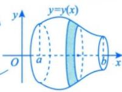

原文页码：1；bbox：`[601, 386, 722, 450]`

## 图 2

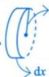

原文页码：1；bbox：`[403, 430, 445, 478]`

## 图 3

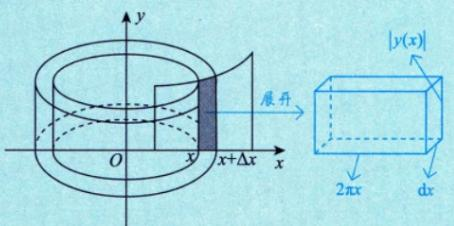

原文页码：2；bbox：`[485, 191, 759, 287]`

**图注：** 图10-5

## 图 4

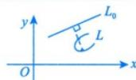

原文页码：2；bbox：`[658, 444, 761, 487]`

## 图 5

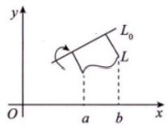

原文页码：2；bbox：`[410, 571, 534, 638]`

**图注：** 图10-6

## 图 6

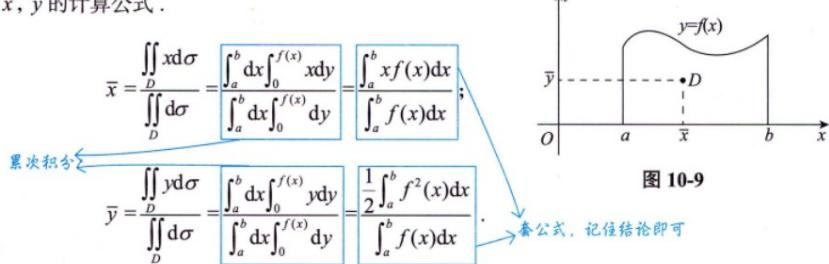

原文页码：6；bbox：`[258, 443, 759, 556]`

## 图 7

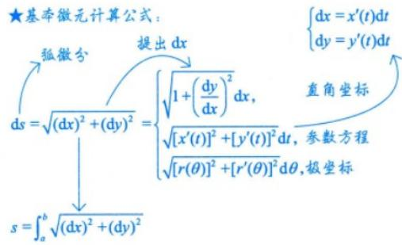

原文页码：8；bbox：`[334, 223, 640, 355]`

## 图 8

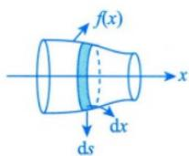

原文页码：8；bbox：`[684, 472, 808, 544]`

## 图 9

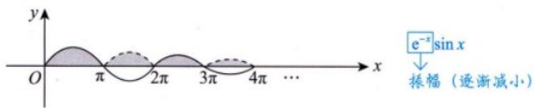

原文页码：8；bbox：`[361, 769, 761, 826]`

**图注：** 图10-4

## 图 10

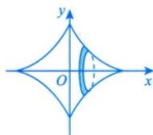

原文页码：11；bbox：`[697, 193, 811, 265]`

## 图 11

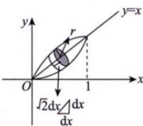

原文页码：12；bbox：`[636, 390, 763, 468]`

**图注：** 图10-12
