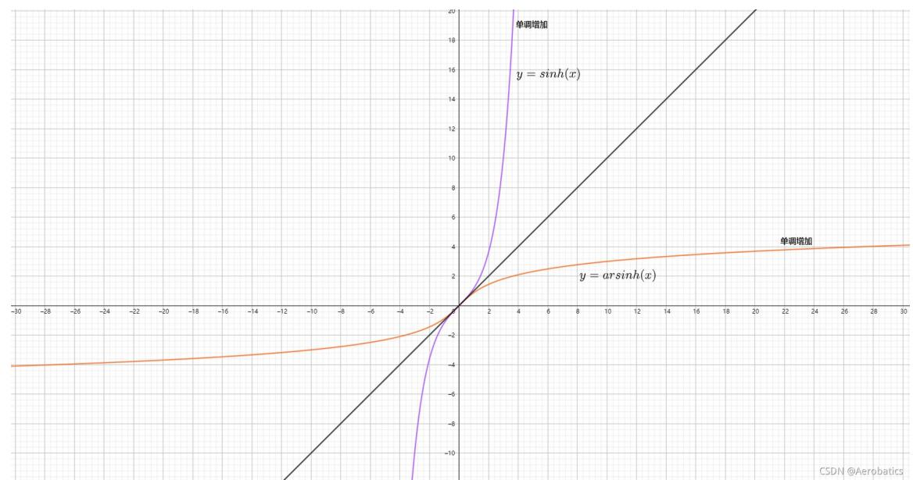

# 第四讲  一元函数微分学.docx

## 第四讲 一元函数微分学

知识点：

1. 反双曲正弦函数极其图像

$$
\sinh (x) = \frac {\mathrm{e} ^ {x} - \mathrm{e} ^ {- x}}{2}
$$

反双曲正弦函数的指数形式

反双曲正弦函数的对数形式推导

$$
\begin{array}{r l} & {\sinh (x) = \frac {\mathrm{e} ^ {x} - \mathrm{e} ^ {- x}}{2}} \\ & {y = \sinh^ {- 1} (x) \qquad x = \sinh (y) = \frac {e ^ {y} - e ^ {- y}}{2}} \end{array}
$$

令 $u = \mathrm{e}^{y}$ 则 $\frac{1}{e^y} = e^{-y} = \frac{1}{u}$

$$
\begin{array}{r l} & {\boxed {x = \frac {u - \frac {1}{u}}{2}}} \\ & {\quad \text {同乘} 2 u} \\ & {\quad \boxed {u ^ {2} - 2 x u - 1 = 0}} \\ & {\quad \text {一元二次方程都可化为} a x ^ {2} + b x + c = 0 (a \neq 0)} \\ & {\quad \boxed {x = \frac {- b \pm \sqrt {b ^ {2} - 4 a c}}{2 a}}} \\ & {\quad \boxed {u = \frac {2 x \pm \sqrt {4 x ^ {2} + 4}}{2} = x \pm \sqrt {x ^ {2} + 1}}} \\ & {\quad \boxed {e ^ {y} = u} \quad \text {对上式取对数}} \\ & {\quad \boxed {l n (e ^ {y}) = l n (x \pm \sqrt {x ^ {2} + 1})}} \end{array}
$$

当 $x \geqslant 1$ 时 $y = ln(x + \sqrt{x^2 + 1})$

$$
y = \sinh^ {- 1} (x) = a r \sinh (x) = l n (x + \sqrt {x ^ {2} + 1})
$$

反双曲正弦函数的导数推导

$$
\begin{array}{r l} & {\text {反函数} \quad y = \sinh^ {- 1} (x) = a r \sinh (x)} \\ & {\quad \Bigg | f (y) = f (f ^ {- 1} (x))} \\ & {\text {原函数} \quad x = \sinh (y)} \\ & {\quad \frac {d}{d x} (x) = 1} \\ & {\text {原函数导数} \quad 1 = \cosh (y) \frac {d y}{d x}} \\ & {\quad \text {原函数导数的倒数} \quad \frac {d y}{d x} = \frac {1}{\sqrt {x ^ {2} + 1}}} \\ & {\quad \text {原函数导数的倒数} \quad \frac {d}{d x} (\sinh^ {- 1} (x)) = \frac {d}{d x} (a r \sinh (x)) = \frac {1}{\sqrt {x ^ {2} + 1}}} \end{array}
$$

## 2. 泰勒展开

8. $\arctan x$ 的展开（经典交错级数）

$$
\boxed {\arctan x = \sum_ {n = 0} ^ {\infty} (- 1) ^ {n} \frac {x ^ {2 n + 1}}{2 n + 1} = x - \frac {x ^ {3}}{3} + \frac {x ^ {5}}{5} - \frac {x ^ {7}}{7} + \dots , \quad x \in [ - 1, 1 ]}
$$

\- 常用结论： $\arctan 1 = \frac{\pi}{4} = 1 - \frac{1}{3} + \frac{1}{5} - \frac{1}{7} + \cdots$ (莱布尼茨级数)

9. $\arcsin x$ 的展开（低频但会考）

$$
\arcsin x = x + \sum_ {n = 1} ^ {\infty} \frac {(2 n) !}{4 ^ {n} (n !) ^ {2} (2 n + 1)} x ^ {2 n + 1} = x + \frac {1}{2} \cdot \frac {x ^ {3}}{3} + \frac {1 \cdot 3}{2 \cdot 4} \cdot \frac {x ^ {5}}{5} + \dots , \quad x \in [ - 1, 1 ]
$$

题目：

题目 1:

4.7 已知 $g(x)$ 在 $x = 0$ 处二阶可导，且 $g(0) = g'(0) = 0$ ，设

$$
f (x) = \left\{ \begin{array}{l l} \frac {g (x)}{x}, & x \neq 0, \\ 0, & x = 0, \end{array} \right.
$$

证明： $f(x)$ 的导函数在 x=0 处连续.

## 4.7 证明 根据导数定义，有

$$
f ^ {\prime} (0) = \lim _ {x \rightarrow 0} \frac {\frac {g (x)}{x} - 0}{x - 0} = \lim _ {x \rightarrow 0} \frac {g (x)}{x ^ {2}} = \lim _ {x \rightarrow 0} \frac {g ^ {\prime} (x)}{2 x} = \frac {1}{2} \lim _ {x \rightarrow 0} \frac {g ^ {\prime} (x) - g ^ {\prime} (0)}{x - 0} = \frac {1}{2} g ^ {\prime \prime} (0).
$$

当 $x \neq 0$ 时， $f'(x) = \frac{xg'(x) - g(x)}{x^2}$ ，则

$$
\begin{array}{r l} \lim _ {x \to 0} f ^ {\prime} (x) & = \lim _ {x \to 0} \frac {x g ^ {\prime} (x) - g (x)}{x ^ {2}} = \lim _ {x \to 0} \frac {g ^ {\prime} (x)}{x} - \lim _ {x \to 0} \frac {g (x)}{x ^ {2}} \\ & = g ^ {\prime \prime} (0) - \frac {1}{2} g ^ {\prime \prime} (0) = \frac {1}{2} g ^ {\prime \prime} (0) = f ^ {\prime} (0), \end{array}
$$

所以 $f(x)$ 的导函数在x=0处连续.

|（注：部分内容可能由 AI 生成）
