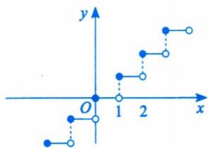
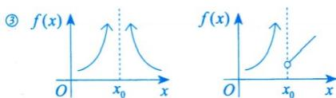
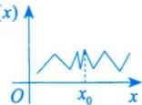
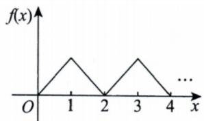

# 第一章 函数极限与连续.docx — 图像索引

> 由 MinerU 结构化结果生成。题目若依赖树形、拓扑、流程、曲线、区域、时序或其他空间关系，应核对这里的原图，不要只依据 OCR 文本推断。

## 图 1

原文页码：6；bbox：`[564, 332, 742, 422]`

## 图 2

原文页码：6；bbox：`[507, 542, 761, 594]`

## 图 3

原文页码：6；bbox：`[542, 605, 636, 653]`

## 图 4

原文页码：6；bbox：`[699, 725, 763, 771]`

## 图 5

原文页码：14；bbox：`[168, 445, 201, 469]`

## 图 6

原文页码：15；bbox：`[438, 624, 618, 699]`
