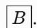
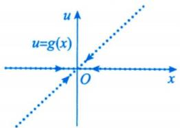
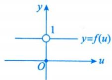
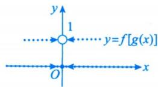
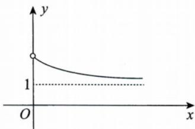
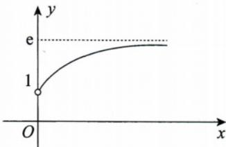
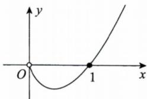
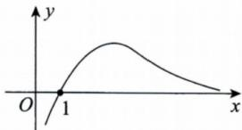

# 第二章 数列极限.docx

# 第二章 数列极限

知识点：

含 $F(Xn, Xn + 1)$ :

一、见到 $f(x_{n},x_{n+1})$ ，且其是含 $x_{n},x_{n+1}$ 的等式关系

( $D_{1}$ (常规操作) + $D_{23}$ (化归经典形式))

(1) 若 $x_{n+1} = f(x_n)$ ， $f(x)$ 易于求导，且求导得 $f'(x)$ 满足 $|f'(x)| \leqslant k < 1$ ，则由压缩映射原理，可知数列 $\{x_n\}$ 收敛. (D₁ (常规操作)) 解题信号 严格小于 1 的常数

【注】①压缩映射原理如下.

原理一 对数列 $\{x_{n}\}$ ，若存在常数 $k(0<k<1)$ ，使得 $\left|x_{n+1}-a\right|\leqslant k\left|x_{n}-a\right|$ ， $n=1,2,\cdots$ ，则 $\{x_{n}\}$ 收敛于 a.

k 必须是常数，如果不是常数，结果不一定成立。如 $\lim_{n\to\infty}\left(1-\frac{1}{n}\right)^{n}=\frac{1}{e}\neq0$

证 $0 \leqslant |x_{n+1} - a| \leqslant k |x_n - a| \leqslant k^2 |x_{n-1} - a| \leqslant \cdots \leqslant k^n |x_1 - a|$ ，由于 $\lim_{n \to \infty} k^n = 0$ ，根据夹逼准则，有 $\lim_{n \to \infty} |x_{n+1} - a| = 0$ ，即 $\{x_n\}$ 收敛于 $a$ 。

原理二 对数列 $\left\{x_{n}\right\}$ ，若 $x_{n+1}=f(x_{n})$ ， $n=1,2,\cdots,f(x)$ 可导，a 是 $f(x)=x$ 的唯一解，且对任意 $x\in R$ ，有 $\left|f'(x)\right|\leqslant k<1$ ，则 $\left\{x_{n}\right\}$ 收敛于 a.

证 $|x_{n + 1} - a| = |f(x_n) - f(a)| \xlongequal{\text{拉格朗日中值定理}} |f'(\xi)| |x_n - a| \leqslant k |x_n - a|$ ，其中 $\xi$ 介于 $a$ 与 $x_n$ 之间，由原理一，有 $\{x_n\}$ 收敛于 $a$ .

以上原理一、二是特殊的压缩映射过程，考生在使用它们时，要写出证明过程。

②重要不等式，见附录的不等式变形.

例2.1 若 $x_{1}=1, x_{n+1}=\sqrt{4+3x_{n}}, n=1,2,\cdots$ ，证明数列 $\{x_{n}\}$ 收敛，并求 $\lim_{n\to\infty}x_{n}$ .

【解】令 $f(x)=\sqrt{4+3x}(x>0)$ ，则 $f(4)=4$ ，且

资料最快更新qq群：1097122063 $\left|f'(x)\right|=\frac{3}{2\sqrt{4+3x}}\leqslant\frac{3}{2\sqrt{4}}=\frac{3}{4}<1$

又有

$$
\left| x _ {n + 1} - 4 \right| = \left| f (x _ {n}) - f (4) \right| = \left| f ^ {\prime} (\xi) \right| \left| x _ {n} - 4 \right| \leqslant \frac {3}{4} \left| x _ {n} - 4 \right|,
$$

其中 $\xi$ 介于 $x_{n}$ 与4之间，从而有

$$
0 <   \left| x _ {n + 1} - 4 \right| \leqslant \frac {3}{4} \left| x _ {n} - 4 \right| \leqslant \left(\frac {3}{4}\right) ^ {2} \left| x _ {n - 1} - 4 \right| \leqslant \dots \leqslant \left(\frac {3}{4}\right) ^ {n} \left| x _ {1} - 4 \right|,
$$

而当 $n \to \infty$ 时， $\left(\frac{3}{4}\right)^n \to 0$ ，故数列 $\{x_n\}$ 收敛，且 $\lim_{n \to \infty} x_n = 4$ 。

(2) 若 $x_{n+1}=f(x_{n})$ ， $f(x)$ 不易求导或 $f'(x)$ 不满足 $\left|f'(x)\right|\leqslant k<1$ . (D₁ (常规操作))

①直接比较 $x_{n+1}$ 与 $x_{n}$ 的大小,定单调.

例2.3 若 $0 < x_{n} < 1$ , $x_{n+1} = 1 - \sqrt{1 - x_{n}} (n = 1, 2, \cdots)$ , 求:

(1) $\lim_{n\to \infty}x_n$

(2) $\lim_{n\to \infty}\frac{x_{n + 1}}{x_n}$ .

【分析】 $f(x)=1-\sqrt{1-x}$ ，0<x<1，则 $f'(x)=\frac{1}{2\sqrt{1-x}}>\frac{1}{2}$ ，无法使用压缩映射原理，故考虑直接比较 $x_{n+1}$ 与 $x_{n}$ 的大小，定单调.

【解】（1）由 $x_{n + 1} = 1 - \sqrt{1 - x_n} = \frac{x_n}{1 + \sqrt{1 - x_n}} < x_n$ ， $0 < x_{n} < 1$ ，知数列 $\{x_{n}\}$ 单调减少且有下界，故数列 $\{x_{n}\}$ 收敛. 共苑思想： $\sqrt{a} -\sqrt{b} = \frac{a - b}{\sqrt{a} + \sqrt{b}}$

设 $\lim_{n\to \infty}x_n = a$ ，则有 $a = 1 - \sqrt{1 - a}$ ，解得 $a = 0(a = 1$ 舍去)，故 $\lim_{n\to \infty}x_n = 0$ ：

(2)由(1)可知， $\lim_{n\to\infty}\frac{x_{n+1}}{x_n}=\lim_{n\to\infty}\frac{1-\sqrt{1-x_n}}{x_n}=\lim_{n\to\infty}\frac{1}{1+\sqrt{1-x_n}}=\frac{1}{2}$ . 若a=1，则由于 $\{x_{n}\}$ 单调减少，且 $\lim_{n\to\infty}x_{n}=1$ ，则有 $x_{n}\geqslant1$ ，矛盾.故 $a\neq1$

②作差 $x_{n + 1} - x_n$ ，根据正负定单调.

## 例子 2.4：https://chatgpt.com/c/6a7820a7-c750-83e8-a3ae-e9450cc7ea57

例2.4 设 $x_{n+1} = \frac{x_n^2}{2(x_n - 1)} (n = 1, 2, \cdots), x_1 > 1$ ，证明数列 $\{x_n\}$ 收敛，并求 $\lim_{n \to \infty} x_n$ .

【解】

$$
x _ {n + 1} = \frac {1}{2} \left(x _ {n} - 1 + \frac {1}{x _ {n} - 1}\right) + 1 \geqslant 2, x _ {n + 1} - x _ {n} = \frac {x _ {n} (2 - x _ {n})}{2 (x _ {n} - 1)} \leqslant 0,
$$

故由单调有界准则知, 数列 $\{x_{n}\}$ 收敛.

设 $\lim_{n\to \infty}x_n = A$ ，则有 $A = \frac{A^2}{2(A - 1)}$ ，解得 $A = 2$ 或 $A = 0$ （舍去），故 $\lim_{n\to \infty}x_n = 2$ ：

③作商 $\frac{x_{n + 1}}{x_n} (x_{n + 1}$ 与 $x_{n}$ 同号)，根据与1的大小关系定单调.

例2.5 设 $x_{n+1} = \sqrt{x_n(2 - x_n)} (n = 1, 2, \cdots), 0 < x_1 < 2$ ，证明数列 $\{x_n\}$ 的极限存在，并求此极限.

【解】首先证明数列 $\{x_{n}\}$ 有界.因为 $0 < x_{1} < 2$ ，所以 $x_{1},2 - x_{1}$ 均为正数，从而

$$
0 <   x _ {2} = \sqrt {x _ {1} (2 - x _ {1})} \leqslant \frac {x _ {1} + 2 - x _ {1}}{2} = 1.
$$

16

设 $0 < x_{k} \leqslant 1 (k > 1)$ , 则 $0 < x_{k+1} = \sqrt{x_{k}(2 - x_{k})} \leqslant \frac{1}{2} (x_{k} + 2 - x_{k}) = 1$ , 由数学归纳法知, 对任意正整数 $n > 1$ , 都有 $0 < x_{n} \leqslant 1$ , 即数列 $\{x_{n}\}$ 有界.

再证明数列 $\{x_{n}\}$ 单调.当 $n > 1$ 时，

$$
\frac {x _ {n + 1}}{x _ {n}} = \sqrt {\frac {2}{x _ {n}} - 1} \geqslant 1,
$$

即 $x_{n + 1}\geqslant x_n(n > 1)$ ，所以数列 $\{x_{n}\} (n > 1)$ 单调增加.

根据单调有界准则知 $\lim_{n\to \infty}x_n$ 存在，设其为 $a$ ，则

$$
a = \lim _ {n \rightarrow \infty} x _ {n} = \lim _ {n \rightarrow \infty} \sqrt {x _ {n - 1} (2 - x _ {n - 1})} = \sqrt {a (2 - a)},
$$

解得 a=1 或 a=0 (舍去). 故 $\lim_{n\to\infty}x_n=1$ .

④根据题设提示(往往是第(1)问), 判有界或单调.

例2.6 (1)证明对任意正整数 $n$ ，都有 $\frac{1}{n + 1} < \ln \left(1 + \frac{1}{n}\right) < \frac{1}{n}$ 成立；

(2) 设 $a_{n}=1+\frac{1}{2}+\cdots+\frac{1}{n}-\ln n(n=1,2,\cdots)$ ，证明数列 $\left\{a_{n}\right\}$ 收敛.

【证】(1)令 $f(x)=\ln x(x>0)$ .对任意正整数n，对 $f(x)$ 在 $[n,n+1]$ 上使用拉格朗日中值定理，得

$$
\frac {1}{n + 1} <   \frac {1}{\xi} <   \frac {1}{n}
$$

$$
\ln \left(1 + \frac {1}{n}\right) = \ln (1 + n) - \ln n = \frac {1}{\xi},
$$

其中 $n < \xi < n + 1$ ，所以 $\frac{1}{n + 1} < \ln \left(1 + \frac{1}{n}\right) < \frac{1}{n}$ .

(2)由(1)知,当 $n\geqslant1$ 时,有

$$
a _ {n + 1} - a _ {n} = \frac {1}{n + 1} - \ln \left(1 + \frac {1}{n}\right) <   0,
$$

$$
\begin{array}{r l} a _ {n} & = 1 + \frac {1}{2} + \dots + \frac {1}{n} - \ln n > \ln (1 + 1) + \ln \left(1 + \frac {1}{2}\right) + \dots + \ln \left(1 + \frac {1}{n}\right) - \ln n \\ & = \ln (1 + n) - \ln n > 0, \end{array}
$$

故数列 $\{a_{n}\}$ 单调减少且有下界，所以数列 $\{a_{n}\}$ 收敛.

## 含不等式关系：

## ( $D_{1}$ (常规操作))

比较 $x_{n},x_{n+1}$ 的大小,定 $x_{n}$ 的上、下界. 注:可能考 $f(x)$ 的最值

例2.7 若 $(1-x_{n+1})x_{n}>\frac{1}{4}(n=1,2,\cdots)$ ， $0<x_{n}<1$ ，证明数列 $\{x_{n}\}$ 收敛，并求 $\lim_{n\to\infty}x_{n}$

【解】由题设可知， $\frac{1}{2}<\sqrt{(1-x_{n+1})x_{n}}\leqslant\frac{1-x_{n+1}+x_{n}}{2}$ ，故 $x_{n}\geqslant x_{n+1}$ .又 $0<x_{n}<1$ ，因此由单调有界准则知，数列 $\{x_{n}\}$ 收敛.

$$
x - x ^ {2} \leqslant \frac {1}{4}
$$

设 $\lim_{n\to \infty}x_n = a$ ，则有 $(1 - a)a\geqslant \frac{1}{4}$ 又 $(1 - a)a\leqslant \frac{1}{4}$ 故 $(1 - a)a = \frac{1}{4}$ 解得 $a = \frac{1}{2}$ 即 $\lim_{n\to \infty}x_n = \frac{1}{2}$

戴帽法,不要忘记等号

初值对敛散性的影响：

## 三、初值 $x_{1}$ 对 $x_{n + 1} = f(x_{n})$ 的敛散性的影响（ $\mathrm{D}_1$ （常规操作））

对于 $x_{n + 1} = f(x_n)$ ，若初值 $x_{1}$ 仅给定取值范围，可能需要分情况讨论.

例2.8 设数列 $\{a_{n}\}$ 满足 $\left\{\begin{aligned}a_{1}&>2,\\ a_{n+1}&=a_{n}-\frac{a_{n}-3}{a_{n}-2},\quad n=1,2,3,\cdots,\end{aligned}\right.$ 则().

(A) $\{a_{n}\}$ 收敛于大于3的数

(B) $\{a_{n}\}$ 收敛于3

(C) $\{a_{n}\}$ 发散

(D) $\{a_{n}\}$ 的敛散性与 $a_1$ 有关

【解】应选(B).

令

$$
f (x) = x - \frac {x - 3}{x - 2}, x > 2,
$$

$$
f (x) = x - \frac {x - 3}{x - 2}
$$

则

$$
f ^ {\prime} (x) = 1 - \frac {1}{(x - 2) ^ {2}} \stackrel {\text {令}} {=} 0 ,
$$

$$
\begin{array}{l} = x - 2 + \frac {1}{x - 2} + 1 \\ \geqslant 3, \end{array}
$$

解得 x=3，又 $f''(x)=\frac{2}{(x-2)^{3}}>0$ ，则 x=3 为 $f(x)$ 在 $(2,+\infty)$ 上的最小值点，即

$x = 3$ 时取等号

$$
[ f (x) ] _ {\min} = f (3) = 3,
$$

于是

$$
a _ {n + 1} = f (a _ {n}) \geqslant 3.
$$

找(或证) $\{a_{n}\}$ 有界, 若 $a_{n}=f(n)$ ,
f可导,那么求 $f(x)$ 在 $x\in I$ 上的最值,便是一个好方法.

若 $a_1 > 3$ ，则

$$
a _ {2} = a _ {1} - \frac {a _ {1} - 3}{a _ {1} - 2} <   a _ {1},
$$

$$
a _ {2} = f \left(a _ {1}\right) > f (3) = 3,
$$

由归纳法， $3 < a_{n + 1} < a_n$ ，故数列 $\{a_{n}\}$ 收敛.

若 $2 < a_{1} < 3$ ，则

$$
a _ {2} = a _ {1} - \frac {a _ {1} - 3}{a _ {1} - 2} = f (a _ {1}) > f (3) = 3,
$$

故

$$
a _ {3} = a _ {2} - \frac {a _ {2} - 3}{a _ {2} - 2} <   a _ {2},
$$

由归纳法， $3 < a_{n + 1} < a_n (n \geqslant 2)$ ，故数列 $\{a_n\}$ 收敛.

设 $a_1 > 2$ 且 $a_1 \neq 3$ ，记 $\lim_{n \to \infty} a_n = A$ ，则 $A = A - \frac{A - 3}{A - 2}$ ，解得 $A = 3$ 。

显然当 $a_{1}=3$ 时， $a_{n}=3,n=2,3,4,\cdots$

综上， $\{a_{n}\}$ 收敛于3.

有，而且我更推荐一个\*\*“平移变量”方法\*\*，比讨论 $2 < a_{n} < 3$ 、 $a_{n} > 3$ 干净很多。

$$
b _ {n} = a _ {n} - 3.
$$

那么 $a_{n} = b_{n} + 3$ ，原递推式变成

$$
\begin{array}{r l} & b _ {n + 1} = a _ {n + 1} - 3 \\ & \qquad = a _ {n} - 3 - \frac {a _ {n} - 3}{a _ {n} - 2} \\ & \qquad = b _ {n} - \frac {b _ {n}}{b _ {n} + 1} \\ & \qquad = \boxed {\frac {b _ {n} ^ {2}}{1 + b _ {n}}}. \end{array}
$$

题目给 $a_1 > 2$ ，所以

$$
b _ {1} > - 1.
$$

因此

$$
b _ {2} = \frac {b _ {1} ^ {2}}{1 + b _ {1}} \geq 0.
$$

注意，这一步直接把数列“送进”了

$$
\boxed {b _ {n} \geq 0}
$$

这个最舒服的区域里。也就是说，从 $n = 2$ 开始，我们根本不用再讨论 $a_{n}$ 是在 $2 \sim 3$ 还是 $>3$ 。接下来对 $n \geq 2$ ，因为 $b_{n} \geq 0$ ，

$$
b _ {n + 1} = \frac {b _ {n} ^ {2}}{1 + b _ {n}} = b _ {n} \frac {b _ {n}}{1 + b _ {n}}.
$$

而

$$
0 \leq \frac {b _ {n}}{1 + b _ {n}} <   1
$$

(如果 $b_{n}=0$ ，后面直接全为0）。

所以

$$
\boxed {0 \leq b _ {n + 1} \leq b _ {n}}.
$$

于是 $\{b_n\}$ 单调递减且下有界，因此收敛。

设

$$
b _ {n} \rightarrow L \geq 0,
$$

在递推式中取极限：

$$
L = \frac {L ^ {2}}{1 + L}.
$$

于是

$$
L (1 + L) = L ^ {2}
$$

即

$$
\boxed {L = 0.}
$$

所以

$$
a _ {n} = b _ {n} + 3 \rightarrow 3.
$$

因此答案仍然是

你可以把这题的最优思路记成：

$$
\text {看到极限候选} 3, \text {就令} b _ {n} = a _ {n} - 3
$$

然后递推直接化成

$$
\boxed {b _ {n + 1} = \frac {b _ {n} ^ {2}}{1 + b _ {n}}}.
$$

这个形式比原式好太多，因为从第二项开始立刻有

$$
0 \leq b _ {n + 1} \leq b _ {n}.
$$

这类递推数列强化题里，“围绕不动点作平移 $b_{n} = a_{n} - A$ ”是非常值得优先尝试的方法。

https://chatgpt.com/g/g-p-6a1d505226e08191a7f47eb8e9418ffe-gao-shu-ocr/c/6a7fed81-7590-83ee-9173-6c82e2751010

$\left(D_{1}\text{(常规操作)}+D_{21}\text{(观察研究对象)}+D_{23}\text{(化归经典形式)}\right)$

(1) 将 $a_{n}, b_{n}$ 满足的式子联立，消去 $a_{n}$ 或 $b_{n}$ 其中一个，转化为单通项问题。且常用①恒等变形；②无穷小比阶；③常见放缩；④函数单调性，来作细节处理。

$\rightarrow D_{23}$ （化归经典形式）

(2) 令 $c_{n} = \frac{a_{n}}{b_{n}}$ ，转求 $\lim_{n\to \infty}c_n$ ，且常用①单调有界准则；②夹逼准则；③极限保号性，来作细节处理。

例2.9 设数列 $\left\{a_{n}\right\}$ ， $\left\{b_{n}\right\}$ 满足 $a_{n}+b_{n}=\frac{\pi}{2}$ ， $a_{n+1}=a_{n}+\cos a_{n}$ ，其中 $n=1,2,\cdots,a_{1}=1$ ，当 $n\to\infty$ 时， $b_{n}$ 与 $b_{n-1}^{a}$ 为同阶无穷小量，则 $a=(\quad)$ .
(A)1 (B)2 (C)3 (D)5

【解】应选(C).

$$
\begin{array}{r l} b _ {n} & = \frac {\pi}{2} - a _ {n} = \frac {\pi}{2} - a _ {n - 1} - \cos a _ {n - 1} \\ & = \frac {\pi}{2} - a _ {n - 1} - \sin \left(\frac {\pi}{2} - a _ {n - 1}\right) \\ & = b _ {n - 1} - \sin b _ {n - 1} (n \geqslant 2). \end{array}
$$

$D_{21}$ （观察研究对象）+ $D_{23}$ （化归经典形式），题设中说的是 $b_{n}$ 与 $b_{n-1}^{a}$ ，自然应该想到建立 $b_{n}$ 与 $b_{n-1}$ 的关系，所谓的“观察”与“化归”，往往相互配合，提供给我们变形的方向。

由 $a_1 = 1$ ，则 $b_{1} = \frac{\pi}{2} -1\in (0,1),b_{2} = b_{1} - \sin b_{1} <   b_{1}$ ，即 $0 <   b_{2} <   b_{1} <   1$

假设当 $n = k(k \geqslant 2)$ 时， $0 < b_k < b_{k-1} < 1$ 成立，则当 $n = k + 1$ 时，

$$
0 <   b _ {k + 1} = b _ {k} - \sin b _ {k} <   b _ {k} <   1,
$$

故 $\{b_n\}$ 单调有界，则由单调有界准则，知 $\{b_n\}$ 收敛. 令 $\lim_{n\to \infty}b_n = A$ ，在等式 $b_{n} = b_{n - 1} - \sin b_{n - 1}$ 两端取极限，得 $A = A - \sin A$ ，故 $A = 0$ ，即 $\lim_{n\to \infty}b_n = 0.$

故当 $n \to \infty$ ，即 $b_{n} \to 0$ 时， $b_{n} = b_{n-1} - \sin b_{n-1} \sim \frac{1}{6} b_{n-1}^{3}$ ，因此 $a = 3$ .

例2.10 设正项数列 $\{a_{n}\}$ 收敛于0, 若 $a_{n+1} = \cos b_{n} - \cos a_{n}, a_{n} \in \left(0, \frac{\pi}{2}\right), b_{n} \in \left(0, \frac{\pi}{2}\right)$ , 且 $(1 - b_{n})^{n} = \cos b_{n}$ , 则 $\lim_{n \to \infty} \frac{\ln \cos b_{n}}{n} =$ \_\_\_\_.

【解】应填1.

$\cos b_{n} - \cos a_{n} = a_{n + 1} > 0$ ，因为 $a_{n}\in \left(0,\frac{\pi}{2}\right),b_{n}\in \left(0,\frac{\pi}{2}\right)$ ，所以 $0 <   b_n <   a_n$ .又正项数列 $\{a_n\}$ 收敛于0，故 $\lim_{n\to \infty}b_n = 0.$ 于是

$$
\lim _ {n \to \infty} b _ {n} ^ {\frac {\ln \cos b _ {n}}{n}} = \mathrm{e} ^ {\lim _ {n \to \infty} \frac {\ln \cos b _ {n}}{n} \ln b _ {n}} = \mathrm{e} ^ {\lim _ {n \to \infty} \overbrace {\ln (1 - b _ {n}) \ln b _ {n}} ^ {\text {等价于“} - b _ {n}}} = \mathrm{e} ^ {0} = 1.
$$

## 复合函数的极限：

$\left(D_{1}\right)$ （常规操作） $+D_{21}$ （观察研究对象）

1. 定理一(因变量极限定理)

设 $y=f[g(x)]$ ， $u=g(x)$ ， $y=f(u)$ 。若 $\left\{\begin{aligned}&①\lim_{x\to x_{0}}g(x)=u_{0},\\ &②\lim_{u\to u_{0}}f(u)=a,\\ &③ 当 x\neq x_{0} 时， g(x)\neq u_{0},\end{aligned}\right.$ 则 $\lim_{x\to x_{0}}f[g(x)]=a$ 。
注意此条件，当 $f(u)$ 在u处连续时，不需要③

例2.11 设

$u = g(x) = \left\{ \begin{array}{ll}x, & x\text{是有理数，}\\ 0, & x\text{是无理数，} \end{array} \right.\quad y = f(u) = \left\{ \begin{array}{ll}1, & u\neq 0,\\ 0, & u = 0, \end{array} \right.$

则 $\lim_{x\to 0}f[g(x)]$ （ ）. (A)等于0 (B)等于1 (C)等于 $x$ (D)不存在

【解】应选(D).

由题设有， $\lim_{x\to0}g(x)=0,\lim_{u\to0}f(u)=1,$ 但由于 $y=f[g(x)]=\left\{\begin{aligned}&1,&x\text{是有理数且}x\neq0,\\ &0,&x\text{是无理数或}x=0,\end{aligned}\right.$ 于是 $\lim_{x\to0}f[g(x)]$ 不存在.

【注】关键是当 $x \neq 0$ 时， $g(x)$ 也有零点，故复合函数的极限定理一的运算不一定成立

https://chatgpt.com/g/g-p-6a1d505226e08191a7f47eb8e9418ffe-gao-shu-ocr/c/6a7ff706-d554-83e8-9153-e8591fcf565e

## 2. 定理二(中间变量极限定理)

设 $u_{n}\in$ 有限区间I，若 $f(x)$ 在I上严格单调，且 $\lim_{n\to\infty}f(u_{n})$ 存在，则 $\lim_{n\to\infty}u_{n}$ 存在.

例2.12 已知数列 $\{x_{n}\}$ ，其中 $-\frac{\pi}{2} \leqslant x_{n} \leqslant \frac{\pi}{2}$ ，则（ ）.

(A) 若 $\lim_{n\to \infty}\cos \sin x_n$ 存在，则 $\lim_{n\to \infty}x_n$ 存在

(B) 若 $\lim_{n\to \infty}\sin \cos x_n$ 存在，则 $\lim_{n\to \infty}x_n$ 存在

(C) 若 $\lim_{n\to \infty}\cos \sin x_n$ 存在，则 $\lim_{n\to \infty}\sin x_n$ 存在，但 $\lim_{n\to \infty}x_n$ 不一定存在

(D) 若 $\lim_{n\to \infty}\sin \cos x_n$ 存在，则 $\lim_{n\to \infty}\cos x_n$ 存在，但 $\lim_{n\to \infty}x_n$ 不一定存在

【解】应选(D).

根据定理二, 由于 $\sin x$ 在 $\left[-\frac{\pi}{2}, \frac{\pi}{2}\right]$ 上单调, 因此, 由 $\lim_{n \to \infty} \sin \cos x_n$ 存在可得 $\lim_{n \to \infty} \cos x_n$ 存在, 但 $\cos x$ 在 $\left[-\frac{\pi}{2}, \frac{\pi}{2}\right]$ 上不单调, 所以当 $\lim_{n \to \infty} \cos x_n$ 存在时, $\lim_{n \to \infty} x_n$ 不一定存在, 可知 (D) 正确, (B) 错误.

由于 $\cos x$ 在 $\left[-\frac{\pi}{2}, \frac{\pi}{2}\right]$ 上不单调，因此，由 $\lim_{n \to \infty} \cos x_n$ 存在无法得到 $\lim_{n \to \infty} \sin x_n$ 存在，进而也无法得到 $\lim_{n \to \infty} x_n$ 存在，可知(A)与(C)均错误.

https://chatgpt.com/g/g-p-6a1d505226e08191a7f47eb8e9418ffe-gao-shu-ocr/c/6a7ff9c3-5728-83e8-9d1a-255ce6fe8017

例2.13 设正项数列 $\{a_{n}\}$ 单调增加, 则以下选项中使得 $\{a_{n}\}$ 收敛的是( ). (A) $\left\{(1 + a_n)^{\frac{1}{a_n}}\right\}$ 收敛于1 (B) $\left\{\left(1 + \frac{1}{a_n}\right)^{a_n}\right\}$ 收敛于e (C) $\{a_{n} \ln a_{n}\}$ 收敛于0 (D) $\left\{\frac{\ln a_{n}}{a_{n}}\right\}$ 收敛于0

【解】应选(C).

正项数列 $\{a_{n}\}$ 单调增加，要么 $\lim_{n\to \infty}a_n = +\infty$ ，要么 $\lim_{n\to \infty}a_n = a$

对于选项(A)， $(1+x)^{\frac{1}{x}}(x>0)$ 的图像如图(a)所示.

  
(a)

当 $\left(1 + a_{n}\right)^{\frac{1}{a_{n}}} \to 1$ 时， $a_{n} \to +\infty$ ，故 $\{a_{n}\}$ 发散.

对于选项(B)， $\left(1+\frac{1}{x}\right)^{x}(x>0)$ 的图像如图(b)所示.

  
(b)

当 $\left(1+\frac{1}{a_{n}}\right)^{a_{n}}\rightarrow e$ 时， $a_{n}\rightarrow+\infty$ ，故 $\left\{a_{n}\right\}$ 发散.

对于选项(C)， $x \ln x (x > 0)$ 的图像如图(c)所示.

  
(c)

当 $a_{n}\ln a_{n}\rightarrow 0$ 时， $a_{n}\rightarrow 0^{+}$ 或 $a_{n}\rightarrow 1$ ，又 $a_{n} > 0$ 且单调增加，所以 $a_{n}\rightarrow 1^{-}$ ，故 $\{a_n\}$ 收敛.对于选项(D)， $\frac{\ln x}{x}(x > 0)$ 的图像如图(d)所示.

  
(d)

当 $\frac{\ln a_n}{a_n} \to 0$ 时， $a_n \to 1^-$ 或 $a_n \to +\infty$ ，故 $\{a_n\}$ 可能收敛，也可能发散。

【注】此题是作者新命制的题目，着重考查基本概念与性质，对考生区分度高.

Problems:

单调性问题：

## 二、差式不好判断：把它写成“固定点因子”

这是递推数列强化题最重要的方法之一。

假设

先解方程

$$
a _ {n + 1} = f (a _ {n}).
$$

$$
x = f (x),
$$

得到固定点 $\alpha$ 。

然后研究

$$
a _ {n + 1} - a _ {n} = f (a _ {n}) - a _ {n}.
$$

很多题都能因式分解成

$$
\left| a _ {n + 1} - a _ {n} = (\alpha - a _ {n}) g (a _ {n}) \right|
$$

并且 $g(a_{n}) > 0$ 。

这时候立刻得到：

即递增；

$$
a _ {n} <   \alpha \Rightarrow a _ {n + 1} - a _ {n} > 0
$$

而

$$
a _ {n} > \alpha \Rightarrow a _ {n + 1} - a _ {n} <   0
$$

即递减。

所以固定点 $\alpha$ 往往同时承担两个角色：

所以固定点 $\alpha$ 往往同时承担两个角色：

单调性的分界点 + 极限候选值

## 三、作差太复杂：研究函数 $g(x) = f(x) - x$

这个方法其实是上一种的升级版。

因为

$$
a _ {n + 1} - a _ {n} = f (a _ {n}) - a _ {n},
$$

定义

$$
g (x) = f (x) - x.
$$

于是

$$
a _ {n + 1} - a _ {n} = g (a _ {n}).
$$

问题直接转化成：

$g(x)$ 在 $a_{n}$ 所在区间内是什么符号？

如果

$$
g (x) > 0
$$

就递增；

如果

$$
g (x) <   0
$$

就递减。

而判断 $g(x)$ 正负，可以用导数：

$$
g ^ {\prime} (x) = f ^ {\prime} (x) - 1.
$$

注意这个地方非常容易混：

$$
\text {判断数列单调性，真正有用的是} f (x) - x, \text {不是单独看} f ^ {\prime} (x)
$$

例如你发现

$$
f ^ {\prime} (x) > 0
$$

只能说明 $f$ 是递增函数，不能说明

$$
a _ {n + 1} > a _ {n}.
$$

因为“f递增”和“数列递增”完全是两个概念。

## 七、你做题时真正应该用的顺序

以后看到

$$
\boxed {a _ {n + 1} = f (a _ {n})}
$$

你脑子里按这个顺序走：

<table><tr><td>顺序</td><td>要问的问题</td><td>目的</td></tr><tr><td>1</td><td> $a_n$  在哪个区间?</td><td>先确定符号、不变区间</td></tr><tr><td>2</td><td>能不能直接算  $a_{n+1} - a_n$ ?</td><td>首选作差</td></tr><tr><td>3</td><td>能不能解  $f(x) = x$ ?</td><td>找固定点  $\alpha$ </td></tr><tr><td>4</td><td> $f(x) - x$  能否因式分解?</td><td>看  $a_n - \alpha$ </td></tr><tr><td>5</td><td>差式不好判断,能否令  $g(x) = f(x) - x$ ?</td><td>用导数判符号</td></tr><tr><td>6</td><td>全正且乘除结构明显吗?</td><td>考虑作商</td></tr><tr><td>7</td><td> $f$  本身递增吗?</td><td>用  $a_2 - a_1 +$ 归纳</td></tr><tr><td>8</td><td> $f$  递减吗?</td><td>不要硬证单调,研究  $f \circ f$ 、奇偶子列</td></tr></table>

其中最值得形成条件反射的是：

$$
\boxed {\text {递推式} \longrightarrow \text {不变区间} \longrightarrow a _ {n + 1} - a _ {n} \longrightarrow \text {固定点}}
$$

特别是你现在做强化阶段的递推极限题，“先判断 $a_{n}$ 在哪边，再判断往哪边走”，往往比一上来硬作差更清楚。武忠祥强化资料本身也把单调有界法作为递推数列的核心处理方式。27武忠祥高数辅导讲义-强化上OCR

其中最值得形成条件反射的是：

$$
\text {递推式} \longrightarrow \text {不变区间} \longrightarrow a _ {n + 1} - a _ {n} \longrightarrow \text {固定点}
$$

特别是你现在做强化阶段的递推极限题，“先判断 $a_{n}$ 在哪边，再判断往哪边走”，往往比一上来硬作差更清楚。武忠祥强化资料本身也把单调有界法作为递推数列的核心处理方式。27武忠祥高数辅导讲义-强化上OCR

最后给你一个最有用的记忆：

$$
\begin{array}{r l} & {a _ {n + 1} - a _ {n} > 0 \Rightarrow \uparrow} \\ & {a _ {n + 1} - a _ {n} <   0 \Rightarrow \downarrow} \\ & {a _ {n + 1} = f (a _ {n}),   f \uparrow \Rightarrow \text {看}   a _ {2} - a _ {1}} \\ & {\quad f \downarrow \Rightarrow \text {看奇偶子列}} \\ & {f (x) = x   \text {的根} \Rightarrow \text {重点拿来作比较}} \end{array}
$$

这套框架基本能覆盖考研数一里绝大多数“递推数列单调性”的问题。

https://chatgpt.com/g/g-p-6a1d505226e08191a7f47eb8e9418ffe-gao-shu-ocr/c/6a818f1ea588-83e8-921e-ed2d2c895626

## 区间问题:

https://chatgpt.com/g/g-p-6a1d505226e08191a7f47eb8e9418ffe-gao-shu-ocr/c/6a819c1c-568c-83e8-834e-1e4b507d05eb

## URL:

https://chatgpt.com/g/g-p-6a1d505226e08191a7f47eb8e9418ffe-gao-shu-ocr/c/6a781718-af10-83ee-b0de-34fe6911dddf

题:

题1:

例2.5 设 $x_{n+1} = \sqrt{x_n(2 - x_n)} (n = 1, 2, \cdots), 0 < x_1 < 2$ ，证明数列 $\{x_n\}$ 的极限存在，并求此极限.

【解】首先证明数列 $\{x_{n}\}$ 有界.因为 $0 < x_{1} < 2$ ，所以 $x_{1},2 - x_{1}$ 均为正数，从而

$$
0 <   x _ {2} = \sqrt {x _ {1} (2 - x _ {1})} \leqslant \frac {x _ {1} + 2 - x _ {1}}{2} = 1.
$$

设 $0 < x_{k} \leqslant 1 (k > 1)$ ，则 $0 < x_{k+1} = \sqrt{x_{k}(2 - x_{k})} \leqslant \frac{1}{2} (x_{k} + 2 - x_{k}) = 1$ ，由数学归纳法知，对任意正整数 $n > 1$ ，

都有 $0 < x_{n} \leqslant 1$ ，即数列 $\{x_{n}\}$ 有界.

$P_{3}$ (数学归纳)

再证明数列 $\{x_{n}\}$ 单调.当 $n > 1$ 时，

$$
\frac {x _ {n + 1}}{x _ {n}} = \sqrt {\frac {2}{x _ {n}} - 1} \geqslant 1,
$$

即 $x_{n + 1}\geqslant x_n(n > 1)$ ，所以数列 $\{x_{n}\} (n > 1)$ 单调增加.

根据单调有界准则知 $\lim_{n\to \infty}x_n$ 存在，设其为 $a$ ，则

$$
a = \lim _ {n \rightarrow \infty} x _ {n} = \lim _ {n \rightarrow \infty} \sqrt {x _ {n - 1} (2 - x _ {n - 1})} = \sqrt {a (2 - a)},
$$

解得 a=1 或 a=0 (舍去). 故 $\lim_{n\to\infty}x_{n}=1$ .

https://chatgpt.com/g/g-p-6a1d505226e08191a7f47eb8e9418ffe-gao-shu-ocr/c/6a7824cb-971c-83e8-a401-b9c7f36bcb30

题2:

例2.6 (1)证明对任意正整数 $n$ ，都有 $\frac{1}{n + 1} < \ln \left(1 + \frac{1}{n}\right) < \frac{1}{n}$ 成立；

(2) 设 $a_{n}=1+\frac{1}{2}+\cdots+\frac{1}{n}-\ln n(n=1,2,\cdots)$ ，证明数列 $\left\{a_{n}\right\}$ 收敛.

【证】(1)令 $f(x)=\ln x(x>0)$ .对任意正整数n，对 $f(x)$ 在 $[n,n+1]$ 上使用拉格朗日中值定理，得

$$
\frac {1}{n + 1} <   \frac {1}{\xi} <   \frac {1}{n}
$$

$$
\ln \left(1 + \frac {1}{n}\right) = \ln (1 + n) - \ln n = \frac {1}{\xi},
$$

其中 $n < \xi < n + 1$ ，所以 $\frac{1}{n + 1} < \ln \left(1 + \frac{1}{n}\right) < \frac{1}{n}$ .

(2)由(1)知,当 $n\geqslant1$ 时,有

$$
a _ {n + 1} - a _ {n} = \frac {1}{n + 1} - \ln \left(1 + \frac {1}{n}\right) <   0,
$$

$$
\begin{array}{r l} a _ {n} & = 1 + \frac {1}{2} + \dots + \frac {1}{n} - \ln n > \ln (1 + 1) + \ln \left(1 + \frac {1}{2}\right) + \dots + \ln \left(1 + \frac {1}{n}\right) - \ln n \\ & = \ln (1 + n) - \ln n > 0, \end{array}
$$

故数列 $\{a_{n}\}$ 单调减少且有下界，所以数列 $\{a_{n}\}$ 收敛.

|（注：部分内容可能由 AI 生成）
