# 多元积分及其应用（上）.docx

# 多元积分及其应用（上）

## 三重积分

## 知识点：

1. 三重积分的轮转对换性：

三重积分的轮转对换性（轮换对称性）是指：当积分区域 $\Omega$ 关于变量 $x, y, z$ 具有轮换不变性时，积分变量按顺序轮换（ $x \to y \to z \to x$ ）后，积分值保持不变。

## 一、核心定义与条件

设三重积分：

$$
I = \iiint_ {\Omega} f (x, y, z) d V
$$

成立条件：

将 $(x,y,z)$ 依次替换为 $(y,z,x)$ 或 $(z,x,y)$ 后，积分区域 $\Omega$ 的方程形式不变。

结论：

$$
\iiint_ {\Omega} f (x, y, z) d V = \iiint_ {\Omega} f (y, z, x) d V = \iiint_ {\Omega} f (z, x, y) d V
$$

## 二、常见适用区域

\- 球体: $x^{2} + y^{2} + z^{2} \leq R^{2}$

\- 正方体： $0 \leq x, y, z \leq a$

\- 正八面体: $|x| + |y| + |z| \leq a$

\- 第一卦限锥 / 球: 如 $x \geq 0, y \geq 0, z \geq 0$ 且 $x^{2} + y^{2} + z^{2} \leq R^{2}$

## 三、核心用法（简化计算）

## 1. 被积函数直接轮换

若 $f(x,y,z)$ 轮换后形式不变（如 $f = x^{2} + y^{2} + z^{2}$ ），则：

$$
\iiint_ {\Omega} x ^ {2} d V = \iiint_ {\Omega} y ^ {2} d V = \iiint_ {\Omega} z ^ {2} d V
$$

技巧：

$$
\iiint_ {\Omega} \left(x ^ {2} + y ^ {2} + z ^ {2}\right) d V = 3 \iiint_ {\Omega} x ^ {2} d V
$$

## 2. 拆分与合并（考研常用）

例：计算 $\iiint_{\Omega}(x + 2y + 3z)dV,\Omega :x^{2} + y^{2} + z^{2}\leq 1$

\- 由轮换对称: $\iiint x dV = \iiint y dV = \iiint z dV$

\- 原式 $= 6 \iiint_{\Omega} x dV$

\- 又 $x$ 是奇函数、区域关于 $yOz$ 面对称，故积分 $= 0$

## 五、使用步骤（速记）

1. 看区域：Ω 方程中 x, y, z 互换后是否不变

2. 换变量：将 $f(x, y, z) \rightarrow f(y, z, x)$

3. 合并 / 简化: 利用 $I = I_{1} = I_{2}$ 合并或降次

## 六、易错点

\- 仅区域对称不够：必须同时满足轮换不变

\- 不能部分轮换：必须 $x \to y, y \to z, z \to x$ 全轮换

2. 公式:

半径为 $R$ 的球的体积公式:

$$
\boxed {V = \frac {4}{3} \pi R ^ {3}}
$$

\- 直径为 $D$ 时: $V = \frac{1}{6} \pi D^{3}$

\- 表面积: $S = 4 \pi R^{2}$

曲线积分:

第一节：曲线积分

对弧长的曲线积分

## 一、对弧长的曲线积分（第一类曲线积分）

## 1. 定义

$$
\int_ {L} f (x, y) d s = \lim _ {\lambda \rightarrow 0} \sum_ {i = 1} ^ {n} f (\xi_ {i}, \eta_ {i}) \Delta s _ {i}.
$$

## 2. 性质

$$
\int_ {L (A B)} f (x, y) d s = \int_ {L (B A)} f (x, y) d s \quad (\text {与积分路径的方向无关}).
$$

## 3. 计算方法（平面）

(1) 直接法

① 若 $L: \left\{ \begin{array}{l} x = x(t), \\ y = y(t), \end{array} \right.$ $\alpha \leq t \leq \beta$ ，则

$$
\int_ {L} f (x, y) d s = \int_ {\alpha} ^ {\beta} f [ x (t), y (t) ] \sqrt {x ^ {\prime 2} (t) + y ^ {\prime 2} (t)} d t.
$$

② 若 $L: y = y(x), a \leq x \leq b,$ 则

$$
\int_ {L} f (x, y) d s = \int_ {a} ^ {b} f [ x, y (x) ] \sqrt {1 + y ^ {\prime 2} (x)} d x.
$$

③ 若 $L: r = r(\theta)$ , $\alpha \leq \theta \leq \beta$ , 则

$$
\int_ {L} f (x, y) d s = \int_ {\alpha} ^ {\beta} f (r \cos \theta , r \sin \theta) \sqrt {r ^ {2} + r ^ {\prime 2}} d \theta .
$$

## (2) 利用奇偶性

① 若积分曲线 $L$ 关于 $y$ 轴对称, 则

$$
\int_ {L} f (x, y) d s = \left\{ \begin{array}{l l} 2 \int_ {L _ {y \geq 0}} f (x, y) d s, & \text {当} f (x, y) \text {关于} x \text {为偶函数}, \\ 0, & \text {当} f (x, y) \text {关于} x \text {为奇函数}. \end{array} \right.
$$

② 若积分曲线 $L$ 关于 $x$ 轴对称, 则

$$
\int_ {L} f (x, y) d s = \left\{ \begin{array}{l l} 2 \int_ {L _ {x \geq 0}} f (x, y) d s, & \text {当} f (x, y) \text {关于} y \text {为偶函数}, \\ 0, & \text {当} f (x, y) \text {关于} y \text {为奇函数}. \end{array} \right.
$$

## (3) 利用对称性

若积分曲线关于直线 $y = x$ 对称，则 $\int_{L}f(x,y)ds = \int_{L}f(y,x)ds.$

特别地， $\int_{L}f(x)ds = \int_{L}f(y)ds.$

对空间曲线积分 $\int_{L} f(x, y, z) ds$ ，通常化为定积分计算，即若曲线 $L$ 的方程为：

$x = x(t), y = y(t), z = z(t) (\alpha \leq t \leq \beta)$ ，则

$$
\int_ {L} f (x, y, z) d s = \int_ {\alpha} ^ {\beta} f [ x (t), y (t), z (t) ] \sqrt {x ^ {\prime 2} (t) + y ^ {\prime 2} (t) + z ^ {\prime 2} (t)} d t.
$$

## 对坐标的曲线积分：

2. 性质

$\int_{L(AB)}P\mathrm{d}x+Q\mathrm{d}y=-\int_{L(BA)}P\mathrm{d}x+Q\mathrm{d}y$ （与积分路径的方向有关）.

## 3. 计算方法(平面)

(1) 直接法.

设有光滑曲线 $L: \left\{ \begin{array}{l} x = x(t), \\ y = y(t), \end{array} \right. t \in [\alpha, \beta]$ ，其起点和终点分别对应参数 $t = \alpha$ 和 $t = \beta, P(x, y), Q(x, y)$ 在 $L$ 上连续，则

$$
\int_ {L} P \mathrm{d} x + Q \mathrm{d} y = \int_ {\alpha} ^ {\beta} \left\{P [ x (t), y (t) ] x ^ {\prime} (t) + Q [ x (t), y (t) ] y ^ {\prime} (t) \right\} \mathrm{d} t.
$$

(2) 格林公式.

设闭区域 D 由分段光滑的曲线 L 围成, 函数 $P(x,y)$ , $Q(x,y)$ 在 D 上具有一阶连续偏导数, 则有

$$
\oint_ {L} P \mathrm{d} x + Q \mathrm{d} y = \iint_ {D} \left(\frac {\partial Q}{\partial x} - \frac {\partial P}{\partial y}\right) \mathrm{d} \sigma ,
$$

其中 L 为 D 取正向的边界曲线.

(3) 补线用格林公式(利用曲线积分与路径无关).

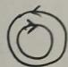

① 曲线积分与路径无关的判定.

定理 设函数 $P(x,y), Q(x,y)$ 在单连通域 $D$ 上有一阶连续偏导数，则以下四条等价：

(A) 曲线积分 $\int_{L} P \, \mathrm{d}x + Q \, \mathrm{d}y$ 与路径无关.

(B) $\oint_{L}Pdx+Qdy=0$ ,其中L为D中任一分段光滑闭曲线.

(C) $\frac{\partial P}{\partial y}=\frac{\partial Q}{\partial x},\forall(x,y)\in D.$

(D) $P(x,y)\mathrm{d}x+Q(x,y)\mathrm{d}y=\mathrm{d}F(x,y).$

② 计算.

(A) 改换路径计算.

一般是沿平行于坐标轴的直线段积分.

$$
\int_ {(x _ {1}, y _ {1})} ^ {(x _ {2}, y _ {2})} P \mathrm{d} x + Q \mathrm{d} y = \int_ {x _ {1}} ^ {x _ {2}} P (x, y _ {1}) \mathrm{d} x + \int_ {y _ {1}} ^ {y _ {2}} Q (x _ {2}, y) \mathrm{d} y,
$$

或

$$
\int_ {(x _ {1}, y _ {1})} ^ {(x _ {2}, y _ {2})} P \mathrm{d} x + Q \mathrm{d} y = \int_ {y _ {1}} ^ {y _ {2}} Q (x _ {1}, y) \mathrm{d} y + \int_ {x _ {1}} ^ {x _ {2}} P (x, y _ {2}) \mathrm{d} x.
$$

(B) 利用原函数计算.

设 $P\mathrm{d}x + Q\mathrm{d}y = \mathrm{d}F(x,y)$ ，即 $F(x,y)$ 为 $P\mathrm{d}x + Q\mathrm{d}y$ 的原函数，则

$$
\int_ {(x _ {1}, y _ {1})} ^ {(x _ {2}, y _ {2})} P \mathrm{d} x + Q \mathrm{d} y = F (x _ {2}, y _ {2}) - F (x _ {1}, y _ {1}).
$$

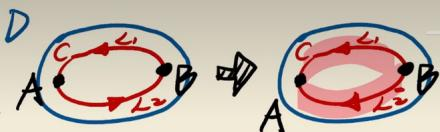

在格林公式中，正向（positive orientation）通常是指沿边界曲线的正方向，具体定义如下：

对于一个平面单连通或多连通区域 $D$ ，其边界曲线 $\partial D$ 的正向是指：当一个人沿着边界行走时，区域 $D$ 始终在他的左侧。

换句话说：

\- 如果区域 $D$ 始终在边界曲线的左侧，那么这个方向就是正向。

\- 对应的，如果区域在右侧，则是负向。

## 通俗理解（逆时针 vs 顺时针）

\- 对于无洞的单连通区域（如圆盘、矩形），正向通常就是逆时针方向。

\- 对于有洞的区域（如圆环），外边界取逆时针（区域在左侧），内边界取顺时针（区域仍在左侧，但此时内边界是洞的边界，区域在洞的外侧，所以沿内边界顺时针行走时，区域在左侧）。

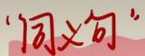

## 😊 平面曲线积分与路径无关的充要条件

设 $D$ 为单连通区域,函数 $P\left( {x,y}\right) ,Q\left( {x,y}\right)$ 在 $D$ 上有连续一阶偏导数,则以下命题等价:

$$
\int_ {D} \left(\frac {\partial u}{\partial x} - \frac {\partial f}{\partial y}\right) d \sigma
$$

① 在 $D$ 内对任一分段光滑的封闭曲线 $C$ , 有 $\oint_{C} P d x + Q d y = 0$ ;

② 在 $D$ 内任一曲线积分 $\int_{L} Pdx + Qdy$ 与路径无关;

$$
= \int_ {2 1} + \int_ {2 2} = \int_ {2 1}
$$

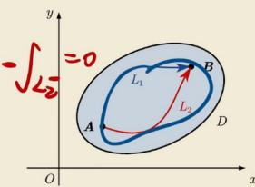

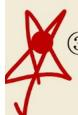

③ 在D内对恒有 $\frac{\partial Q}{\partial x}=\frac{\partial P}{\partial y}$ 成立；

与路径无关：

④ 存在二元函数 $u(x,y)$ ，使 $du(x,y)=P(x,y)dx+Q(x,y)dy;$

对于 G 内两个点 A、B 和 G 内任意两条曲线 $L_{1}, L_{2}$ ， $\int_{L_{1}}Pdx+Qdy=\int_{L_{2}}Pdx+Qdy$ 恒成立.

⑤ $P(x,y)\boldsymbol{i}+Q(x,y)\boldsymbol{j}$ 为某二元函数 $u(x,y)$ 的梯度.

知识点：

弧长公式:

## 弧长公式·复习 $\int_{L} ds$

直角坐标: $L: y = y(x)(a \leq x \leq b)$ , 则 $L = \int_{a}^{b} \sqrt{1 + [y'(x)]^2} dx$ .

参数方程： $L:\left\{ \begin{array}{l}x = x(t)\\ y = y(t) \end{array} (\alpha \leq t\leq \beta)\right.$ ，则 $L = \int_{\alpha}^{\beta}\sqrt{\left[x'(t)\right]^2 + \left[y'(t)\right]^2} dt.$

极坐标： $L: r = r(\theta)(\alpha \leq \theta \leq \beta)$ ，则 $L = \int_{\alpha}^{\beta}\sqrt{\left[r(\theta)\right]^2 + \left[r'(\theta)\right]^2} d\theta$

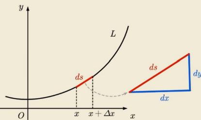

## 对坐标的曲线积分计算方法：

## 总结

\- 参数方程情形: 设平面曲线 $L$ 的方程为 $L: \left\{ \begin{array}{l} x = x(t), \\ y = y(t) \end{array} \right.$ , $t \in [\alpha, \beta]$ , 其中 $x(t), y(t)$ 有一阶连续导数. 若函数 $f(x, y)$ 在 $L$ 上连续, 则

$$
\int_ {L} f (x, y) d s = \int_ {\alpha} ^ {\beta} f (x (t), y (t)) \sqrt {\left[ x ^ {\prime} (t) \right] ^ {2} + \left[ y ^ {\prime} (t) \right] ^ {2}} d t.
$$

直角坐标情形: 设平面曲线 L 的方程为 $y = y(x) (a \leq x \leq b)$ ，则

$$
\int_ {L} f (x, y) d s = \int_ {a} ^ {b} f (x, y (x)) \sqrt {1 + [ y ^ {\prime} (x) ] ^ {2}} d x
$$

极坐标情形: 设平面曲线 L 的方程为 $r = r(\theta) (\alpha \leq \theta \leq \beta)$ ，则

$$
\int_ {L} f (x, y) d s = \int_ {\alpha} ^ {\beta} f (r \cos \theta , r \sin \theta) \sqrt {r ^ {2} + r ^ {\prime 2}} d \theta
$$

注：必须使定积分的下限≤上限

## 椭圆周长、面积公式：

## 椭圆周长、面积公式（考研直接背）

设椭圆标准方程：

$$
\frac {x ^ {2}}{a ^ {2}} + \frac {y ^ {2}}{b ^ {2}} = 1, \quad a > b > 0
$$

## 1. 面积公式（必考，简单）

$$
\boxed {S = \pi a b}
$$

\- 当 $a = b = r$ 时，就是圆面积 $S = \pi r^2$

## 2. 周长公式（考研只考近似，精确式不用记）

精确表达式（积分形式）

$$
L = 4 a \int_ {0} ^ {\frac {\pi}{2}} \sqrt {1 - e ^ {2} \sin^ {2} \theta} d \theta
$$

其中离心率 $e = \frac{\sqrt{a^2 - b^2}}{a}$ ，这是第二类椭圆积分，没有初等函数表达式。

## 第一类曲线积分的普通对称性：

## 第一类曲线积分的普通对称性

设空间曲线 $\Gamma$ 关于 $yOz$ 面对称, 且 $f(x, y, z)$ 关于 $x$ 有奇偶性, 则

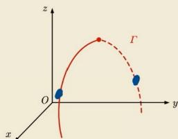

$$
\int_ {\Gamma} f (x, y, z) d s = \left\{ \begin{array}{l l} 2 \int_ {\Gamma_ {1}} f (x, y, z) d s, & f (- x, y, z) = f (x, y, z), \\ 0, & f (- x, y, z) = - f (x, y, z), \end{array} \right.
$$

其中 $\Gamma_{1}$ 是 $\Gamma$ 在 $yOz$ 面前侧的部分.

同理可得关于其他平面的普通对称性.

## 第一类曲线积分的化简神器

∠2同时满足(2个约束)

[例 4] 计算 $\oint_{L} (x^{2} + y^{2}) ds$ ，其中 L 为球面 $x^{2} + y^{2} + z^{2} = a^{2}$ 与平面 $x + y + z = 0$ 的交线.

解：由轮顶对称性.

“大国”

$$
\oint_ {L} x ^ {2} d s = \oint_ {L} y ^ {2} d s = \frac {1}{3} \oint_ {L} (x ^ {2} + y ^ {2} + z ^ {2}) d s
$$

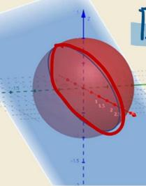

圆心与球心重合

$$
\begin{array}{r l} {\mathrm{原式}} & {= 2 \cdot \frac {1}{3} \oint_ {L} (x ^ {2} + y ^ {2} + z ^ {2}) d s} \\ & {= \frac {2}{3} \cdot a ^ {2} \oint_ {L} d s = \frac {a ^ {2}}{3} a ^ {2} \cdot 2 \pi a = \frac {4}{3} \pi a ^ {3}} \\ & {\mathrm{周长}} \end{array}\tag{#}
$$

## 形心公式:

## 第一类曲线积分的形心公式

所谓形心,是指均匀的平面薄片、空间立体、曲线段或曲面块等物体的质心. 对曲线段, 有

$$
\overline {{{x}}} ^ {\text {质心}} = \frac {\int_ {L} x \mu (x , y) d s}{\int_ {L} \mu (x , y) d s} \overset {\text {形心}} {=} \frac {\int_ {L} x d s}{\int_ {L} d s} \Rightarrow \int_ {L} x d s = \overline {{{x}}} \cdot \int_ {L} d s
$$

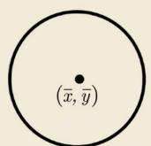

$$
\overline {{{y}}} ^ {\text {质心}} = \frac {\int_ {L} y \mu (x , y) d s}{\int_ {L} \mu (x , y) d s} \overset {\text {形心}} {=} \frac {\int_ {L} y d s}{\int_ {L} d s} \Rightarrow \int_ {L} y d s = \overline {{{y}}} \cdot \int_ {L} d s
$$

其中 $(\overline{x},\overline{y})$ 为曲线L的形心坐标， $\mu(x,y)$ 为L的面密度.

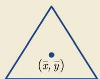

格林公式：

格林公式是连接第二类曲线积分与二重积分的重要工具。应用时需满足以下条件：

## 1. 封闭曲线条件（最关键）

\- 曲线 $L$ 必须是封闭的

格林公式直接针对封闭曲线上的积分。若曲线不封闭，需先补线使其封闭，再减去补线上的积分。

## 2. 方向条件

\- 取正向：封闭曲线的正向定义为逆时针方向（即区域始终在左侧）。若为顺时针，结果需加负号。

## 3. 函数可微性条件（在闭区域 D 上）

\- $P(x,y)$ 、 $Q(x,y)$ 在闭区域 $D$ （包括边界）上具有一阶连续偏导数。即 $\frac{\partial P}{\partial y}$ 与 $\frac{\partial Q}{\partial x}$ 在 $D$ 内连续。

## 4. 无奇点条件（重要补充）

\- 区域 $D$ 内不能有使 $P, Q$ 或它们的偏导数不连续/不存在的点（奇点）。若奇点在边界上，通常可处理；若在内部，需挖掉奇点（如用“补小圆”法）。

## 5. 单连通或多连通区域

\- 格林公式对单连通和多连通区域均成立，但需注意：

多连通区域（有洞）时，外边界取正向（逆时针），内边界取负向（顺时针），总方向为使区域始终在左侧。

若区域内有奇点，一般不能直接使用格林公式，除非特殊处理。

## 应用时注意

\- 若曲线封闭、方向正向、函数光滑、无内部奇点 $\rightarrow$ 直接使用格林公式。

\- 若曲线不封闭 $\rightarrow$ 补线封闭后再用。

\- 若有奇点 $\rightarrow$ 挖掉奇点，对剩余区域用格林公式（或另寻他法如参数化、特殊路径等）。

常见错误：忽视奇点存在（如 $P = \frac{-y}{x^2 + y^2}, Q = \frac{x}{x^2 + y^2}$ 在原点不可用格林公式直接套用大圆周，需挖去原点小圆）。

## 格林公式（曲线积分版）

格林公式是平面闭合曲线积分与二重积分之间的桥梁，用来把沿闭合曲线的第二类曲线积分转化为更简单的二重积分计算。

## 1. 标准公式

设：

\- $L$ 是平面上分段光滑、正向的闭合曲线

\- $D$ 是 $L$ 围成的闭区域

\- $P(x,y),Q(x,y)$ 在 $D$ 上有连续一阶偏导数

则：

$$
\oint_ {L} P d x + Q d y = \iint_ {D} \left(\frac {\partial Q}{\partial x} - \frac {\partial P}{\partial y}\right) d x d y
$$

## 关键说明

\- 左边：闭合曲线的第二类曲线积分（沿边界一圈）

\- 右边：二重积分（在内部区域上积分）

\- 正向：逆时针为正（人沿曲线走，区域在左侧）

解：P.Q 在(0,0)无定义.

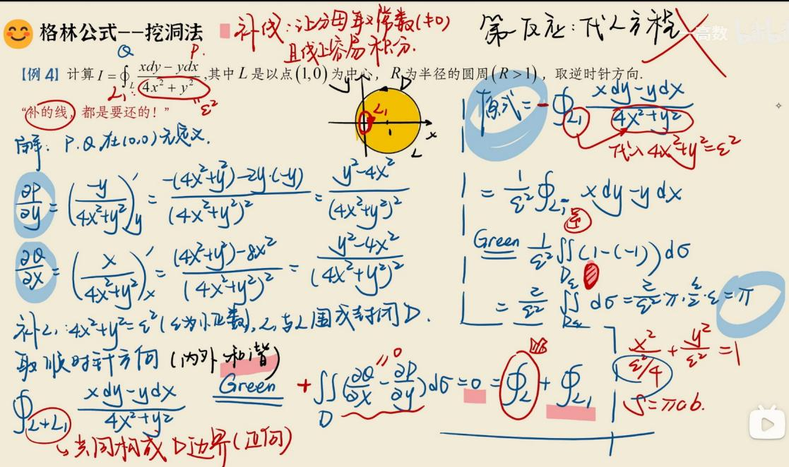

## 空间闭曲线→投影到平面降维→格林公式

## 斯托克斯公式的“平替”

【例 5】计算 $I = \oint_{\Gamma} y \, dx + z \, dy + x \, dz$ ，其中 $\Gamma: \begin{cases} x^{2} + y^{2} + z^{2} = 2az, \\ x + z = a \end{cases}$ (a > 0)，且从 z 轴正向看去为逆时针方向.
（法一：化定积分）消去 $\Gamma$ 方程中的 z，得 $\Gamma$ 在 xOy 面上投影曲线 L： $2x^{2} + y^{2} = a^{2}$ .

消z，写出x,y关系
x,y参数化
z.

$$
\left\{ \begin{array}{l} x = \frac {a}{\sqrt {2}} \cos t, \\ y = a \sin t, \\ z = a \left(1 - \frac {1}{\sqrt {2}} \cos t\right), \end{array} \right.
$$

t从0到2π,

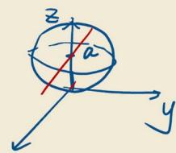

得 $I = \int_0^{2\pi}\left[-\frac{a^2}{\sqrt{2}}\sin^2 t + a^2\left(1 - \frac{1}{\sqrt{2}}\cos t\right)\cos t + \frac{a^2}{2}\cos t\sin t\right]\mathrm{d}t = \frac{-a^2}{\sqrt{2}}\int_0^{2\pi}\mathrm{d}t = -\sqrt{2}\pi a^2.$

#

## 空间闭曲线→投影到平面降维→格林公式

性何比之王

【例 5】计算 $I = \oint_{\Gamma} y \, dx + z \, dy + x \, dz$ ，其中 $\Gamma: \begin{cases} x^{2} + y^{2} + z^{2} = 2az, \\ x + z = a \end{cases}$ (a > 0)，且从 z 轴正向看去为逆时针方向.

“①将 $\Gamma$ 投影到 $xOy$ 面；②把积分中的 $z$ 全部换为 $x$ 和 $y$ ；③在平面曲线 $L$ 上积分”

解：P方程消z，得xoy西投影L: $2x^{2}+y^{2}=a^{2}$ ，一等时针方向. $dz=d(a-x)=-dx$

$$
\begin{array}{r l} {I} & {= \oint_ {L} y d x + (a - x) d y + x \cdot (- d x)} \\ & {= \oint_ {L} (y - x) d x + (a - x) d y = \iint_ {D} [ (- 1) - 1 ] d x d y} \\ & {= - 2 \iint_ {D} d x d y = - 2 \cdot \pi \cdot \frac {a}{\sqrt {2}} \cdot a = - \sqrt {2} \pi a ^ {2}} \end{array}
$$

## 梯度：

## 一、梯度的定义（多元函数）

设函数 $z = f(x, y)$ 在平面区域 $D$ 内具有一阶连续偏导数，则对任意点 $(x, y) \in D$ ，定义梯度为向量：

$$
\operatorname{grad} f = \nabla f = \left(\frac {\partial f}{\partial x}, \frac {\partial f}{\partial y}\right)
$$

若为三元函数 $u = f(x, y, z)$ ，则梯度为：

$$
\operatorname{grad} f = \left(\frac {\partial f}{\partial x}, \frac {\partial f}{\partial y}, \frac {\partial f}{\partial z}\right)
$$

一句话记：

梯度 = 把所有一阶偏导数按顺序排成一个向量。

## 二、梯度与方向导数的关系（核心考点）

函数在某点沿方向向量 $l$ 的方向导数为:

$$
\frac {\partial f}{\partial l} = \nabla f \cdot \boldsymbol {e} _ {l} = | \nabla f | \cos \theta
$$

其中:

\- $e_{l}$ 是 $l$ 方向的单位向量

\- $\theta$ 是梯度 $\nabla f$ 与方向 $l$ 的夹角

由此直接推出三个最重要结论：

1. 沿梯度方向，方向导数最大

最大值 $= |\nabla f| = \sqrt{\left(\frac{\partial f}{\partial x}\right)^2 + \left(\frac{\partial f}{\partial y}\right)^2}$

2. 沿梯度反方向，方向导数最小

$$
\mathrm{最小值} = - | \nabla f |
$$

3. 沿与梯度垂直的方向，方向导数 = 0

(也就是函数在该方向瞬时不增不减)

全微分方程：

## 全微分方程与原函数计算公式

全微分方程:

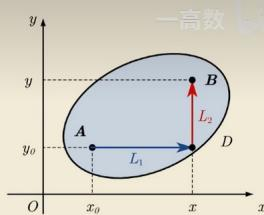

如果微分方程 $P(x,y)\mathrm{d}x + Q(x,y)\mathrm{d}y = 0$ 的左端恰好是某个 $u(x,y)$ 的全微分.

则称为全微分方程. 其隐式通解为 $u(x, y) = C$ , $C$ 是任意常数.

u(x,y)计算公式:

$$
u (x, y) = \int_ {(x _ {0}, y _ {0})} ^ {(x, y)} P (x, y) d x + Q (x, y) d y + C = \int_ {x _ {0}} ^ {x} P (x, y _ {0}) d x + \int_ {y _ {0}} ^ {y} Q (x, y) d y + C
$$

注:也可用凑微分法求 $u(x,y)$ .

两类曲线积分的联系：

## 两类曲线积分的联系

公式： $\int_{L}P(x,y)dx + Q(x,y)dy = \int_{L}[P(x,y)\cos \alpha +Q(x,y)\cos \beta ]ds.$

其中 $\cos\alpha,\cos\beta$ 为有向曲线 L 沿正向切向量的方向余弦.

cosβ
F
dr
dy
B
dr
dx
作用力 F = (P(x,y), Q(x,y))
cosα
dr = (dx, dy)
A
O
x
y

\- $L$ 的切向量:

参数方程：设有向曲线弧 $L: \begin{cases} x = x(t), \\ y = y(t) \end{cases}$ ，则切向量 $\tau = (x'(t), y'(t))$ 。

$\tau$ 的方向余弦： $(\cos \alpha ,\cos \beta) = \left(\frac{x'(t)}{\sqrt{x'^2(t) + y'^2(t)}},\frac{y'(t)}{\sqrt{x'^2(t) + y'^2(t)}}\right).$

直角坐标: 设有向曲线弧的方向余弦: $L: \left\{ \begin{array}{l} x = x, \\ y = y(x) \end{array} \right.$ , 则切向量 $\tau = (1, y'(x))$ .

$\tau$ 的方向余弦： $(\cos \alpha ,\cos \beta) = \left(\frac{1}{\sqrt{1 + y'^2(x)}},\frac{y'(x)}{\sqrt{1 + y'^2(x)}}\right).$

## 斯托克斯公式：

## 内容

播报 编辑

设 $\Sigma$ 是具有边界曲线 $\Gamma$ 的有向曲面， $\Sigma$ 的边界曲线 $\Gamma$ 的正向这样规定：使这个正向与有向曲面 $\Sigma$ 的法向量符合右手法则。即当右手除大拇指外的四指依曲线 $\Gamma$ 的绕行方向时，竖起的大拇指的指向与曲面 $\Sigma$ 的法向量的指向一致，如此定向的边界曲线 $\Gamma$ 称为有向曲面 $\Sigma$ 的正向边界曲线。

设 $\Gamma$ 为空间的一条分段光滑的有向曲线， $\Sigma$ 是以 $\Gamma$ 为边界的分片光滑的有向曲面， $\Gamma$ 的正向与 $\Sigma$ 的侧符合右手法则。函数 $P(x,y,z), Q(x,y,z), R(x,y,z)$ 在曲面 $\Sigma$ (连同边界 $\Gamma$ ) 上具有连续的一阶偏导数，则

$$
\oint_ {\Gamma} P d x + Q d y + R d z = \iint_ {\Sigma} \left(\frac {\partial R}{\partial y} - \frac {\partial Q}{\partial z}\right) d y d z + \left(\frac {\partial P}{\partial z} - \frac {\partial R}{\partial x}\right) d z d x + \left(\frac {\partial Q}{\partial x} - \frac {\partial P}{\partial y}\right) d x d y
$$

称为斯托克斯公式。 [2]

斯托克斯公式

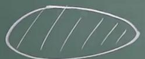

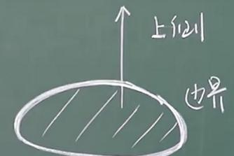

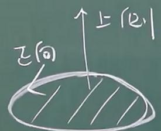

曲面

有向曲面边界曲线正向边界曲线

宋洁老师官方DII

斯托克斯公式

P: 空间有向闭曲线, $\Sigma$ ; 以 P 为边界的有向曲面
① $\iint_{\Sigma} \left( \frac{\partial R}{\partial y} - \frac{\partial Q}{\partial z} \right) dy dz + \left( \frac{\partial P}{\partial z} - \frac{\partial R}{\partial x} \right) dz dx + \left( \frac{\partial Q}{\partial x} - \frac{\partial P}{\partial y} \right) dx dy = \oint_{P} P dx + Q dy + R dz.$ 对坐标的曲面积分
② $\int_{a}^{b} f(x) dx = F(x) \bigg|_{a}^{b} = F(b) - F(a)$ 牛莱
③ $\iint_{D} \left( \frac{\partial Q}{\partial x} - \frac{\partial P}{\partial y} \right) dx dy = \oint_{L} P dx + Q dy$ , 格林.
④ $\iiint_{\Omega} \left( \frac{\partial P}{\partial x} + \frac{\partial Q}{\partial y} + \frac{\partial R}{\partial z} \right) dv = \oint_{\Sigma} P dy dz + Q dz dx + R dx dy$ . 高斯

$$
= \oint_ {P} P d x + Q d y + R d z. \iint_ {\Sigma} \left| \begin{array}{l l l} d y d z & d z d x & d x d y \\ \frac {\partial}{\partial x} & \frac {\partial}{\partial y} & \frac {\partial}{\partial z} \\ P & Q & R \end{array} \right|
$$

斯托克斯公式将曲面积分转化为二重积分时怎么判断正负

判断斯托克斯公式转化前后的正负，核心就看曲线方向与曲面法向量方向是否满足右手定则。这是考研数一曲面积分中必拿分但也最容易丢分的点。

下面用“三步法”教你彻底判断，附考研常考场景的速记规则。

## 一、核心判定法则：右手定则（唯一标准）

斯托克斯公式的本质是：曲线的方向（环流量）决定曲面的侧（通量）。

1. 伸出你的右手

2. 四指弯曲方向：贴合曲线 $\Gamma$ 的正向

3. 大拇指指向：即为曲面 $\Sigma$ 的法向量方向（取正侧）

结论：

\- 若曲线 $\Gamma$ 取正向，且曲面法向量与大拇指方向一致 $\rightarrow$ 取正号

\- 若曲线 $\Gamma$ 取正向，但曲面法向量与大拇指方向相反 $\rightarrow$ 必须取负号

\- 若曲线 $\Gamma$ 本身就是负向 $\rightarrow$ 先按上面判断，再整体乘以 $-1$

计算曲线积分时用到斯托克斯1公式，会有三个角

明白了，你指的是在利用斯托克斯公式将曲线积分转化为曲面积分时，需要将向量场旋度 $\nabla \times F$ 与曲面法向量 n 做点积，而计算这个点积时经常涉及三个方向角（方向余弦），也就是法向量与三个坐标轴的夹角。

具体来说，设曲面的单位法向量为：

$$
\mathbf {n} = (\cos \alpha , \cos \beta , \cos \gamma)
$$

其中 $\alpha, \beta, \gamma$ 分别是 n 与 x, y, z 轴正向的夹角，满足：

$$
\cos^ {2} \alpha + \cos^ {2} \beta + \cos^ {2} \gamma = 1
$$

## 曲面面积元素投影转换：

## 曲面面积元素投影转换（dxdy/dydz/dzdx 关系）

这部分是斯托克斯公式、第二类曲面积分的核心知识点，本质是曲面的不同坐标面投影之间的转换关系，我们一步步拆解清楚。

## 一、核心原理：法向量与投影的关系

对于光滑曲面 $\Sigma$ ，若其方程为 $z = z(x,y)$ （即可以表示为 $z$ 关于 $x,y$ 的显式函数），取上侧（法向量 $\vec{n}$ 与 $z$ 轴正方向夹角为锐角），则曲面的法向量为：

$$
\vec {n} = \left(- \frac {\partial z}{\partial x}, - \frac {\partial z}{\partial y}, 1\right)
$$

(推导：曲面的隐式方程为 $F(x,y,z)=z-z(x,y)=0$ ，法向量

$$
\vec {n} = \nabla F = (F _ {x}, F _ {y}, F _ {z}) = \left(- \frac {\partial z}{\partial x}, - \frac {\partial z}{\partial y}, 1\right))
$$

## 二、投影转换公式的推导

第二类曲面积分中，面积元素 dydz, dzdx, dxdy 分别是曲面在 yOz, zOx, xOy 坐标面上的有向投影，它们的比值等于法向量对应分量的比值：

$$
\frac {d y d z}{\cos \alpha} = \frac {d z d x}{\cos \beta} = \frac {d x d y}{\cos \gamma} = d S
$$

其中 $(\cos \alpha, \cos \beta, \cos \gamma)$ 是曲面的单位法向量， $dS$ 是曲面的无向面积元素。

## 1. 用 $z = z(x, y)$ 表示的转换公式

由法向量 $\vec{n} = (-z_x, - z_y, 1)$ （记 $z_x = \frac{\partial z}{\partial x}, z_y = \frac{\partial z}{\partial y}$ ），可得：

$$
\cos \alpha = \frac {- z _ {x}}{\sqrt {z _ {x} ^ {2} + z _ {y} ^ {2} + 1}}, \quad \cos \beta = \frac {- z _ {y}}{\sqrt {z _ {x} ^ {2} + z _ {y} ^ {2} + 1}}, \quad \cos \gamma = \frac {1}{\sqrt {z _ {x} ^ {2} + z _ {y} ^ {2} + 1}}
$$

结合 $\frac{dydz}{\cos\alpha} = \frac{dxdy}{\cos\gamma}$ ，代入得：

$$
d y d z = \frac {\cos \alpha}{\cos \gamma} d x d y = - z _ {x} \cdot d x d y
$$

同理，由 $\frac{dzdx}{\cos\beta} = \frac{dxdy}{\cos\gamma}$ ，得：

$$
d z d x = \frac {\cos \beta}{\cos \gamma} d x d y = - z _ {y} \cdot d x d y
$$

这就是你题目中用到的核心公式：

$$
\left\{ \begin{array}{l} d y d z = - \frac {\partial z}{\partial x} d x d y \\ d z d x = - \frac {\partial z}{\partial y} d x d y \end{array} \right.
$$

## 四、补充：其他曲面形式的转换公式

1. 曲面表示为 $x = x(y, z)$ （取前侧，法向量 $x$ 分量为正）

法向量 $\vec{n} = \left(1, -\frac{\partial x}{\partial y}, -\frac{\partial x}{\partial z}\right)$ ，转换公式：

$$
\boxed {\left\{ \begin{array}{l} d x d y = - \frac {\partial x}{\partial z} d y d z \\ d z d x = - \frac {\partial x}{\partial y} d y d z \end{array} \right.}
$$

2. 曲面表示为 $y = y(x, z)$ （取右侧，法向量 $y$ 分量为正）

法向量 $\vec{n} = \left(-\frac{\partial y}{\partial x}, 1, -\frac{\partial y}{\partial z}\right)$ ，转换公式：

$$
\int d y d z = - \frac {\partial y}{\partial x} d z d x
$$

## 五、关键注意事项（考研高频考点）

1. 方向的影响

公式默认取上侧 / 前侧 / 右侧（对应法向量 $z / x / y$ 分量为正）；若取下侧 / 后侧 / 左侧，公式需要整体加负号。

例如： $z = z(x, y)$ 取下侧时，法向量为 $(z_x, z_y, -1)$ ，此时：

$$
d y d z = z _ {x} \cdot d x d y, \quad d z d x = z _ {y} \cdot d x d y
$$

2. 适用场景

这类转换公式的核心作用是将第二类曲面积分统一转化为 $xOy$ 面上的二重积分，避免分别计算三个投影的积分，大幅简化计算（尤其是斯托克斯公式中，将线积分转化为曲面积分后，用这个公式统一投影）。

3. 与第一类曲面积分的关系

第一类曲面积分的面积元素 $dS = \sqrt{1 + z_x^2 + z_y^2} dxdy$ ，而第二类的 $dxdy = \cos \gamma \cdot dS$ ，本质是有向投

影，符号由法向量方向决定。

题目：

题1:

方法1:

设曲线 $I$ 为圆柱面 $x^{2} + y^{2} = 4$ 与平面 $\frac{x}{2} + z = 1$ 的交线，从 $z$ 轴正向看去为逆时针方向，计算曲线积分

$$
\oint_ {\Gamma} (y ^ {2} z - x) d x + (3 x - 2 y z ^ {2}) d y + (x + y + z) d z
$$

这是第二类空间曲线积分（对坐标的曲线积分），典型考研数一题型，解法首选斯托克斯公式。

## 一、题目类型

$$
\oint_ {L} P d x + Q d y + R d z
$$

\- 空间闭合曲线积分

\- 从 $z$ 轴正向看逆时针 $\rightarrow$ 给出了曲线方向

\- 标准考点：斯托克斯公式

## 二、通用解法步骤（斯托克斯公式）

斯托克斯公式：

$$
\oint_ {L} P d x + Q d y + R d z = \iint_ {\Sigma} \left| \begin{array}{c c c} d y d z & d z d x & d x d y \\ \frac {\partial}{\partial x} & \frac {\partial}{\partial y} & \frac {\partial}{\partial z} \\ P & Q & R \end{array} \right|
$$

你这题：

$$
P = y ^ {2} z - x, \quad Q = 3 x - 2 y z ^ {2}, \quad R = x + y + z
$$

## 1. 算旋度（行列式）

$$
\left| \begin{array}{c c c} \mathbf {i} & \mathbf {j} & \mathbf {k} \\ \frac {\partial}{\partial x} & \frac {\partial}{\partial y} & \frac {\partial}{\partial z} \\ y ^ {2} z - x & 3 x - 2 y z ^ {2} & x + y + z \end{array} \right|
$$

逐项计算：

\- $i$ 分量: $\frac{\partial R}{\partial y} - \frac{\partial Q}{\partial z} = 1 + 4yz$

\- $j$ 分量: $\frac{\partial P}{\partial z} - \frac{\partial R}{\partial x} = y^2 - 1$

\- $k$ 分量: $\frac{\partial Q}{\partial x} - \frac{\partial P}{\partial y} = 3 - 2yz$

旋度向量：

$$
\operatorname{rot} \vec {F} = (1 + 4 y z, y ^ {2} - 1, 3 - 2 y z)
$$

## 2. 选曲面 $\Sigma$

曲线是

$$
x ^ {2} + y ^ {2} = 4, \quad \frac {x}{2} + z = 1 \Rightarrow z = 1 - \frac {x}{2}
$$

取平面上被圆围出的那一块作为 $\Sigma$ ，方向：上侧（与逆时针右手系一致）。

平面法向量:

$$
z = 1 - \frac {x}{2} \Rightarrow \frac {x}{2} + z = 1
$$

法向量 $\vec{n} = (\frac{1}{2}, 0, 1)$ ，单位法向量可直接用投影公式：

$$
d y d z = - \frac {\partial z}{\partial x} d x d y, \quad d z d x = - \frac {\partial z}{\partial y} d x d y
$$

这里：

$$
z _ {x} = - \frac {1}{2}, z _ {y} = 0 \Rightarrow d y d z = \frac {1}{2} d x d y, d z d x = 0
$$

## 3. 代入斯托克斯公式

$$
\oint_ {L} = \iint_ {D _ {x y}} \left[ (1 + 4 y z) \cdot \frac {1}{2} + (y ^ {2} - 1) \cdot 0 + (3 - 2 y z) \cdot 1 \right] d x d y
$$

化简：

$$
\frac {1}{2} (1 + 4 y z) + (3 - 2 y z) = \frac {1}{2} + 2 y z + 3 - 2 y z = \frac {7}{2}
$$

惊喜: $yz$ 全部抵消!

所以积分变成:

$$
\iint_ {x ^ {2} + y ^ {2} \leq 4} \frac {7}{2} d x d y = \frac {7}{2} \cdot (\pi \cdot 2 ^ {2}) = \frac {7}{2} \cdot 4 \pi = 1 4 \pi
$$

## 三、最终答案

14π

## 方法 2:

## 156 【答案】 $14\pi$

【分析】将 $z = 1 - \frac{x}{2}$ 代入积分, 得

$$
\begin{array}{l} \oint_ {\Gamma} (y ^ {2} z - x) \mathrm{d} x + (3 x - 2 y z ^ {2}) \mathrm{d} y + (x + y + z) \mathrm{d} z \\ = \oint_ {x ^ {2} + y ^ {2} = 4} \left(y ^ {2} - \frac {1}{2} x y ^ {2} - x\right) \mathrm{d} x + \left(3 x - 2 y + 2 x y - \frac {x ^ {2} y}{2}\right) \mathrm{d} y + \left(\frac {x}{2} + y + 1\right) \left(- \frac {1}{2}\right) \mathrm{d} x \\ = \oint_ {x ^ {2} + y ^ {2} = 4} \left(y ^ {2} - \frac {1}{2} x y ^ {2} - \frac {5}{4} x - \frac {y}{2} - \frac {1}{2}\right) \mathrm{d} x + \left(3 x - 2 y + 2 x y - \frac {x ^ {2} y}{2}\right) \mathrm{d} y \\ = \iint_ {x ^ {2} + y ^ {2} \leqslant 4} \left(3 + 2 y - x y - 2 y + x y + \frac {1}{2}\right) \mathrm{d} x \mathrm{d} y = \iint_ {x ^ {2} + y ^ {2} \leqslant 4} \left(3 + \frac {1}{2}\right) = 1 4 \pi . \end{array}
$$

## 题2:

157 设函数 $u(x, y, z)$ 在球面 $\Sigma: x^2 + y^2 + z^2 = 2z$ 所包围的闭区域 $\Omega$ 上有二阶连续偏导数，且满足关系式

$$
\frac {\partial^ {2} u}{\partial x ^ {2}} + \frac {\partial^ {2} u}{\partial y ^ {2}} + \frac {\partial^ {2} u}{\partial z ^ {2}} = x ^ {2} + y ^ {2} + z ^ {2}.
$$

n 为 $\Sigma$ 外法线方向的单位向量, 计算 $I = \iint_{\Sigma} \frac{\partial u}{\partial n} \, dS = \frac{52}{15} \pi$ .

笔记区

答题收获 □ 核心结论 □ 易错细节 □ 特例反例 □ 知识盲区

## 数学基础过关 660题 数学

## 157 【答案】 $\frac{32}{15}\pi$

【分析】设 $n = \{\cos \alpha, \cos \beta, \cos \gamma\}$ ，则 $\frac{\partial u}{\partial n} = \frac{\partial u}{\partial x} \cos \alpha + \frac{\partial u}{\partial y} \cos \beta + \frac{\partial u}{\partial z} \cos \gamma$ ，所以

$$
I = \iint_ {\Sigma} \frac {\partial u}{\partial \boldsymbol {n}} \mathrm{d} S = \iint_ {\Sigma} \left(\frac {\partial u}{\partial x} \mathrm{d} y \mathrm{d} z + \frac {\partial u}{\partial y} \mathrm{d} x \mathrm{d} z + \frac {\partial u}{\partial z} \mathrm{d} x \mathrm{d} y\right),
$$

由高斯公式可得：

$$
\begin{array}{l} I = \iiint_ {\Omega} \left(\frac {\partial^ {2} u}{\partial x ^ {2}} + \frac {\partial^ {2} u}{\partial y ^ {2}} + \frac {\partial^ {2} u}{\partial z ^ {2}}\right) \mathrm{d} v = \iiint_ {\Omega} (x ^ {2} + y ^ {2} + z ^ {2}) \mathrm{d} x \mathrm{d} y \mathrm{d} z \\ = \int_ {0} ^ {2 \pi} \mathrm{d} \theta \int_ {0} ^ {\frac {\pi}{2}} \mathrm{d} \varphi \int_ {0} ^ {2 \cos \varphi} r ^ {2} \cdot r ^ {2} \sin \varphi \mathrm{d} r = \frac {3 2}{1 5} \pi . \end{array}
$$

## 第二节：曲面积分

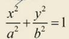  
平面  
球面

## 第一类曲面积分:

## 老演员表——常用曲面/平面方程

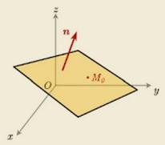

$$
A x + B y + C z + D = 0
$$

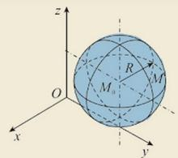

$$
\left(x - x _ {0}\right) ^ {2} + \left(y - y _ {0}\right) ^ {2} + \left(z - z _ {0}\right) ^ {2} = R ^ {2}
$$

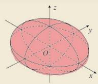

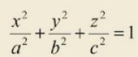  
椭球面

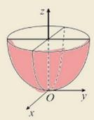

$$
z = x ^ {2} + y ^ {2}
$$

旋转抛物面

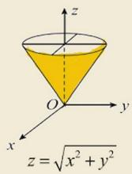  
圆锥面

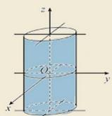  
椭圆柱面

## “一投二代三计算”

$$
x, y, z
$$

设曲面 $\Sigma : z = z(x, y)$ 为单值函数， $\Sigma$ 在 $xoy$ 面上的投影为 $D_{xy}$ ，且 $z = z(x, y)$ 在 $D_{xy}$ 具有连续偏导数，则

$$
\iint_ {\Sigma} f (x, y, z) d S = \iint_ {D _ {x y}} f (x, y, z (x, y)) \sqrt {1 + z _ {x} ^ {\prime 2} (x , y) + z _ {y} ^ {\prime 2} (x , y)} d x d y.
$$

设曲面 $\Sigma : y = y(x, z)$ 为单值函数， $\Sigma$ 在 $xoz$ 面上的投影为 $D_{xz}$ ，且 $y = y(x, z)$ 在 $D_{xz}$ 具有连续偏导数，则

$$
\iint_ {\Sigma} f (x, y, z) d S = \iint_ {D _ {x z}} f (x, y (x, z), z) \sqrt {1 + y _ {x} ^ {\prime 2} (x , z) + y _ {z} ^ {\prime 2} (x , z)} d x d z.
$$

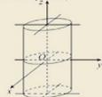

设曲面 $\Sigma : x = x(y, z)$ 为单值函数， $\Sigma$ 在 $yoz$ 面上的投影为 $D_{yz}$ ，且 $x = x(y, z)$ 在 $D_{yz}$ 具有连续偏导数，则

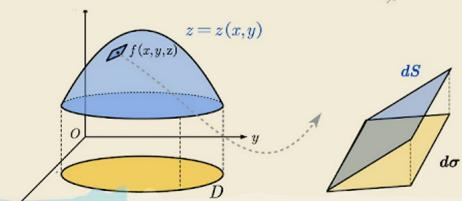

$$
\iint_ {\Sigma} f (x, y, z) d S = \iint_ {D _ {y z}} f (x (y, z), y, z) \sqrt {1 + x _ {y} ^ {\prime 2} (y , z) + x _ {z} ^ {\prime 2} (y , z)} d y d z.
$$

## “一投二代三计算” “Σ是x,y,z之间永远满足的约束（羁绊）.”——沃·茨基硕德

设曲面 $\Sigma : z = z(x, y)$ 为单值函数， $\Sigma$ 在 $xoy$ 面上的投影为 $D_{xy}$ ，且 $z = z(x, y)$ 在 $D_{xy}$ 具有连续偏导数，则

$$
\iint_ {\Sigma} f (x, y, z) d S = \iint_ {D _ {x y}} f (x, y, z (x, y)) \sqrt {1 + z _ {x} ^ {\prime 2} (x , y) + z _ {y} ^ {\prime 2} (x , y)} d x d y.
$$

设曲面 $\Sigma: y = y(x, z)$ 为单值函数， $\Sigma$ 在 xoz 面上的投影为 $D_{xz}$ ，且 $y = y(x, z)$ 在 $D_{xz}$ 具有连续偏导数，则 $\Sigma F_{0}: x = -\sqrt{1 - y^{2}}$

$$
\iint_ {\Sigma} f (x, y, z) d S = \iint_ {D _ {x}} f (x, y (x, z), z) \sqrt {1 + y _ {x} ^ {\prime 2} (x , z) + y _ {z} ^ {\prime 2} (x , z)} d x d z.
$$

$\xi_{\text{前}}: x = \sqrt{1 - y^{2}}$

设曲面 $\Sigma : x = x(y, z)$ 为单值函数， $\Sigma$ 在 $yoz$ 面上的投影为 $D_{yz}$ ，且 $x = x(y, z)$ 在 $D_{yz}$ 具有连续偏导数，则

$\iint_{S}f(x,y,z)dS = \iint_{D}f(x(y,z),y,z)\sqrt{1 + x_y'^2(y,z) + x_z'^2(y,z)} dydz.$

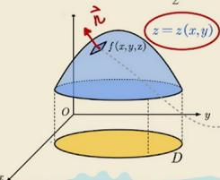

$$
z = z (x, y) \times t (x, y, z)
$$

$\therefore z \uparrow$ 两面面积元素

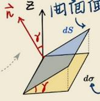

$$
d S \cdot \cos \gamma = d \sigma
$$

$$
\vec {n} = (- z _ {x} ^ {\prime}, - z _ {y} ^ {\prime}, ①)
$$

投影面积

$\therefore n$ 关于 $z$ 轴正方向的方向余弦

$$
\cos \gamma = \frac {1}{\sqrt {z _ {x} ^ {\prime 2} + z _ {y} ^ {\prime 2} + 1}} \Rightarrow d S = \sqrt {z _ {x} ^ {\prime 2} + z _ {y} ^ {\prime 2} + 1} d \sigma
$$

## 第一类曲面积分的运算性质:

性质1（线性性）：设 $k_{1}, k_{2}$ 是常数，则

$$
\iint_ {\Sigma} \left[ k _ {1} f (x, y, z) \pm k _ {2} g (x, y, z) \right] d S = k _ {1} \iint_ {\Sigma} f (x, y, z) d S \pm k _ {2} \iint_ {\Sigma} g (x, y, z) d S.
$$

性质2（可加性）：设积分曲面 $\Sigma$ 可分为两段分片光滑曲面 $\Sigma_{1},\Sigma_{2}$ ，则

$$
\iint_ {\Sigma} f (x, y, z) d S = \iint_ {\Sigma_ {1}} f (x, y, z) d S + \iint_ {\Sigma_ {2}} f (x, y, z) d S.
$$

性质 3 $\iint_{\Sigma} 1dS = S$ ( $\Sigma$ 的面积).

【曲面光滑】曲面在每点都有切平面，并且切平面的方向随着曲面上点的连续变动而连续变化。【曲面分片光滑】曲面是由有限个光滑曲面并起来的。

(比如球面是光滑曲面, 长方体的边界面是分片光滑曲面)

## 第三节 曲面积分

考试内容概要

一、对面积的曲面积分(第一类曲面积分)

## 1. 定义

$$
\iint_ {\Sigma} f (x, y, z) \mathrm{d} S = \lim _ {\lambda \rightarrow 0} \sum_ {i = 1} ^ {n} f (\xi_ {i}, \eta_ {i}, \zeta_ {i}) \Delta S _ {i}.
$$

## 2. 性质

$\iint_{\Sigma}f(x,y,z)\mathrm{d}S=\iint_{-\Sigma}f(x,y,z)\mathrm{d}S($ 与积分曲面的方向无关 $)$ .

## 3. 计算

(1) 直接法.

设曲面 $\Sigma: z = z(x, y), (x, y) \in D_{xy}$ ,

$$
\iint_ {\Sigma} f (x, y, z) \mathrm{d} S = \iint_ {D _ {x y}} f [ x, y, z (x, y) ] \sqrt {1 + (z _ {x} ^ {\prime}) ^ {2} + (z _ {y} ^ {\prime}) ^ {2}} \mathrm{d} x \mathrm{d} y.
$$

若曲面由方程 $x = x(y, z)$ 或 $y = y(z, x)$ 给出，也可类似地把对面积的面积分化为相应的二重积分。

(2) 利用奇偶性.

若曲面 $\Sigma$ 关于 $xOy$ 面对称，则

$\iint_{\Sigma}f(x,y,z)\mathrm{d}S=\left\{\begin{aligned}&2\iint_{\Sigma_{z\geqslant0}}f(x,y,z)\mathrm{d}S,\\ &0,\end{aligned}\right.$ 当 $f(x,y,z)$ 关于 z 为偶函数，当 $f(x,y,z)$ 关于 z 为奇函数.

用流量理解第二类曲面积分!!! m=A $\cdot$ $\overrightarrow{v}$ $\cdot$ $\overrightarrow{n}$ 二重积分 $d \times dy$

$\iint_{\Sigma} \boldsymbol{v} \cdot \boldsymbol{n} dS = \iint_{\Sigma} (P(x, y, z) \cos \alpha + Q(x, y, z) \cos \beta + R(x, y, z) \cos \gamma) dS$ 模积面积 $= \iint_{\Sigma} P(x, y, z) dy dz + Q(x, y, z) dz dx + R(x, y, z) dx dy$ $dx \wedge dy = dS - d$

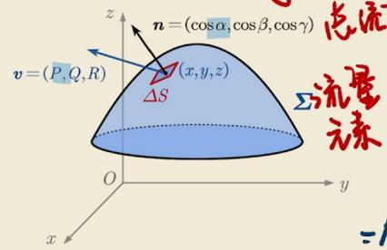

(x,y,z)处.△S

$$
\begin{array}{r l} {d x \wedge d y} & {= d S \cdot \cos \gamma} \\ {\mathrm{有+有-}} \\ {d y \wedge d x} & {= - d x \wedge d y} \end{array}
$$

元素

$$
\begin{array}{r l} {\Delta m} & {= \Delta S \cdot \vec {v} \cdot \vec {\pi}} \\ & {= (P \cos \alpha + Q \cos \beta + A \cos \gamma) \cdot \Delta S} \end{array}
$$

$\Delta S$ 在 $xoy$ 腾

稳定流动的不可压缩液体（假定密度为1）以速度 $v=P(x,y,z)\boldsymbol{i}+Q(x,y,z)\boldsymbol{j}+R(x,y,z)\boldsymbol{k}$ 流向 $\Sigma$ ，

在单位时间内流过曲面 $\Sigma$ 指定侧的流体的质量.

## 直接投影法（往自己的面投影，不能选面!!!）

“一投二代三定号”

设曲面 $\Sigma : z = z(x, y)$ ， $D_{xy}$ 为曲面 $\Sigma$ 在 $xoy$ 面上的投影区域，则

$$
\iint_ {\Sigma} R (x, y, z) d x d y = \pm \iint_ {D _ {x y}} R (x, y, z (x, y)) d x d y.
$$

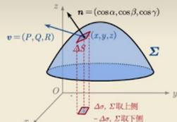

其中，若 $\Sigma$ 取上侧（法向量与 $z$ 轴正向夹锐角），则右端取“+”；若 $\Sigma$ 取下侧，则右端取“-”.

设曲面 $\Sigma : x = x(y, z)$ ， $D_{yz}$ 为曲面 $\Sigma$ 在 $yoz$ 面上的投影区域，则

$$
\iint_ {\Sigma} P (x, y, z) d y d z = \pm \iint_ {D _ {y z}} P (x (y, z), y, z) d y d z.
$$

其中，若 $\Sigma$ 取前侧（法向量与 $x$ 轴正向夹锐角），则右端取“+”；若 $\Sigma$ 取后侧，则右端取“-”。

若曲面 $\Sigma : y = y(x, z)$ ， $D_{zx}$ 为曲面 $\Sigma$ 在 $zox$ 面上的投影区域，则

$$
\iint_ {\Sigma} Q (x, y, z) d z d x = \pm \iint_ {D _ {z x}} R (x, y (z, x), z) d z d x.
$$

其中，若 $\Sigma$ 取右侧（法向量与 $y$ 轴正向夹锐角），则右端取“+”；若 $\Sigma$ 取左侧，则右端取“-”.

## 第二类曲面积分的普通对称性

设积分曲面 $\Sigma$ 关于 $xoy$ 面对称. 且 $R(x, y, z)$ 关于 $z$ 有奇偶性, 则

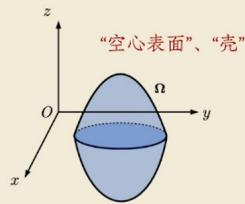

$$
\iint_ {\Sigma} R (x, y, z) d x d y = \left\{ \begin{array}{l l} 0, & f (x, y, - z) = f (x, y, z), \\ 2 \iint_ {\Sigma_ {1}} R (x, y, z) d x d y, & f (x, y, - z) = - f (x, y, z), \end{array} \right.
$$

其中 $\Sigma_{1}$ 是 $\Sigma$ 在 $z$ 轴正半轴的部分. 同理可得关于其他平面的普通对称性.

"关于z偶零奇倍"

PART II
第二类曲面积分怎么算？ $z$ 关于 $x_{0}y$ 面上下的利 $xyz$ 关于 $z$ 奇（信）

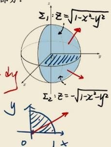

【例1】计算曲面积分 $\iint_{\Sigma}xyz\,dx dy$ ，其中 $\Sigma$ 是球面 $x^{2}+y^{2}+z^{2}=1$ 外侧在 $x\geq0,y\geq0$ 的部分。
解：将 $\Sigma$ 分为 $\Sigma_{1},\Sigma_{2}$ 上两片。Dxy: $x^{2}+y^{2}\leq1,x\geq0,y\geq0$ $\Sigma_{1}^{y}:z=\sqrt{1-x^{2}-y^{2}}$ ，取正侧； $\Sigma_{2}^{y}:z=-\sqrt{1-x^{2}-y^{2}}$ ，取下侧
= 2 $\iint_{\Sigma_{1}}xy\,z\,dx\,dy$ 二极二代 $\iint_{\Sigma_{1}}xy\,z\,dx\,dy=\iint_{\Sigma_{1}}xy\,z\,dx\,dy+\iint_{\Sigma_{2}}xyz\,d\,x\,dy$ 三定号 $=+\iint_{Dxy}\sqrt{1-x^{2}-y^{2}}\,dx\,dy-\iint_{Dxy}\left(xy\cdot(-\sqrt{1-x^{2}-y^{2}})\right)\,dx\,dy$ $=2\iint_{Dxy}\sqrt{1-x^{2}-y^{2}}\,dx\,dy=\frac{\pi}{2}\int_{0}^{1}\cos\theta\cdot n\sin\theta\cdot\sqrt{1-r^{2}}n dr$ $=2\int_{0}^{\frac{\pi}{2}}\cos\theta\cdot n\sin\theta d\theta\cdot\int_{0}^{1}\frac{\pi}{2}\sqrt{1-r^{2}}d r=2-\frac{t}{2}\sin^{2}\theta/\frac{\pi}{2}\cdot\int_{0}^{\frac{\pi}{2}}\sin t^{3}(1-s)^{2}t dt$ $=1-\left(\frac{2}{3}-\frac{4}{5}\cdot\frac{z}{3}\right)=\frac{2}{15}$

直接投影法:一投二代三定号 投影为四边形, 积分为0.有向右不与

【例2】计算曲面积分 $\iint_{\Sigma} x^{2} dy dz + y^{2} dz dx + z^{2} dx dy$ , 其中 $\Sigma$ 长方体 $\Omega$ 整个表面的外侧, $\Omega = \{(x, y, z) | 0 \leq x \leq a, 0 \leq y \leq b, 0 \leq z \leq c\}$ 设 $\Sigma_{1}: Z = C$ ( $0 \leq x \leq a, 0 \leq y \leq b$ , 上侧) $\Sigma_{2}: Z = 0$ ( $0 \leq x \leq a, 0 \leq y \leq b$ , 下侧) $\oint_{\Sigma} z^{2} dx dy = \iint_{\Sigma_{1}} z^{2} dx dy + \iint_{\Sigma_{2}} z^{2} dx dy + \iint_{\Sigma - \Sigma_{1} - \Sigma_{2}} z^{2} dx dy$ $= +\iint_{Dxy} c^{2} dx dy = c^{2} \iint_{Dxy} dx dy = abc^{2}$

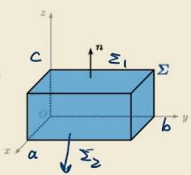

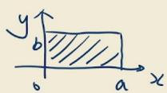

将 $\Sigma$ 方程代入到被积函数中, 达到简化计算的效果. (两类线面积分都可如此操作!)

直接投影法:一投二代三定号 投影为两或, 科舍为0. 看略不与

【例2】计算曲面积分 $\oiint_{\Sigma} x^{2} dy dz + y^{2} dz dx + z^{2} dx dy$ ，其中 $\Sigma$ 长方体 $\Omega$ 整个表面的外侧，

$$
\Omega = \{(x, y, z) \mid 0 \leq x \leq a, 0 \leq y \leq b, 0 \leq z \leq c \}.
$$

$$
\mathrm{设} \Sigma_ {1}: z = c (0 \leq x \leq a, 0 \leq y \leq b, \mathrm{上侧})
$$

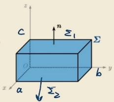

$$
\Sigma_ {2}: z = 0 (0 \leq x \leq a, 0 \leq y \leq b. \mathrm{下侧})
$$

$$
\oint_ {\Sigma^ {4}} z ^ {2} d x d y = \iint_ {\Sigma_ {1}} z ^ {2} d x d y + \iint_ {\Sigma_ {2}} z ^ {2} d x d y + \iint_ {\Sigma - \Sigma_ {1} - \Sigma_ {2}} z ^ {2} d x d y
$$

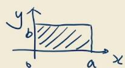

$$
= \int_ {D _ {x y}} c ^ {2} d x d y = c ^ {2} \int_ {D _ {x y}} d x d y = a b c ^ {2}
$$

$$
\begin{array}{r l} {\mathrm{陈式}} & {= a b c ^ {2} + b c a ^ {2} + a c b ^ {2}} \\ & {= a b c (a + b + c)} \end{array}
$$

$$
\mathrm{同理} \oint_ {\Sigma} x ^ {2} d y d z = b c a ^ {2}, \oint_ {\Sigma} y ^ {2} d z d x = a c b ^ {2}
$$

将Σ方程代入到被积函数中,达到简化计算的效果。(两类线面积分都可如此操作!)

“Σ是x,y,z之间永远满足的约束。”——沃·茨基硕德

## 两类曲面积分的联系!!!

$\iint_{\Sigma} P(d y d z + Q d z d x + R d x d y) = \pm \iint_{D_{xy}} \left[ P(-z_x') + Q(-z_y') + R \right] d x d y,$

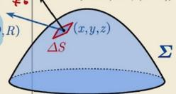

$$
z = z (x, y)
$$

其中,曲面取上(下)侧,取正(负)号.(前提 $\sum:z=z(x,y)$ 在 $D_{xy}$ 连续可偏导).

其中 $\cos \alpha, \cos \beta, \cos \gamma$ 为有向曲面 $\Sigma$ 在点 $(x, y, z)$ 处的法向量的方向余弦.

$$
\overrightarrow {n} = (z _ {x} ^ {\prime}, z _ {y} ^ {\prime}, - 1) ^ {3 0}
$$

转换(合一)投影法:往同一坐标面投影 $z_{x}^{\prime}=\frac{1}{2}\cdot2x=x$

【例3】计算 $\iint_{\Sigma}\left(z^2 + x\right)\mathrm{d}y\mathrm{d}z - z\mathrm{d}x\mathrm{d}y$ ，其中 $\Sigma$ 是 $z = \frac{1}{2}\left(x^2 + y^2\right)$ 介于平面 $z = 0$ 及 $z = 2$ 之间的部分的下侧.

解：Σ在x,y=投影区域Dxy: x²+y²≤4.

由转换投影法.

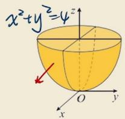

$$
\begin{array}{r l} & {\int_ {z} \int (z ^ {2} + x) d y d z - z d x d y = - \iint_ {D _ {x y}} [ P (- z _ {x} ^ {\prime}) + R ] d x d y} \\ & {= - \iint_ {D _ {x y}} \left[ \left(\frac {1}{4} (x ^ {2} + y ^ {2}) ^ {2} + x\right) (- x) \right] - \frac {1}{2} (x ^ {2} + y ^ {2}) d x d y} \\ & {\mathrm{关于x奇.D关于y轴不右}} \\ & {= \frac {1}{2} \iint_ {D _ {x y}} (3 x ^ {2} + y ^ {2}) d x d y \quad \mathrm{轮换} \quad \frac {1}{2} \cdot 4 \cdot \frac {1}{2} \iint_ {D _ {x y}} (x ^ {2} + y ^ {2}) d x d y} \\ & {= \int_ {0} ^ {2 \pi} d \theta \int_ {0} ^ {2} r ^ {2}. r d r = 2 \pi \cdot \frac {1}{4} r ^ {4} | _ {0} ^ {2} = 8 \pi} \end{array}
$$

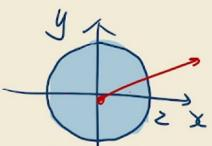

$$
\iint_ {D} x ^ {2} d \sigma = \sqrt {\iint_ {D} y ^ {2}} d \sigma
$$

## 高斯公式：

高斯(Gauss)公式——第二类曲面积分

若 ① 有向分片光滑的闭曲面 $\Sigma$ 围成空间有界闭区域 $\Omega$

② $P(x,y,z),Q(x,y,z),R(x,y,z)$ 在 $\Omega$ 上有一阶连续偏导数

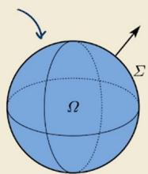

③ $\Sigma$ 是 $\Omega$ 的整个边界曲面的外侧

则有 $\iint_{\Sigma} P dy dz + Q dz dx + R dx dy = \iiint_{\Omega} \left( \frac{\partial P}{\partial x} + \frac{\partial Q}{\partial y} + \frac{\partial R}{\partial z} \right) dV$

注 1: 用高斯公式前, 可代入 $\Sigma$ 方程化简, 使计算更容易.

注 2: Ω可以为空间二维单连通区域或复连通区域.

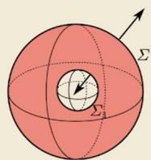

你这个问题问得很关键，涉及到高斯公式使用的前提条件。简单直接地回答：

是的，高斯公式要求函数 $P(x,y,z), Q(x,y,z), R(x,y,z)$ 在闭区域 $\Omega$ （即曲面所围成的空间体，包括内部）上具有一阶连续偏导数。

更精确地说，完整的条件是：

1. 闭区域 $\Omega$ 是由分片光滑的闭曲面 $\Sigma$ 所围成。

2. 函数 P, Q, R 在 $\Omega$ 上（包含内部和边界曲面）具有一阶连续偏导数。

## 这里有两个容易被忽视的关键点：

1. 要求的是“整个闭区域”而不是“曲面上”

你问“在曲面上存在一阶偏导”，其实不完全是。因为公式把曲面积分转化为三重积分，所以要求函数在整个三维区域内部及边界都可偏导且连续。如果只在曲面（边界）上可偏导，但内部某点不满足（比如无定义或不可导），高斯公式不能直接使用。

## 2. 如果不满足条件怎么办？（考研常见考点）

如果函数在区域内部存在“奇点”（例如分母出现 $x^{2} + y^{2} + z^{2}$ ，在原点无定义），则不能直接套用高斯公式。这时需要用挖洞法（也称补面法）：

\- 以奇点为中心，挖掉一个小球面或小椭球面，形成一个新的不含奇点的闭区域。

\- 在这个新区域上用高斯公式。

\- 再单独计算挖掉的那个小曲面上的积分（通常方向与外侧相反，且易于计算，比如利用形心或直接代入）。

空间二维单连通区域vs复连通区域

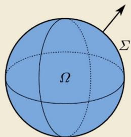

单:不含有“洞”、“点洞”

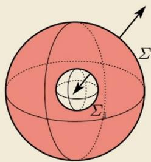

复:含有“洞”、“点洞”

设空间区域 $\Omega$ ，如果 $\Omega$ 内任一闭曲面所围成的区域全属于 $\Omega$

则称 $\Omega$ 是空间二维单连通域(如左图), 否则称复连通域(如右图)

技巧：形心公式（适用重积分、第一类线/面积分）

$$
\overline {{{x}}} ^ {\text {形心}} = \frac {\iiint_ {\Omega} x d V}{\iiint_ {\Omega} d V} \Rightarrow \iiint_ {\Omega} x d V = \overline {{{x}}} \cdot \iiint_ {\Omega} d V; \text {同理}
$$

$$
\iiint_ {\Omega} y d V = \bar {y} \cdot \iiint_ {\Omega} d V; \quad \iiint_ {\Omega} z d V = \bar {z} \cdot \iiint_ {\Omega} d V.
$$

形心（也称为几何中心或质心，在均匀密度的物体中与重心重合）指的是一个平面图形或空间物体在其几何形状上的中心点。对于密度均匀的物体，形心就是其质心。

在考研数学一（高等数学）中，形心主要用于二重积分和三重积分的应用题，特别是形心坐标公式常被用来简化某些积分的计算（例如，结合二重积分的中值定理或质心公式去反推积分值）。

## 1. 平面薄片（或平面区域）的形心坐标公式

设平面区域 $D$ 的面积为 $A$ ，则该区域的形心坐标 $(\bar{x},\bar{y})$ 为：

$$
\bar {x} = \frac {1}{A} \iint_ {D} x d \sigma , \quad \bar {y} = \frac {1}{A} \iint_ {D} y d \sigma
$$

其中 $A = \iint_{D} d\sigma$ 是区域 D 的面积。

记忆方法：形心的 x 坐标 = $\frac{区域上所有点的 x 坐标的平均值}{面积}$ （用积分实现平均）。

## 2. 空间物体（或立体区域）的形心坐标公式

设空间区域 $\Omega$ 的体积为 $V$ ，则该立体的形心坐标 $(\bar{x},\bar{y},\bar{z})$ 为：

$$
\bar {x} = \frac {1}{V} \iiint_ {\Omega} x d V, \quad \bar {y} = \frac {1}{V} \iiint_ {\Omega} y d V, \quad \bar {z} = \frac {1}{V} \iiint_ {\Omega} z d V
$$

其中 $V = \iiint_{\Omega} dV$ 是区域 $\Omega$ 的体积。

质心是物体（或物体系）质量分布的中心，可以理解为质量的加权平均位置。

简单来说，你可以把整个物体的质量想象成集中在这个点。在均匀重力场中，质心与重心重合。

## 核心概念：

\- 质点系：质心位置 = (各质点质量 × 各自位置) 的总和 ÷ 总质量

\- 刚体：将物体无限分割成微小质量元，进行积分计算

## 关键性质：

\- 质心的运动只由合外力决定，与内力无关

\- 即使物体旋转或变形，质心仍遵循牛顿第二定律运动

## 典型例子：

\- 均匀球体：质心在球心

\- 均匀圆环：质心在圆心（虽然那里没有质量）

\- 均匀直杆：质心在中点

\- 锤子：质心靠近锤头一端

\- 花样滑冰：运动员旋转时，质心按抛物线运动（抛跳时）或保持不变（旋转时）

质心与重心的区别：

\- 在均匀重力场中（地球表面近似）：两者重合

\- 重力场不均匀时（如巨大天体）：质心是几何/质量概念，重心是重力合力作用点，两者可能不同

[例3]计算 $\iint_{\Sigma}\left(x^{2}\cos \alpha +y^{2}\cos \beta +z^{2}\cos \gamma\right)\mathrm{d}S$ ，其中 $\Sigma$ 为锥面 $x^{2} + y^{2} = z^{2}$ 介于平面 $z = 0$ 及

平面 $z = h(h > 0)$ 之间部分的下侧， $\cos \alpha ,\cos \beta ,\cos \gamma$ 是 $\Sigma$ 在点 $(x,y,z)$ 处法向量的方向余弦.

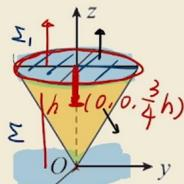

解：补正： $z = h(x^{2} + y^{2} \leq h^{2})$ ，取上侧

(1法一) 形形式

形u：中u轴

记义:由上与上围成的空间区域$= 2 \cdot \overline{z} \cdot V_{s2} = 2 \cdot \frac{3}{4}h \cdot \frac{1}{3}\pi h^{2} \cdot h_{2}$ $= \frac{1}{2}\pi h^{4}$

上跑底面 $\frac{1}{4}h$ 处.

$$
\oint_ {\Sigma + \Sigma_ {1}} x ^ {2} \cos \alpha + y ^ {2} \cos \beta + z ^ {2} \cos \gamma d S
$$

(法二)校面坐标(先一后=+极坐标)

$$
= 2 \iint_ {D _ {x y}} d x d y \int_ {\sqrt {x ^ {2} + y ^ {2}}} ^ {h} z d z
$$

关于x奇，Ω关于y0z前后对称

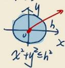

$$
\underline {{\underline {{G a u s s}}}} = 2 \iint_ {\Omega} (x + y + z) d V = 2 \iint_ {\Omega} z d V
$$

$$
= \iint_ {D x y} (h ^ {2} - x ^ {2} - y ^ {2}) d x d y
$$

$$
1 = h ^ {2} \cdot \pi h ^ {2} - \int_ {0} ^ {2 \pi} d \theta \int_ {0} ^ {h} r ^ {2} \cdot r d r
$$

$$
= \pi h ^ {4} - 2 \pi \cdot \frac {1}{4} h ^ {4} = \frac {1}{2} \pi h ^ {4}
$$

高斯公式--挖洞法

【例 4】计算曲面积分 $I=\iint\limits_{\Sigma}\frac{xdydz+ydzdx+zdxdy}{(x^{2}+y^{2}+z^{2})^{\frac{3}{2}}}$ “补的面,都是要还的!”

$$
行使反应:代入方程. (效果不好 \vee \Delta^{\vee})
$$

“一步步解读,困惑终结者!”

补面：让分田取,其中 $\Sigma$ 是曲面 $2x^{2}+2y^{2}+z^{2}=4$ 的外侧. $\oint_{\Sigma+\Sigma_{1}}Gauss\int_{\Omega}\left(\frac{\partial P}{\partial x}+\frac{\partial Q}{\partial y}+\frac{\partial P}{\partial z}\right)dV$

解：P.Q.K在(0,0,0)无定义.

常数(≠0)

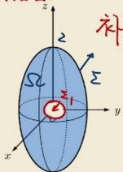

补 $\Sigma_{1}:x^{2}+y^{2}+z^{2}=\Sigma^{2}$ (设为小正数)
取内侧. $\Omega$ 由 $\Sigma_{1}$ 与 $\Sigma$ 围成

$$
= 0 = \oint_ {\Sigma} + \oint_ {\Sigma_ {1}}
$$

$$
\frac {\partial P}{\partial x} = \frac {(x ^ {2} + y ^ {2} + z ^ {2}) ^ {\frac {3}{2}} - x \cdot \frac {3}{2} (x ^ {2} + y ^ {2} + z ^ {2}) ^ {\frac {1}{2}} \cdot 2 x}{(x ^ {2} + y ^ {2} + z ^ {2}) ^ {2 / 2}}
$$

$$
I = - \oint_ {\Sigma_ {1}} x d y d z + y d z d x + z d x d y (x ^ {2} + y ^ {2} + z ^ {2}) ^ {\frac {3}{2}} T - \lambda x ^ {2} + y ^ {2} + z ^ {2} = \Sigma^ {2} (1 + 1)
$$

$$
= \frac {y ^ {2} + z ^ {2} - 2 x ^ {2}}{(x ^ {2} + y ^ {2} + z ^ {2}) ^ {\frac {5}{2}}}
$$

$=  - \frac{1}{{z}^{3}}\Phi$ x dy dz + y dz dx + z dx dy

$$
\begin{array}{c} \int s s d v \\ r ^ {2} \\ V _ {\Omega_ {1}} \end{array}
$$

$$
\frac {\partial P}{\partial x} + \frac {\partial Q}{\partial y} + \frac {\partial P}{\partial z} = \frac {(y ^ {2} + z ^ {2} - 2 x ^ {2}) + (z ^ {2} + x ^ {2} - 2 y ^ {2}) + (x ^ {2} + y ^ {2} - 2 z ^ {2})}{(x ^ {2} + y ^ {2} + z ^ {2}) ^ {5 / 2}} = 0 \quad \text {   =   } \frac {1}{q ^ {3}} \cdot 3 \cdot \frac {4}{3} \pi q ^ {3} = 4 \pi \quad \text {   口   }
$$

## 高斯公式的证明

$$
\oiint_ {\Sigma} P d y d z + Q d z d x + R d x d y = \iiint_ {\Omega} \left(\frac {\partial P}{\partial x} + \frac {\partial Q}{\partial y} + \frac {\partial R}{\partial z}\right) d V
$$

证：不妨设 $\Sigma$ 由 $\Sigma_1, \Sigma_2, \Sigma_3$ 围成

一投=下代三定号

$$
\begin{array}{r l} {\mathrm{右}} & {\oint_ {\Sigma} R d x d y = (\iint_ {\Sigma_ {1}} + \iint_ {\Sigma_ {2}} + \iint_ {\Sigma_ {3}}) R d x d y} \\ & {= - \iint_ {D _ {x y}} R (x, y, z _ {1} (x, y) d x d y + \iint_ {D _ {x y}} R (x, y, z _ {2} (x, y) d x d y} \\ & {= \iint_ {D _ {x y}} R (x, y, z _ {2} (x, y) - R (x, y, z _ {1} (x, y) d x d y = \iint_ {D _ {x y}} \left(R (x, y, z) \Big | _ {z _ {1} (x, y)} ^ {z _ {2} (x, y)}\right) d x d y} \\ & {= \iint_ {D _ {x y}} \left(\int_ {z _ {1} (x, y)} ^ {z _ {2} (x, y)} \frac {\partial P}{\partial z} d z\right) d x d y = \iint_ {\Omega} \frac {\partial P}{\partial z} d V \quad \mathrm{先一} \overline {{{F}}} =.} \end{array}
$$

## 散度：

Divergence 散度

## 高斯公式的物理意义

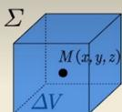

$\bullet$ 散度: $divF = \lim_{\Delta V \to 0} \frac{\oiint_{\Sigma} F \cdot n dS}{\Delta V} = \lim_{\Delta V \to 0} \frac{\oiint_{\Sigma} P dy dz + Q dz dx + R dx dy}{\Delta V}$ . 其中 $\Delta V$ 闭曲面 $\Sigma$ 围成的体积.

意义：流体在点 M(x,y,z) 处的 汇聚或发散的速率/ 单位体积(向外)的流量/ 流量体密度/ 源头强度

\- divF > 0 说明流体从该点向外发散，有“正源”；

divF < 0 说明流体向该点汇聚，有吸收流体的“负源”（“汇”、“洞”）；

divF = 0 说明流体在该处无源.

在考研数学一（通常指工科、理科等专业所需的数学科目）中，向量场是一个重要的概念，出现在多元函数微积分（尤其是曲线积分与曲面积分）部分。下面是它的定义和相关要点：

## 1. 定义

设 $D \subset \mathbb{R}^n$ （通常 $n = 2$ 或 $n = 3$ ），如果对于 $D$ 中每一点 $P$ ，都有一个确定的向量 $\mathbf{F}(P)$ 与之对应，则称 $\mathbf{F}$ 是 $D$ 上的一个向量场。

即：

$$
\mathbf {F}: D \to \mathbb {R} ^ {n}
$$

\- 在二维空间（平面）中：

$$
\mathbf {F} (x, y) = P (x, y) \mathbf {i} + Q (x, y) \mathbf {j}
$$

\- 在三维空间中：

$$
\mathbf {F} (x, y, z) = P (x, y, z) \mathbf {i} + Q (x, y, z) \mathbf {j} + R (x, y, z) \mathbf {k}
$$

其中 $P, Q, R$ 是标量函数（称为分量函数）。

## 2. 直观理解

向量场好比在空间中的每个点处都“画”了一个箭头，表示该点处的向量（如力、速度、电场等）。例子：

\- 梯度场： $\nabla f$ 是一个向量场，方向指向函数 $f$ 增长最快的方向，大小是方向导数最大值。

\- 流速场：水流中每一点处的水流速度向量。

\- 力场：如重力场、电场。

## 可以，而且这是一个非常形象且正确的理解方式。

在考研数学一的框架下，将向量场 $\mathbf{F} = P\mathbf{i} + Q\mathbf{j} + R\mathbf{k}$ 的分量 $P, Q, R$ 理解为三个方向上的流速（或更一般地说，是流量密度），是掌握曲线积分和曲面积分物理意义的关键。

为了让你更清晰地理解，我们可以从几个层次来看：

## 1. 直观理解：流速场

想象一个三维空间中的流体（比如空气或水）在流动。

\- 在任意一点 $(x, y, z)$ 处，流体都有一个速度向量 $\mathbf{v}(x, y, z)$ 。

\- 将这个速度向量分解到三个坐标轴上：

○ $P(x,y,z)$ 就是该点流速的 x 轴分量（水平方向流速）。

○ $Q(x,y,z)$ 就是该点流速的 y 轴分量（水平方向流速）。

○ $R(x,y,z)$ 就是该点流速的 z 轴分量（垂直方向流速）。

所以， $\mathbf{F} = (P, Q, R)$ 就是一个流速场。物理上，它告诉你流体在每个位置朝哪个方向、以多快速度运动。

## 2. 在曲线积分中的意义：环流量

计算曲线积分 $\int_{C}\mathbf{F}\cdot d\mathbf{r}$ 时：

\- $d\mathbf{r} = (dx,dy,dz)$ 是曲线上的微小切向位移。

\- 点积 $\mathbf{F} \cdot d\mathbf{r} = Pdx + Qdy + Rdz$ 的物理意义是：流速在切线方向的分量乘以微元长度。

\- 整个积分就是流速场沿着曲线的环流量，即单位时间内流体通过这条曲线（对于二维情况是曲线，对于三维是管道的侧边）的流量。

例子：如果你在河流中画一条假想的曲线，这个积分就表示单位时间内有多少水沿着这条曲线的方向流过。

## 3. 在曲面积分中的意义：通量

计算曲面积分 $\iint_{S} \mathbf{F} \cdot d\mathbf{S}$ 时：

\- $d\mathbf{S} = \mathbf{n}dS$ 是曲面上有向面积微元（方向是外法向）。

\- 点积 $\mathbf{F} \cdot \mathbf{n}$ 的物理意义是：流速在法线方向的分量。

\- 整个积分就是流速场穿过曲面 $S$ 的通量，即单位时间内通过该曲面的流体的总体积。

例子：想象一个渔网（曲面）放在河流中，这个积分就表示单位时间内有多少水从渔网的一侧流到另一侧。

## 4. 与散度和旋度的联系

有了“流速”这个物理图像，散度和旋度就有了非常直观的解释：

\- 散度 $\nabla \cdot \mathbf{F} = \frac{\partial P}{\partial x} + \frac{\partial Q}{\partial y} + \frac{\partial R}{\partial z}$ :

\- 物理意义：源头的强度。

\- 如果散度 > 0，表示该点有“源”，流体在向外流出（比如水龙头）。

\- 如果散度 < 0，表示该点有“汇”，流体在向内流入（比如下水道）。

\- 高斯定理：闭曲面上的通量 = 内部所有源的强度之和。

\- 旋度 $\nabla \times \mathbf{F} = \left(\frac{\partial R}{\partial y} - \frac{\partial Q}{\partial z}, \ldots\right)$ :

\- 物理意义：旋转的程度。

\- 如果旋度不为零，表示该点附近流体有旋转（比如一个漩涡）。

\- 斯托克斯定理：曲面上的旋度通量 = 边界上的环流量。

如何得到散度的简洁公式？ Nabla 算子 $\nabla = \left(\frac{\partial}{\partial x}, \frac{\partial}{\partial y}, \frac{\partial}{\partial z}\right)$

数目散度： $div\pmb {F} = \lim_{\Delta V\to 0}\frac{\oint\oint\pmb{F}\cdot\pmb{ndS}}{\Delta V} = \lim_{\Delta V\to 0}\frac{\oint\oint Pdydz + Qdzdx + Rdxdy}{\Delta V} = \frac{\partial P}{\partial x} +\frac{\partial Q}{\partial y} +\frac{\partial R}{\partial z},$ 即 $\nabla \cdot F$

其中 $M(x,y,z)$ 处向量场 $F = (P(x,y,z), Q(x,y,z), R(x,y,z))$ ， $\Delta V$ 为闭曲面 $\Sigma$ 围成的体积。沿 x 轴方向，流速为 $P(x,y,z)$ 的流体，穿过 $\Sigma$ 的净流出量。

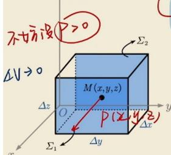

$$
\oint_ {\Sigma} P d y d z = \iint_ {\Sigma_ {1} + \Sigma_ {2}} P d y d z
$$

$$
P (x + \frac {\Delta x}{2}, y, z) \Delta y \Delta z - P (x - \frac {\Delta x}{2}, y, z) \Delta y \Delta z
$$

$$
\mathrm{出} \Sigma_ {1} \mathrm{的}
$$

$$
\frac {P (x + \frac {\Delta x}{2} , y , z) - P (x - \frac {\Delta x}{2} , y , z)}{\Delta x}
$$

$$
\lim _ {\Delta V \to 0} \frac {1}{\Delta V} \oint_ {\Sigma} P   d y d z = \lim _ {\Delta X \to 0} \frac {P (x + \frac {\Delta x}{\Sigma} , y , z) - P (x - \frac {\Delta x}{\Sigma} , y , z)}{\Delta X} = \frac {2 P}{2 x}
$$

问题：

1.

在计算曲面积分时，判断“锥面在柱面内的那部分面”的关键在于：用柱面的方程去限制锥面上点的坐标范围。

一般步骤如下：

## 1. 明确两个曲面的方程

\- 锥面：例如 $z = \sqrt{x^2 + y^2}$ 或 $z = k\sqrt{x^2 + y^2}$

\- 柱面：例如圆柱面 $x^{2} + y^{2} = a^{2}$ 或椭圆柱面 $\frac{x^2}{a^2} +\frac{y^2}{b^2} = 1$

题意“锥面在柱面内的那部分面”，指的是：

锥面上的点，同时满足“该点在柱面的内部或边界上”。

## 2. 写出柱面内（含边界）的不等式

柱面通常是一个无限长的柱体，它的内部是：

$$
x ^ {2} + y ^ {2} \leq a ^ {2} \quad (\text {圆柱})
$$

$$
\frac {x ^ {2}}{a ^ {2}} + \frac {y ^ {2}}{b ^ {2}} \leq 1 \quad (\text {椭圆柱})
$$

## 3. 把锥面方程代入不等式

锥面已经给出了 $z$ 与 $x, y$ 的关系，因此曲面上点的水平投影 $(x, y)$ 必须满足上述不等式。

例：

锥面 $z = \sqrt{x^2 + y^2}$ ，圆柱 $x^{2} + y^{2} = R^{2}$

柱内区域： $x^{2} + y^{2}\leq R^{2}$

于是锥面上点的投影集合：

$$
x ^ {2} + y ^ {2} \leq R ^ {2}
$$

并且 $z = \sqrt{x^2 + y^2}$ 。

这部分锥面就是：

$$
\{(x, y, z) \mid z = \sqrt {x ^ {2} + y ^ {2}}, \quad x ^ {2} + y ^ {2} \leq R ^ {2} \}
$$

## 4. 确定积分区域（投影法时）

当用投影到 $xy$ 平面计算曲面积分时：

$$
\iint_ {S} f (x, y, z) d S = \iint_ {D _ {x y}} f (x, y, \sqrt {x ^ {2} + y ^ {2}}) \cdot \sqrt {1 + z _ {x} ^ {2} + z _ {y} ^ {2}} d x d y
$$

其中 $D_{xy}=\{x^{2}+y^{2}\leq R^{2}\}$ 。

2.

曲面积分什么时候可以带方程，什么时候不能

一句话结论：

只有被积函数是常数、只含坐标变量（x,y,z），且积分区域是闭合/非闭合曲面时，才能代入曲面方程；

只要出现了偏导数（如dS、dxdy等投影）、或者是对坐标的曲面积分里的投影项，绝对不能代入。

1. 什么时候可以代入曲面方程？

(1) 对面积的曲面积分

$$
\iint_ {\Sigma} f (x, y, z) d S
$$

\- $dS$ 是面积元素，与坐标无关

\- 被积函数 $f(x, y, z)$ 只是 $x, y, z$ 的函数

完全可以把曲面方程代入化简

例：球面 $x^{2} + y^{2} + z^{2} = R^{2}$

$$
\iint_ {\Sigma} \left(x ^ {2} + y ^ {2} + z ^ {2}\right) d S = \iint_ {\Sigma} R ^ {2} d S = R ^ {2} \cdot S
$$

2. 什么时候绝对不能代入？

(1) 用高斯公式转换成三重积分后

$$
\iiint_ {\Omega} \left(\frac {\partial P}{\partial x} + \frac {\partial Q}{\partial y} + \frac {\partial R}{\partial z}\right) d V
$$

\- 三重积分区域是整个体积内部，不只是曲面

\- 内部点不满足曲面方程

严禁代入曲面方程

(2) 对坐标的曲面积分中, 投影项里不能代

比如：

$$
\iint_ {\Sigma} z d x d y
$$

\- 被积函数 $z$ 可以用方程代

\- 但 $dxdy$ 是投影，不能代

(本质：投影是坐标关系，不是曲面方程)

(3) 求 dS 时的偏导数表达式

$$
d S = \sqrt {1 + z _ {x} ^ {2} + z _ {y} ^ {2}} d x d y
$$

里面的 $z_{x}, z_{y}$ 是偏导，不能代方程化简，只能先求导。

## 3. 超简记口诀

\- 面积分 $dS$ : 随便代

\- 三重积分内部：绝对不能代

\- 投影 $dxdy$ 等：不能代

\- 被积函数：能代就代

## 多元积分的应用：

$$
\begin{array}{r l} \iiint_ {\Omega} (3 x ^ {2} + 3 y ^ {2} + 7) \mathrm{d} v & = \int_ {0} ^ {1} \mathrm{d} v \int_ {0} ^ {1} \mathrm{d} r \int_ {r ^ {2}} \\ & = 2 \pi \int_ {0} ^ {1} r (3 r ^ {2} + 7) (1 - r ^ {2}) \mathrm{d} r \\ & = 4 \pi , \end{array}
$$

$$
I = - 4 \pi .
$$

## 第四节 多元积分应用

考试内容概要

多元积分应用一览表

<table><tr><td>所求几何形体量</td><td>平面板</td><td>空间体</td><td>曲线</td><td>曲面</td></tr><tr><td>几何度量</td><td>面积 $S=\iint_{D}d\sigma$ </td><td>体积 $V=\iiint_{\Omega}dv$ </td><td>弧长 $L=\int_{C}ds$ </td><td>面积 $S=\iint_{\Sigma}dS$ </td></tr></table>

## 1. 变力做功

$$
\text { 力 }   \pmb {F} = P \pmb {i} + Q \pmb {j} + R \pmb {k}  ,
$$

$$
W = \int_ {\widehat {A B}} P \mathrm{d} x + Q \mathrm{d} y + R \mathrm{d} z.
$$

2. 通量

向量场: $U(x,y,z)=Pi+Qj+Rk.$

$$
\text { 通量 }: \Phi = \iint_ {\Sigma} P   \mathrm{d} y \mathrm{d} z + Q \mathrm{d} z \mathrm{d} x + R \mathrm{d} x \mathrm{d} y.
$$

常考题型与典型例题

考研数学一定积分应用里考的转动惯量，只考平面薄板，公式非常固定，直接背下面这套就够做题了。

## 一、考研数一标准公式（必考）

## 1. 线密度：细杆（一维）

杆沿 $x$ 轴，线密度 $\rho (x)$ ，绕 $y$ 轴转动：

$$
I = \int_ {a} ^ {b} x ^ {2} \rho (x) d x
$$

## 2. 面密度：平面薄片（二维，最常考）

薄片在 $xOy$ 面，面密度 $\rho (x,y)$

\- 绕 $\mathbf{x}$ 轴转动惯量：

$$
I _ {x} = \iint_ {D} y ^ {2} \rho (x, y) d x d y
$$

\- 绕 y 轴转动惯量:

$$
I _ {y} = \iint_ {D} x ^ {2} \rho (x, y) d x d y
$$

\- 绕原点z轴转动惯量：

$$
I _ {o} = \iint_ {D} (x ^ {2} + y ^ {2}) \rho (x, y) d x d y
$$

考研里几乎都是：均匀薄片 $\rho =$ 常数，可以直接提到积分外面。

## 题目：

## 题目1:

(此题非常好，考查三重积分的计算)

【例 2】（2000）设有一半径为 R 的球体， $P_{0}$ 是此球的表面上的一个定点，球体上任一点的密度与该点到 $P_{0}$ 距离的平方成正比（比例常数 k > 0），求球体的重心位置。

## 1. 问题设定

球心 $O(0,0,0)$ ，球半径 $R$ ，球面方程

$$
x ^ {2} + y ^ {2} + z ^ {2} = R ^ {2}.
$$

已知 $P_{0}$ 在球面上某点，坐标设为

$$
P _ {0} (x _ {0}, y _ {0}, z _ {0}), \quad x _ {0} ^ {2} + y _ {0} ^ {2} + z _ {0} ^ {2} = R ^ {2}.
$$

任一点 $P(x,y,z)$ 到 $P_0$ 距离的平方为

$$
(x - x _ {0}) ^ {2} + (y - y _ {0}) ^ {2} + (z - z _ {0}) ^ {2} = x ^ {2} + y ^ {2} + z ^ {2} + R ^ {2} - 2 (x x _ {0} + y y _ {0} + z z _ {0}).
$$

记

$$
r ^ {2} = x ^ {2} + y ^ {2} + z ^ {2}, \quad r _ {0} ^ {2} = R ^ {2}.
$$

于是

$$
d ^ {2} = r ^ {2} + R ^ {2} - 2 (x x _ {0} + y y _ {0} + z z _ {0}).
$$

密度

$$
\rho (P) = k d ^ {2}.
$$

## 2. 重心公式

重心坐标

$$
\bar {x} = \frac {\iiint_ {\Omega} x \rho (P) d V}{\iiint_ {\Omega} \rho (P) d V}, \quad \bar {y} = \dots , \quad \bar {z} = \dots .
$$

把 $\rho(P) = k[r^2 + R^2 - 2(xx_0 + yy_0 + zz_0)]$ 代入。

## 3. 用对称性简化

由于 $x_0, y_0, z_0$ 固定但不一定在坐标轴上，而球关于原点对称，我们有：

\- $\iiint_{\Omega} x dV = 0$

\- $\iiint_{\Omega} x r^2 dV = 0$

$$
\iiint_ {\Omega} x \left(x x _ {0} + y y _ {0} + z z _ {0}\right) d V = x _ {0} \iiint x ^ {2} d V + y _ {0} \iiint x y d V + z _ {0} \iiint x z d V
$$

其中 $\iiint xy dV = 0$ ， $\iiint xz dV = 0$ ，因为奇对称。

并且 $\iiint x^2 dV = \frac{1}{3}\iiint r^2 dV$ （因为 $x^{2}$ 与 $y^{2},z^{2}$ 在球内积分相等）。

所以

$$
\iiint_ {\Omega} x \left[ r ^ {2} + R ^ {2} - 2 (x x _ {0} + y y _ {0} + z z _ {0}) \right] d V = 0 + 0 - 2 \left[ x _ {0} \iiint x ^ {2} d V \right].
$$

$$
\iiint x ^ {2} d V = \frac {1}{3} \iiint r ^ {2} d V.
$$

$$
\iiint r ^ {2} d V = \int_ {0} ^ {R} r ^ {2} \cdot 4 \pi r ^ {2} d r = 4 \pi \frac {R ^ {5}}{5} = \frac {4 \pi R ^ {5}}{5}.
$$

于是

$$
\iiint x ^ {2} d V = \frac {1}{3} \cdot \frac {4 \pi R ^ {5}}{5} = \frac {4 \pi R ^ {5}}{1 5}.
$$

因此

$$
\iiint_ {\Omega} x \rho (P) d V = - 2 x _ {0} \cdot \frac {4 \pi R ^ {5}}{1 5} = - \frac {8 \pi R ^ {5}}{1 5} x _ {0}.
$$

截图工具

同理，由对称性可得 $\bar{y},\bar{z}$ 的分子：

$$
\iiint_ {\Omega} y \rho d V = - \frac {8 \pi k R ^ {5}}{1 5} y _ {0}, \quad \iiint_ {\Omega} z \rho d V = - \frac {8 \pi k R ^ {5}}{1 5} z _ {0}
$$

## 二、补充计算分母（总质量 $M = \iiint_{\Omega} \rho(P) dV$ ）

$$
\begin{array}{l} M = k \iiint_ {\Omega} \left[ r ^ {2} + R ^ {2} - 2 (x x _ {0} + y y _ {0} + z z _ {0}) \right] d V \\ = k \left[ \iiint_ {\Omega} r ^ {2} d V + R ^ {2} \iiint_ {\Omega} d V - 2 \left(x _ {0} \iiint_ {\Omega} x d V + y _ {0} \iiint_ {\Omega} y d V + z _ {0} \iiint_ {\Omega} z d V\right) \right] \end{array}
$$

由对称性， $\iiint_{\Omega}xdV = \iiint_{\Omega}ydV = \iiint_{\Omega}zdV = 0$ ，因此交叉项全部为0。

代入已知积分:

$$
\bullet \quad \iiint_ {\Omega} r ^ {2} d V = \frac {4 \pi R ^ {5}}{5}
$$

$$
\begin{array}{r l} M & = k \left(\frac {4 \pi R ^ {5}}{5} + R ^ {2} \cdot \frac {4 \pi R ^ {3}}{3} - 0\right) \\ & = k \cdot 4 \pi R ^ {5} \left(\frac {1}{5} + \frac {1}{3}\right) \\ & = k \cdot 4 \pi R ^ {5} \cdot \frac {8}{1 5} = \frac {3 2 \pi k R ^ {5}}{1 5} \end{array}
$$

\- 球体体积 $\iiint_{\Omega} dV = \frac{4}{3}\pi R^3$

## 三、计算重心坐标 $(\bar{x}, \bar{y}, \bar{z})$

1. $\bar{x}$

$$
\bar {x} = \frac {\iiint_ {\Omega} x \rho d V}{M} = \frac {- \frac {8 \pi k R ^ {5}}{1 5} x _ {0}}{\frac {3 2 \pi k R ^ {5}}{1 5}} = - \frac {x _ {0}}{4}
$$

2. $\bar{y}$ (同理)

$$
\bar {y} = \frac {\iiint_ {\Omega} y \rho d V}{M} = - \frac {y _ {0}}{4}
$$

3. $\bar{z}$ (同理)

$$
\bar {z} = \frac {\iiint_ {\Omega} z \rho d V}{M} = - \frac {z _ {0}}{4}
$$

## 四、最终结论与几何意义

1. 重心坐标

$$
(\bar {x}, \bar {y}, \bar {z}) = \left(- \frac {x _ {0}}{4}, - \frac {y _ {0}}{4}, - \frac {z _ {0}}{4}\right)
$$

|（注：部分内容可能由 AI 生成）
