# 多元积分及其应用（下）.docx — 图像索引

> 由 MinerU 结构化结果生成。题目若依赖树形、拓扑、流程、曲线、区域、时序或其他空间关系，应核对这里的原图，不要只依据 OCR 文本推断。

## 图 1

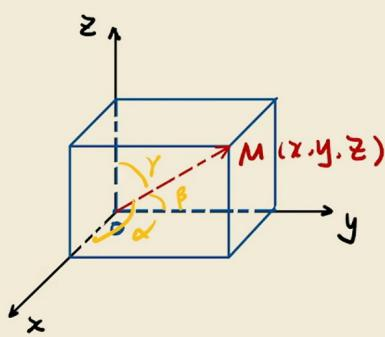

原文页码：1；bbox：`[606, 307, 838, 451]`

## 图 2

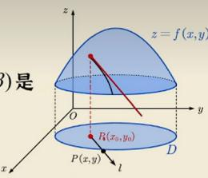

原文页码：1；bbox：`[636, 521, 793, 617]`

## 图 3

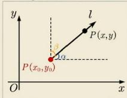

原文页码：1；bbox：`[665, 636, 793, 706]`

## 图 4

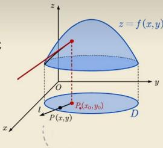

原文页码：2；bbox：`[668, 103, 831, 208]`

## 图 5

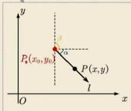

原文页码：2；bbox：`[697, 210, 830, 290]`

## 图 6

原文页码：2；bbox：`[752, 381, 803, 414]`

## 图 7

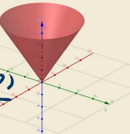

原文页码：2；bbox：`[687, 451, 845, 567]`

## 图 8

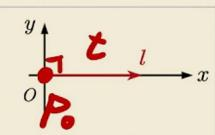

原文页码：2；bbox：`[675, 573, 805, 630]`

## 图 9

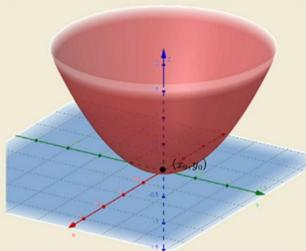

原文页码：2；bbox：`[648, 693, 833, 800]`

## 图 10

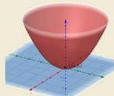

原文页码：4；bbox：`[584, 168, 670, 219]`

## 图 11

原文页码：4；bbox：`[603, 90, 653, 137]`

## 图 12

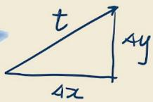

原文页码：4；bbox：`[668, 181, 800, 243]`

## 图 13

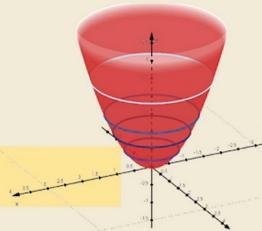

原文页码：4；bbox：`[685, 533, 843, 632]`

## 图 14

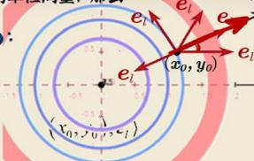

原文页码：5；bbox：`[512, 450, 685, 527]`

## 图 15

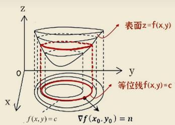

原文页码：5；bbox：`[152, 124, 363, 230]`

## 图 16

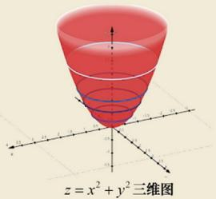

原文页码：5；bbox：`[363, 134, 526, 240]`

## 图 17

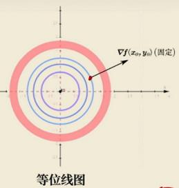

原文页码：5；bbox：`[566, 124, 722, 241]`

## 图 18

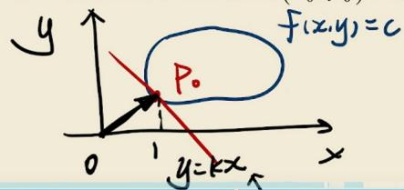

原文页码：5；bbox：`[161, 274, 428, 363]`

## 图 19

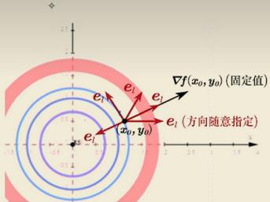

原文页码：6；bbox：`[628, 87, 835, 197]`

## 图 20

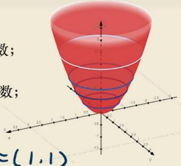

原文页码：7；bbox：`[600, 126, 784, 246]`

## 图 21

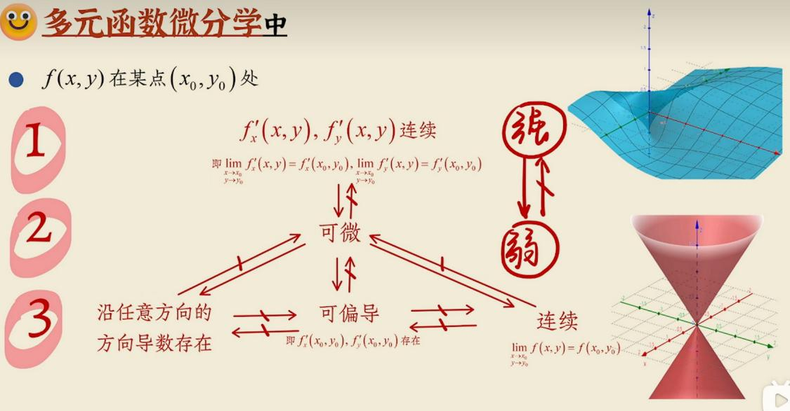

原文页码：9；bbox：`[166, 370, 847, 621]`
