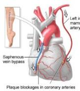
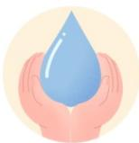
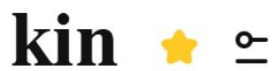
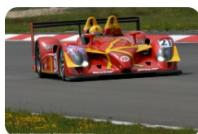
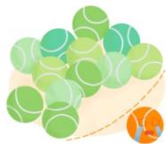

# 2009.docx — 图像索引

> 由 MinerU 结构化结果生成。题目若依赖树形、拓扑、流程、曲线、区域、时序或其他空间关系，应核对这里的原图，不要只依据 OCR 文本推断。

## 图 1

原文页码：5；bbox：`[749, 390, 847, 468]`

## 图 2

原文页码：6；bbox：`[699, 608, 791, 676]`

## 图 3

原文页码：10；bbox：`[379, 441, 416, 468]`

## 图 4

原文页码：12；bbox：`[759, 390, 786, 409]`

## 图 5

原文页码：12；bbox：`[685, 470, 779, 539]`

## 图 6

原文页码：13；bbox：`[174, 543, 363, 577]`

## 图 7

原文页码：14；bbox：`[702, 530, 818, 592]`

## 图 8

原文页码：19；bbox：`[705, 521, 821, 640]`

## 图 9

原文页码：47；bbox：`[697, 474, 816, 531]`

## 图 10

原文页码：56；bbox：`[727, 97, 798, 162]`

## 图 11

原文页码：59；bbox：`[717, 93, 794, 170]`

## 图 12

原文页码：64；bbox：`[715, 87, 828, 156]`

## 图 13

原文页码：67；bbox：`[700, 92, 810, 167]`

## 图 14

原文页码：73；bbox：`[650, 621, 749, 695]`

## 图 15

原文页码：82；bbox：`[682, 468, 783, 539]`
