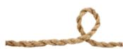
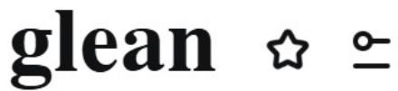
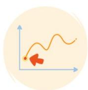
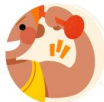

# 4.9.docx

## 4.9

obsess v.使着迷 minor adj.轻微的，不重要的，较小的，未成年的 n.未成年人

hypothetical adj. 假定的 reject v. 拒绝，否决，排斥 n. 次品，废品 rejection n. 拒绝，排斥

Perceive v. 认为，理解，察觉到

adj. perceived 感知到的；感观的

perceptive 感知的，知觉的；有知觉力的

perceptible 可察觉的；可感知的；看得见的

perceivable 可知觉的，可感知的

adv. perceptibly 显然地；可感觉得出地；看得出地

n. perception 知觉；[生理] 感觉；看法；洞察力；获取

percept 认知，认知的对象

perceptibility 感觉力；理解力；可察觉性

v. perceived 感知；认为（perceive的过去分词）；领会

Accurate adj. 准确的，精确的 inevitable adj. 不可避免的，n. 必然发生的事情

View n. 观点，看法，方法，景象 v. 看代，考虑 appreciate v. 行赏，理解，明白

get along 相处，进展

evolutionary adj. 进化的，逐步发展的

词根：evolve

adj. evolutionism 进化论的

evolutionist 进化论的

n. evolution 演变；进化论；进展

evolutionism [进化] 进化论

evolutionist 进化论者

vi. evolve 发展，进展；进化；逐步形成

vt. evolve 发展，进化；进化；使逐步形成；推断出

Origin n.起源，出生 tribe n.一大群人，一伙人，部落 tribal adj.部落的，宗族的

dramatically adv.剧烈地，明显地，戏剧性地 dramatic 戏剧的；引人注目的；激动人心的

interact v. 相互交流，互动；相互作用，相互影响 interaction n. 相互作用

existence n. 存在，实有；生存，生活，生活方式 exist v. 存在；生存；生活；继续存在

shun v. （故意）避开，躲开

neglect v. 疏于照顾，不予重视，忽视；漏做 n. 忽略，忽视，未被重视

词根：neglect

adj. negligible 微不足道的，可以忽略的

neglected 被忽视的；未被好好照管的

negligent 疏忽的；粗心大意的

neglectful 疏忽的；忽略的；不小心的

adv. negligently 疏忽地；粗心大意地

neglectfully 怠慢地；不注意地

n. negligence 疏忽；忽视；粗心大意

v. neglected 忽视；疏忽（neglect的过去分词）

approval n. 称许，赞成；批准，许可 approve vi. 批准；赞成；满意

reliable adj. 可靠的，依赖的 n. 可靠的人

词根：rely

adv. reliably 可靠地；确实地

n. reliability 可靠性

vi. rely 依靠；信赖

caregiver n.照料者 intensify v.加剧，增强；era n.时代，年代

assume v. 假定，认为

词根：assume

adj. assumed 假定的；假装的

assuming 傲慢的；不逊的；僭越的

assumptive 假定的；设想的；傲慢的

adv. assumedly 大概；多半

n. assumption 假定；设想；担任；采取

v. assuming 假设（assume的ing形式）

consistent adj. 始终如一的，一贯的；持续的，连续的；固守的，坚持的；一致的，吻合的

estimate v. 估计；判断，评价 n. 估计，估价；估价单；看法，判断

underestimate v/n. 低估，不足，轻视

initial adj.开始的，最初的，首字母的 n.首字母

beholder n.旁观者 behold v.看，注视

evidence n/v. 证据，证明 evident adj. 清楚的，显然的

judge n. 法官，审判官；裁判员 v. 判断，认为；裁判，评判；估计,批评，指责；审判，审理

desirable adj. 令人向往的，值得拥有的；可取的；性感的 n. 称心合意的人（或物），好的品

质

Undesirable adj. 不受欢迎的，不良的，不想要的 n. 不良分子，不受欢迎的人

词根： desire

adj. desired 渴望的；想得到的

n. desire 欲望；要求，心愿；性欲
desirability 愿望；有利条件；值得向往的事物；合意
desirableness 满意；愿望

v. desired 渴望，要求（desire的过去分词形式）

vi. desire 渴望

vt. desire 想要；要求；希望得到...

negative ☆ ≡

英 / 'negətɪv / »)

美 / 'negətɪv / »

简明 柯林斯

adj. 有害的，负面的；悲观的，消极的；否定的，拒绝的；否定式的；（结果）阴性的；负极的，阴极的；负的，小于零的；亏损的；负像的，底片的；（天文）负的；<英>（立法）自动生效的；Rh阴性的

n. 底片，负片；否定词，否定句；坏处，害处；阴性结果；（逻）（对命题的）否定；负电；负数

v. 拒绝，否定；推翻，证伪；消除，抵消

词根：negate

adv. negatively 消极地；否定地

n. negate 对立面；反面
negation 否定，否认；拒绝
negativity 否定性；消极性
negativeness 消极性；否定性
negativism 否定论；消极论；反对癖性
negativist 消极主义者，否定论者
negatron [物] 阴电子（等于negative electron）

vi. negate 否定；否认；无效

vt. negate 否定；取消；使无效

sensitivity ☆ ≡

英 /ˌsensəˈtɪvəti/ 》美 /ˌsensəˈtɪvəti/ 》

简明

n. （对细节或质量的）感知，觉察；（对新情况的）灵敏度；敏感，易生气；多愁善感；体贴，有分寸；小心谨慎；过敏；敏感性，易惹恼人的倾向；（天生的）悟性，敏锐性；表现力；机密性

词根： sensing
adj. sensitive 敏感的；[仪] 灵敏的；感光的；易受伤害的
sensible 明智的；明显的；意识到的；通晓事理的
sensing 敏感的

adv. sensitively 敏感地；易感知地

n. sensible 可感觉到的东西；敏感的人
sensing 传感；感觉；测知
sensitiveness 神经过敏
sensitizing 光敏处理

v. sensing 感觉，了解（sense的现在分词）
sensitizing 使敏感（sensitize的ing形式）

vi. sensitize 变得敏感
sensitise 变得敏感（等于sensitize）

vt. sensitize 使敏感；使具有感光性
sensitise 使敏感（等于sensitize）

## ambiguous ☆ ≡

英 / cæmˈbɪɡjuəs / ）

美 /æmˈbɪɡjuəs/

简明 柯林斯

adj. 模棱两可的，有歧义的；不明朗的，不确定的

## prophecy ☆ ≡

英 / 'prɒfəsi / 》美 / 'prɑːfəsi / 》

简明 柯林斯

n. 预言；预言能力

词根： prophet

adj. prophetic 预言的，预示的；先知的

adv. prophetically 预言地

n. prophet 先知；预言者；提倡者

prophetess 女先知；女预言家

vi. prophesy 预言；预报；传教

vt. prophesy 预言；预告

英 / , self fʊlˈfɪlm/

美 / ,self fʊlˈfɪlɪŋ/ )

简明 柯林斯

## adj. 实现自己抱负的，自我实现的

accordingly adv.相应地，照着；因此，所以

## motion ☆ ≡

英 / 'məʊʃn/

美 / 'mouʃ(ə)n/

简明 柯林斯

n. 运动，移动；手势，动作；提议，议案；<英>排便，大便；转动的机械装置；（当庭提出裁决或命令的）请求，申请

v. 打手势，示意

loop ☆ ≡

英 / luːp / »

美 / luːp / »

简明 柯林斯

n. 环形，环状物；循环胶片，循环磁带；（程序中）一套重复的指令；回线，回路；<英>（铁道或公路的）环线；<美，非正式>大环（指美国芝加哥市的商业中心）；<英>（可改道的）会车线；翻筋斗（一种飞行特技）；（滑冰）单刃转圈

v. 使成环，使绕成圈；成环形运动；播放一卷磁带，放一卷电影胶片，执行计算机指令

## sting ★ ≡

英 / stɪŋ/ )

美 / stɪŋ/ )

简明 柯林斯

v. （昆虫、动植物）叮，刺，蜇；（使）刺痛，（使）产生剧痛；向……索要惊人高价，敲诈；（使）生气，（使）心烦；刺激

n. 刺伤处，蜇伤处；（植物、水母等的）刺毛；刺痛，灼痛；（身体或心灵的）剧痛，痛苦；（警察为抓住罪犯而设计的）圈套，骗局；<美>（罪犯诈骗钱财的）骗局，诡计

词根： sting

adj. stingy 吝啬的，小气的；有刺的；缺乏的
stinging 激烈的；刺人的；刺一样的
stingless 无刺的；无针的

adv. stingily 刺骨的；吝啬地，小气地

n. stinger 讽刺者；好讽刺人的人；有刺的动物；鸡尾酒

## ease ☆ ≡

英 / iːz / )

美 / iːz/

简明 柯林斯

n. 容易；舒适，自在

v. 减轻，缓和，放松；缓缓移动；使容易；降低；使离职；熟悉

## impact ☆ ≅

英 / 'impækt / »

美 / 'impækt / »

## 简明 柯林斯

n. 撞击，冲击力；巨大影响，强大作用

v. 冲击，撞击；挤入，压紧；（对……）产生影响

affirmation

英 /ˌæfəˈmeɪʃ(ə)n/

美 /ˌæfərˈmeɪʃ(ə)n/

简明

n. 肯定，维护；情感上的支持（或鼓励）；（因良心原因不愿宣誓而作的正式）确认词根： affirm
adj. affirmative 肯定的；积极的
affirmable 可断言的；可确定的

adv. affirmatively 肯定地；断然地

n. affirmative 肯定语；赞成的一方

vi. affirm 确认；断言

vt. affirm 肯定；断言

condemn ★ ≡

英 / kən'dem / ）美 / kən'dem / ）

简明 柯林斯

v. 谴责，严厉指责；宣判，判决；使陷入（不愉快的境地）；宣布……不安全；证明（或表明）有罪

词根：condemn

adj. condemnatory 处罚的；非难的；定罪的

condemnable 该受责备的，应受谴责的；该罚的；应定罪的，该定罪的

n. condemnation 谴责；定罪；非难的理由；征用

condemning 谴责；处刑

v. condemning 谴责（condemn的现在分词）

英 / gli:n / »

美 / gli:n / »

简明 柯林斯

vt. 收集（资料）；拾（落穗）

vi. 收集；拾落穗

## ruminate ☆ ≡

英 / 'ru:mɪneɪt/

美 / 'ru:mɪneɪt/ )

简明 柯林斯

vt. 反刍；沉思；反复思考

vi. 沉思，反刍

词根：ruminate

adj. ruminant 反刍的；沉思的
ruminative 默想的，沉思的；爱反复思考的

n. ruminant 反刍动物

rumination 沉思；反刍

ruminator 沉思默想的人；好思考的人

minimal ☆ ≡

英 / 'mɪnɪm(ə)l/ )

美 / 'mɪnɪm(ə)l/ )

简明 柯林斯

adj. 极小的，极少的；极简抽象艺术的；简朴的，朴实无华的；极简的（指短小乐句不断重复并逐渐变化）；最小差别的

词根：minim
adj. minimum 最小的；最低的
minimized 最小化的；最小化；使达到最低限度的
minimalist 极简抽象派艺术的
minim 最小的；微小的
minimus 最年轻的；微小的

adv. minimally 最低限度地；最低程度地

n. minimum 最小值；最低限度；最小化；最小量
minimalist 极简抽象派艺术家；最低限要求者；最低纲领主义者
minimalism 极简派艺术；最低纲领；极保守行动
minimization 减到最小限度；估到最低额；轻视
minim 量滴（液量最小单位）；极小的东西；二分音符
minimus 最小的东西；小指

v. minimized 使减少；使缩到最小；极度轻视（minimize的过去分词形式）

vi. minimize 最小化

vt. minimize 使减到最少；小看，极度轻视

grace ☆ ≅

英 / greis / 》美 / greis / 》

简明 柯林斯

n. 优美，优雅；文雅，高雅；风度，体面；恩宠，恩典；饭前感恩祷告；宽限期，延缓期；大人（用于对公爵、公爵夫人或大主教的尊称）

v. 为增色，装饰；使增光，使荣耀

词根： grace

adj. graceful 优雅的；优美的

adv. gracefully 优雅地；温文地
gracelessly 笨拙地；不优美地

n. gracefulness 温文，优雅；优美

## obsess ☆ =

英 /əb'ses/

美 /əb'ses/ )

简明 柯林斯

v. 使着迷；使心神不宁；挂牵，念念不忘

词根：obsess

adj. obsessive 强迫性的；着迷的；分神的

adv. obsessively 过分地；着迷地，着魔似地

n. obsession 痴迷；困扰；[内科][心理]强迫观念

## reinforce

英 /ˌriːɪnˈfɔːs/

美 /ˌriːɪnˈfɔːrs/

简明 柯林斯

加强，强化（观点、思想或感觉）；加固，使更结实；给……加强力量（或装备），增援；寻求（或得到）增援

n. 加固物

## resilience ☆ ≡

英 / rɪˈzɪliəns / »

美 / rɪˈzɪliəns / »)

简明

n. 恢复力，复原力；（橡胶等的）弹性

adj. resilient 弹回的，有弹力的

n. resiliency 弹性；跳回

vi. resile 弹回；恢复原状；被撤销

adv. insistently 坚持地；强求地

n. insistence 坚持，强调；坚决主张

insistency 坚持；显著或紧急之事；强迫；强调

vi. insist 坚持，强调

vt. insist 坚持，强调

## insistent ☆ ≡

英 /ɪnˈsɪstənt/

美 /ɪnˈsɪstənt/

简明 柯林斯

adj. 坚持的，坚决要求的；再三的，反复的

|（注：部分内容可能由 AI 生成）
