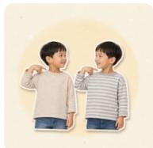
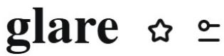
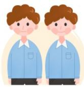
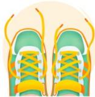
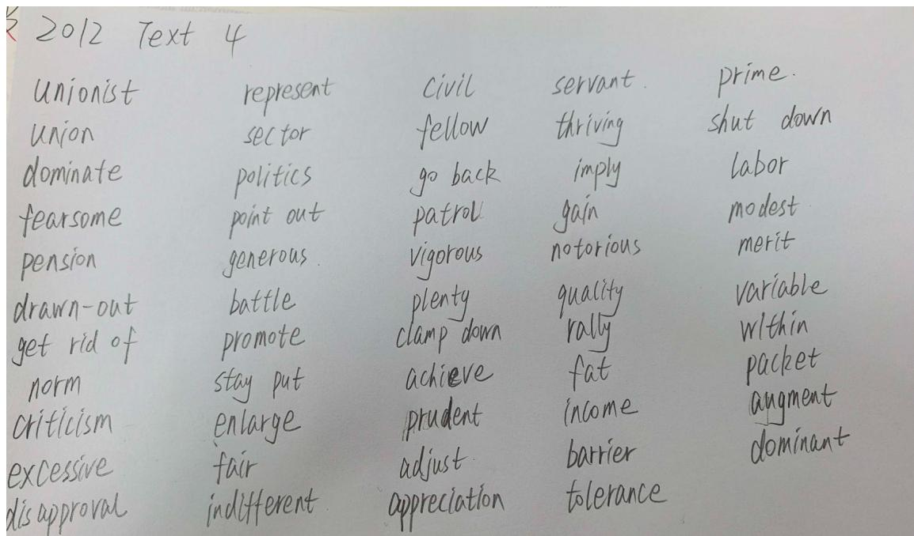

# 2012.docx — 图像索引

> 由 MinerU 结构化结果生成。题目若依赖树形、拓扑、流程、曲线、区域、时序或其他空间关系，应核对这里的原图，不要只依据 OCR 文本推断。

## 图 1

原文页码：3；bbox：`[265, 105, 287, 123]`

## 图 2

原文页码：3；bbox：`[684, 98, 801, 179]`

## 图 3

原文页码：3；bbox：`[421, 351, 448, 370]`

## 图 4

原文页码：4；bbox：`[699, 583, 815, 663]`

## 图 5

原文页码：6；bbox：`[174, 354, 364, 387]`

## 图 6

原文页码：6；bbox：`[712, 676, 815, 743]`

## 图 7

原文页码：8；bbox：`[697, 90, 796, 162]`

## 图 8

原文页码：8；bbox：`[680, 342, 779, 412]`

## 图 9

原文页码：10；bbox：`[665, 625, 759, 693]`

## 图 10

原文页码：13；bbox：`[147, 533, 845, 824]`
