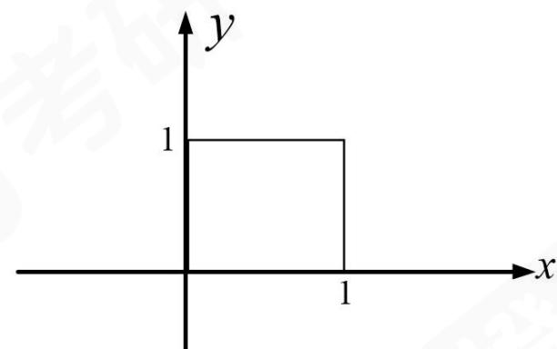

# 2026 考研数学（三）真题试卷及解析（橙啦） .pdf

# 2026 考研数学（三） 真题

# 试卷及解析

## 一、选择题：1～10 小题，每小题 5 分，共 50 分．下列每题给出的四个选项中，只有一个选项是符合题目要求的.

1. 曲线 $y = x\mathrm{e}^{\frac{1}{x}}$ A. 无水平渐近线，无铅直渐近线.
B. 有水平渐近线，有铅直渐近线.
C. 无水平渐近线，有铅直渐近线.
D. 有水平渐近线，无铅直渐近线.

1.【答案】C

【解析】 $y = x e^{\frac{1}{x}}$ 的无定义点为 $x = 0$ .

当 $x \to 0$ 时， $\lim_{x \to 0^{+}} x \mathrm{e}^{\frac{1}{x}} \stackrel{\text{令} x = \frac{1}{t}}{=} \lim_{t \to +\infty} \frac{\mathrm{e}^{t}}{t} \stackrel{\text{洛必达法则}}{=} \lim_{t \to +\infty} \mathrm{e}^{t} = +\infty$ ，故 $x = 0$ 为铅直渐线.

近线.

又 $x \to \infty$ 时， $\lim_{x \to \infty} x e^{\frac{1}{x}} \stackrel{\text{令} x = \frac{1}{t}}{=} \lim_{t \to 0} \frac{e^t}{t} = \lim_{t \to 0} \frac{1}{t} = \infty$ ，故无水平渐近线.选 C.

2. 设函数 $z = z(x, y)$ 由方程 $x - az = e^{y + az}$ （ $a$ 是非零常数）确定，则
A. $\frac{\partial z}{\partial x} - \frac{\partial z}{\partial y} = \frac{1}{a}$ .
B. $\frac{\partial z}{\partial x} + \frac{\partial z}{\partial y} = \frac{1}{a}$ .
C. $\frac{\partial z}{\partial x} - \frac{\partial z}{\partial y} = -\frac{1}{a}$ .
D. $\frac{\partial z}{\partial x} + \frac{\partial z}{\partial y} = -\frac{1}{a}$ .

2.【答案】A 【解析】（法一）由微分形式不变性得 $\mathrm{dx} - a\mathrm{dz} = \mathrm{e}^{y + az}(\mathrm{dy} + a\mathrm{dz})$

整理得： $\left(a\mathrm{e}^{y + at} + a\right)\mathrm{d}z = \mathrm{d}x - \left(\mathrm{e}^{y + az}\right)\mathrm{d}y$ ，故 $\mathrm{dz} = \frac{1}{a}\left[\frac{1}{\mathrm{e}^{y + az} + 1}\mathrm{dx} + \frac{-\mathrm{e}^{y + az}}{\mathrm{e}^{y + az} + 1}\mathrm{dy}\right].$

故 $\frac{\partial z}{\partial x} = \frac{1}{a}\frac{1}{\mathrm{e}^{y + az} + 1},\frac{\partial z}{\partial y} = \frac{1}{a}\left(\frac{-\mathrm{e}^{y + az}}{\mathrm{e}^{y + az} + 1}\right).$

显然： $\frac{\partial z}{\partial x} -\frac{\partial z}{\partial y} = \frac{1}{a}$ ，选A.

（法二）构造 $F(x,y,z)=x-az-e^{y+az}$ ,

由 $\left\{\begin{aligned}F_{x}^{\prime}&=1,\\ F_{y}^{\prime}&=-\mathrm{e}^{y+az},\\ F_{z}^{\prime}&=-a-\mathrm{e}^{y+az}\cdot a,\end{aligned}\right.$ 故

$$
\frac {\partial z}{\partial x} = - \frac {F _ {x} ^ {\prime}}{F _ {z} ^ {\prime}} = - \frac {1}{- a [ 1 + e ^ {y + a z} ]} = \frac {1}{a [ 1 + e ^ {y + a z} ]},
$$

$$
\frac {\partial z}{\partial y} = - \frac {F _ {y} ^ {\prime}}{F _ {z} ^ {\prime}} = - \frac {- \mathrm{e} ^ {y + a z}}{- a [ 1 + \mathrm{e} ^ {y + a z} ]} = - \frac {\mathrm{e} ^ {y + a z}}{a [ 1 + \mathrm{e} ^ {y + a z} ]}.
$$

故 $\frac{\partial z}{\partial x} -\frac{\partial z}{\partial y} = \frac{1}{a}$ ，选A.

3. 已知函数 $f(x) = \int_{1}^{x^3} \frac{\mathrm{e}^t}{1 + t^2} \, \mathrm{d}t$ ， $f$ 的反函数为 $g$ ，则
A. $g(0) = 1, g'(0) = \frac{3}{2} \mathrm{e}$ . B. $g(0) = 1, g'(0) = \frac{2}{3\mathrm{e}}$ . C. $g(1) = 0, g'(1) = \frac{3}{2} \mathrm{e}$ . D. $g(1) = 0, g'(1) = \frac{2}{3\mathrm{e}}$ .

3.【答案】B

【解析】由题知，当 $x = 1$ 时， $f(1) = 0$ ，故 $g(0) = 1$ .

$$
f ^ {\prime} (1) = \lim _ {x \rightarrow 1} \frac {f (x) - f (1)}{x - 1} = \lim _ {x \rightarrow 1} \frac {\int_ {1} ^ {x ^ {3}} \frac {\mathrm{e} ^ {t}}{1 + t ^ {2}} \mathrm{d} t}{x - 1} = \frac {3 \mathrm{e}}{2},
$$

由 $y'=\frac{dy}{dx}=\frac{1}{\frac{dx}{dy}}$ 知 $f'(1)=\frac{1}{g'(0)}$ ，故 $g'(0)=\frac{1}{f'(1)}=\frac{2}{3e}$ . 选 B.

4. 设 $t$ 时刻某证券的交易单价为 $p(t)$ ，某机构持有该证券的份额为 $q(t)$ ，若该机构在 $t \in [0, T]$ 持续购入一定份额该证券，则这些证券的平均购入价格为  
A. $\frac{1}{T} \int_{0}^{T} p(t) \mathrm{d}t$ . B. $\frac{1}{q(T) - q(0)} \int_{0}^{T} p(t) \mathrm{d}t$ .  
C. $\frac{1}{T} \int_{0}^{T} p(t) q'(t) \mathrm{d}t$ . D. $\frac{1}{q(T) - q(0)} \int_{0}^{T} p(t) q'(t) \mathrm{d}t$ .

4.【答案】D

【解析】由题知在 t 时刻，机构买入的价格为 $p(t)q'(t)$ .
在 $[0,T]$ 时间段内，机构持续买入金额为 $\int_{0}^{T}p(t)q'(t)\mathrm{d}t$ 故平均买入价格为 $\frac{1}{q(T)-q(0)}\int_{0}^{T}p(t)q'(t)\mathrm{d}t$ ，选D.

5. 设矩阵 $A=\begin{pmatrix}1&0&1\\0&0&1\\1&1&3\\1&1&1\end{pmatrix},C=\begin{pmatrix}2&0\\1&1\\1&1\\a&b\end{pmatrix}$ ，若存在矩阵 B 满足 AB=C，则
A. a=-1, b=-1.
B. a=2, b=2.
C. a=-1, b=2.
D. a=2, b=-1.

5.【答案】A 【解析】设 $A = (\alpha_{1},\alpha_{2},\alpha_{3}),C = (r_{1},r_{2})$ 由 $AB = C$ 得， $\pmb{B}$ 的列向量为 $Ax = r_1, Ax = r_2$ 的解由 $Ax = r_1$ 有解得 $r(A) = r(A,r_1)$

故 $\begin{pmatrix}1&0&1&2\\0&1&2&-1\\0&0&1&1\\0&0&-2&a-1\end{pmatrix}$ 的最后两行成比例，即 $\frac{1}{-2}=\frac{1}{a-1}$ ，解得a=-1
同理，由 $Ax=r_{2}$ 有解得 $r(A)=r(A,r_{2})$ ，故最后两行成比例 $\frac{1}{-2}=\frac{1}{b-1}$ ，解得b=-1.
故选 A.

6. 设 A 为 3 阶非零矩阵， $A^{*}$ 为 A 的伴随矩阵，若 $A^{*} = -2A$ ，则 $A^{2} =$ A. $\begin{pmatrix}-4&0&0\\0&-4&0\\0&0&-4\end{pmatrix}.$ B. $\begin{pmatrix}-4&0&0\\0&-4&0\\0&0&4\end{pmatrix}.$ C. $\begin{pmatrix}-4&0&0\\0&4&0\\0&0&4\end{pmatrix}.$ D. $\begin{pmatrix}4&0&0\\0&4&0\\0&0&4\end{pmatrix}.$

6.【答案】D

【解析】由 $A^{*} = -2A$ ，两边同时左乘 $\pmb{A}$ ，得

$$
\boldsymbol {A} \boldsymbol {A} ^ {*} = - 2 \boldsymbol {A} ^ {2} \Leftrightarrow | \boldsymbol {A} | \boldsymbol {E} = - 2 \boldsymbol {A} ^ {2} \boldsymbol {E}.
$$

排除 B，C.

由 $A^{*} = -2A$ 两边同时取行列式，得到 $\left|A^{*}\right| = \left|-2A\right|$ .

又 $\left|A^{*}\right|=|A|^{3-1}=|A|^{2}=(-2)^{3}|A|=-8|A|$ ，且 $|A|^{2}+8|A|=0$ ，

故 $|A|(|A|+8)=0$ ，解得 $|A|=0$ 或 $|A|=-8$ .

所以 $|A|^{2}=64$ ，排除A，故选D.

7. 设 3 阶矩阵 $A$ ， $B$ 满足 $AB + BA = A^2 + B^2$ ，且 $A \neq B$ ，则下列结论错误的是
A. $(A - B)^3 = O$ .

B. A-B 只有零特征值.

C. A, B 不能都是对角矩阵.

D. A-B 只有一个线性无关的特征向量.

7.【答案】D

【解析】

$$
\boldsymbol {A} \boldsymbol {B} + \boldsymbol {B} \boldsymbol {A} = \boldsymbol {A} ^ {2} + \boldsymbol {B} ^ {2},
$$

$$
\boldsymbol {A} \boldsymbol {B} - \boldsymbol {A} ^ {2} + \boldsymbol {B} \boldsymbol {A} - \boldsymbol {B} ^ {2} = \boldsymbol {O},
$$

$$
\boldsymbol {A} (\boldsymbol {B} - \boldsymbol {A}) + \boldsymbol {B} (\boldsymbol {A} - \boldsymbol {B}) = \boldsymbol {O},
$$

$$
\boldsymbol {A} (\boldsymbol {B} - \boldsymbol {A}) - \boldsymbol {B} (\boldsymbol {B} - \boldsymbol {A}) = \boldsymbol {O},
$$

$$
(A - B) (B - A) = O,
$$

$$
- (A - B) ^ {2} = O,
$$

故 $(A-B)^{2}=O$ .

A 选项: $(A - B)^3 = (A - B)^2 \cdot (A - B) = O$ 成立;

B 选项: 由 $(A - B)^2 = O$ 可得, $f\left((A - B)^2\right) = O$ , 故 $(A - B)^2$ 只有零特征值. 设 $(A - B)$ 的特征值为入, 则 $(A - B)^2$ 的特征值 $\lambda^2 = 0$ , 故 $A - B$ 也只有零特征值;

C 选项：若 A，B 都是对角矩阵，则 A-B 也为对角阵，而对角矩阵的平方为零；

当且仅当自身为零矩阵（对角元平方为零，则对角元为零），但 $A \neq B$ ，即 $A - B \neq O$ 。故 $A$ ， $B$ 不能都是对角阵；

D 选项：设 C = A - B 满足 $C^{2} = O$ ，但 C 的线性无关特征向量个数不一定为 1

举特例为 $C=\begin{pmatrix}0&1&0\\0&0&0\\0&0&0\end{pmatrix}$ ，满足 $C^{2}=O$ .

而 C 有 2 个线性无关的特征向量，故选 D.

8. 设随机变量 X 和 Y 独立分布，X 的概率密度为 $f(x)=\left\{\begin{aligned}\frac{1}{(1+x)^{2}}, & x>0, \\ 0, & x\leq0,\end{aligned}\right.$ 则 $P\left\{XY\leq1\right\}=$ A. $\frac{3}{4}$ . B. $\frac{1}{2}$ .
C. $\frac{1}{3}$ . D. $\frac{1}{6}$ .

8.【答案】B

【解析】由于 X 与 Y 独立，所以 X 与 Y 的联合概率密度为：

$$
f (x, y) = \left\{ \begin{array}{l l} \frac {1}{(1 + x) ^ {2} (1 + y) ^ {2}}, & x > 0, y > 0, \\ 0, & \text {其他.} \end{array} \right.
$$

所以 $P\left\{XY \leq 1\right\} = \int_{0}^{+\infty} \frac{1}{(1 + x)^{2}} \, dx \int_{0}^{\frac{1}{x}} \frac{1}{(1 + y)^{2}} \, dy = \int_{0}^{+\infty} \frac{1}{(1 + x)^{3}} \, dx$ $= -\frac{1}{2} \frac{1}{(1 + x)^{2}} \bigg|_{0}^{+\infty} = -\frac{1}{2}(0 - 1) = \frac{1}{2}.$

选B.

9. 设随机变量 $X \sim N(0,1)$ ，随机变量 $Y \sim B\left(2, \frac{1}{2}\right)$ ，且 $X$ 与 $Y$ 独立，则 $XY$ 与 $X + Y$ 的相关系数为
A. $\frac{\sqrt{6}}{3}$ B. $\frac{\sqrt{2}}{2}$ C. $\frac{2}{3}$ D. $\frac{1}{2}$

9.【答案】C
【解析】 $\mathrm{Cov}(XY,X+Y)=\mathrm{Cov}(XY,X)+\mathrm{Cov}(XY,Y)$ $=E(X^{2}Y)-E(XY)\cdot EX+E(XY^{2})-E(XY)EY$ 数学解析 第6页（共16页）

$$
\begin{array}{l} = \left[ E (X ^ {2}) - (E X) ^ {2} \right] E Y + E X (E (Y ^ {2}) - (E Y) ^ {2}) \\ = D X E Y + E X D Y. \end{array}
$$

由于 $EX = 0, DX = 1, EY = 1, DY = \frac{1}{2}$ ，则 $\operatorname{Cov}(XY, X + Y) = 1 \times 1 + 0 \times \frac{1}{2} = 1$ . 又因为

$$
D (X Y) = E (X Y) ^ {2} - \left[ E (X Y) \right] ^ {2} = E \left(X ^ {2}\right) E \left(Y ^ {2}\right) - (E X) ^ {2} (E Y) ^ {2} = 1 \times \frac {3}{2} - 0 = \frac {3}{2},
$$

$$
D (X + Y) = D X + D Y = \frac {3}{2},
$$

所以 $XY$ 与 $X + Y$ 的相关系数为 $\rho = \frac{1\times 1 + 0\times\frac{1}{2}}{\sqrt{\frac{3}{2}\cdot\frac{3}{2}}} = \frac{2}{3}.$

选C.

10. 设随机变量 X 的概率分布为 $P\{X=k\}=\frac{1}{2^{k+1}}+\frac{1}{3^{k}}(k=1,2,\cdots)$ ，则对于正整数 m,n，
有
A. $P\{X > m + n | X > m\} = P\{X > m\}$ .
B. $P\{X > m + n | X > m\} = P\{X > n\}$ .
C. $P\{X > m + n | X > m\} > P\{X > m\}$ .
D. $P\{X > m + n | X > m\} > P\{X > n\}$ .

10.【答案】D

【解析】 $P\{X > m\} = \sum_{k = m + 1}^{\infty}P\{X = k\} = \sum_{k = m + 1}^{\infty}\left(\frac{1}{2^{k + 1}} +\frac{1}{3^k}\right) = \frac{\frac{1}{2^{m + 2}}}{1 - \frac{1}{2}} +\frac{\frac{1}{3^{m + 1}}}{1 - \frac{1}{3}}$ $= \frac{1}{2^{m + 1}} +\frac{1}{2}\frac{1}{3^m} = \frac{1}{2}\left(\frac{1}{2^m} +\frac{1}{3^m}\right).$

$$
P \{X > m + n \mid X > m \} = \frac {P \{X > m + n \}}{P \{X > m \}} = \frac {\frac {1}{2} \left(\frac {1}{2 ^ {m + n}} + \frac {1}{3 ^ {m + n}}\right)}{\frac {1}{2} \left(\frac {1}{2 ^ {m}} + \frac {1}{3 ^ {m}}\right)} \underline {{\text {(同乘} 6 ^ {m})}} \frac {\frac {3 ^ {m}}{2 ^ {n}} + \frac {2 ^ {m}}{3 ^ {n}}}{3 ^ {m} + 2 ^ {m}}.
$$

而 $P\{X>n\}=\frac{1}{2}\left(\frac{1}{2^{n}}+\frac{1}{3^{n}}\right)$ ，所以

$$
\begin{array}{r l} P \left\{X > m + n \mid X > m \right\} - P \{X > n) & = \frac {\frac {3 ^ {m}}{2 ^ {n}} + \frac {2 ^ {m}}{3 ^ {n}}}{3 ^ {m} + 2 ^ {m}} - \frac {\frac {1}{2 ^ {n}} + \frac {1}{3 ^ {n}}}{2} (\text {通分}) \\ & = \frac {2 \left(\frac {3 ^ {m}}{2 ^ {n}} + \frac {2 ^ {m}}{3 ^ {n}}\right) - \frac {3 ^ {m} + 2 ^ {m}}{2 ^ {n}} - \frac {3 ^ {m} + 2 ^ {m}}{3 ^ {n}}}{2 \left(3 ^ {m} + 2 ^ {m}\right)} = \frac {\frac {3 ^ {m}}{2 ^ {n}} + \frac {2 ^ {m}}{3 ^ {n}} - \frac {2 ^ {m}}{2 ^ {n}} - \frac {3 ^ {m}}{3 ^ {n}}}{2 \left(3 ^ {m} + 2 ^ {m}\right)} \\ & = \frac {\left(3 ^ {m} - 2 ^ {m}\right) \left(\frac {1}{2 ^ {n}} - \frac {1}{3 ^ {n}}\right)}{2 \left(3 ^ {m} + 2 ^ {m}\right)} > 0, \end{array}
$$

选择D.

## 二、填空题：11～16 小题，每小题 5 分，共 30 分.

11. $\int_0^1 x(x - 1)\left(x - \frac{1}{2}\right)\mathrm{d}x =$

11.【答案】0

【解析】 $\int_0^1 x(x - 1)\left(x - \frac{1}{2}\right)\mathrm{d}x\frac{\text{令}x - \frac{1}{2} = t}{x = t + \frac{1}{2}}\int_{-\frac{1}{2}}^{\frac{1}{2}}\left(t + \frac{1}{2}\right)\left(t - \frac{1}{2}\right)t\mathrm{d}t =$ $= \int_{-\frac{1}{2}}^{\frac{1}{2}}\left(t^{2} - \frac{1}{4}\right)t\mathrm{d}t = 0.$

12. $\lim_{x\to 0}\frac{1}{x}\left(\frac{\sqrt{1 + x^2}}{\sin x} -\frac{1}{\tan x}\right) = \_$ .

12.【答案】1

$$
\begin{array}{r l}\text {【解析】}&\lim _ {x \rightarrow 0} \frac {1}{x} \left(\frac {\sqrt {1 + x ^ {2}}}{\sin x} - \frac {1}{\tan x}\right) = \lim _ {x \rightarrow 0} \frac {\tan x \cdot \left(1 + x ^ {2}\right) ^ {\frac {1}{2}} - \sin x}{x \sin x \tan x}\\&= \lim _ {x \rightarrow 0} \frac {\left[ x + \frac {1}{3} x ^ {3} + o \left(x ^ {3}\right)\right]\left[ 1 + \frac {1}{2} x ^ {2} + o \left(x ^ {2}\right)\right] - \left[ x - \frac {1}{6} x ^ {3} + o \left(x ^ {3}\right)\right]}{x ^ {3}}\\&= \lim _ {x \rightarrow 0} \frac {\left(\frac {1}{3} + \frac {1}{2} + \frac {1}{6}\right) x ^ {3} + o \left(x ^ {3}\right)}{x ^ {3}} = 1.\end{array}
$$

13. 设 $p$ 为常数，若反常积分 $\int_{0}^{+\infty} \frac{\arctan x}{x^{p}(x + 1)} \, \mathrm{d}x$ 收敛，则 $p$ 的取值范围是 \_\_\_\_.

13.【答案】 $0 < p < 2$

【解析】 $I=\int_{0}^{+\infty}\frac{\arctan x}{x^{p}(x+1)}\mathrm{d}x=\int_{0}^{1}\frac{\arctan x}{x^{p}(x+1)}\mathrm{d}x+\int_{1}^{+\infty}\frac{\arctan x}{x^{p}(x+1)}\mathrm{d}x=I_{1}+I_{2}.$

对于 $I_{1}$ ，当 $x\to0^{+}$ 时， $\frac{\arctan x}{x^{p}(x+1)}\sim\frac{x}{x^{p}}=\frac{1}{x^{p-1}}$

故当 $p - 1 < 1$ 时收敛，即 $p < 2$ ；

对于 $I_{2}$ ，当 $x\to +\infty$ 时， $\frac{\arctan x}{x^p(x + 1)}\sim \frac{\frac{\pi}{2}}{x^{p + 1}}$

故当 $p+1>1$ 时收敛，即 p>0.

综上，I 收敛时，0 < p < 2。

14. 微分方程 $y'' - 2y' = e^{x}$ 满足条件 $y(0) = 1$ , $y'(0) = 1$ 的解为 y = \_\_\_\_.

14.【答案】 $y=e^{2x}-e^{x}+1$

【解析】由 $y''-2y'=\mathrm{e}^{x}$ 的齐次方程为 $y''-2y'=0$ ，知特征方程为 $r^{2}-2r=0$ ，故

$r_{1}=0,\quad r_{2}=2$ ，故齐次通解为 $y=C_{1}e^{2x}+C_{2}$

由自由项 $f(x)=\mathrm{e}^{x}$ ，故可设特解为 $y^{*}=A\mathrm{e}^{x}$ ，则 $\left(y^{*}\right)^{\prime}=A\mathrm{e}^{x}$ ， $\left(y^{*}\right)^{\prime\prime}=A\mathrm{e}^{x}$ .
代入方程中得 $A e^{x}-2 A e^{x}=e^{x}$ ，故 A=-1，即非齐次通解为 $y=C_{1}e^{2x}+C_{2}-e^{x}$ .

又由初始条件知 $y(0)=1,\quad y'(0)=1$ . 故 $\left\{\begin{aligned}C_{1}+C_{2}-1=1,\\ 2C_{1}-1=1,\end{aligned}\right.$ 解得 $\left\{\begin{aligned}C_{1}=1,\\ C_{2}=1.\end{aligned}\right.$ 故

$$
y = \mathrm{e} ^ {2 x} - \mathrm{e} ^ {x} + 1.
$$

15. 设矩阵 $A=\begin{pmatrix}1 & b & -1 \\ a+2 & 3 & -3a\end{pmatrix}$ . 若二次型 $\boldsymbol{x}^{\mathrm{T}}\left(\boldsymbol{A}\boldsymbol{A}^{\mathrm{T}}\right)\boldsymbol{x}$ 的规范形为 $y_{1}^{2}$ ，则 $a+b=$

15.【答案】2

【解析】由题可知，二次型 $x^{T}AA^{T}x$ 的规范形为 $y_{1}^{2}$ ，因此矩阵 $AA^{T}$ 的秩为 1，故 A 的秩为 1，矩阵 $A=\begin{pmatrix}1 & b & -1 \\ a+2 & 3 & -3a\end{pmatrix}$ 的两行对应成比例，

$$
\frac {1}{a + 2} = \frac {b}{3} = - \frac {1}{3 a},
$$

即 $\left\{ \begin{array}{l} 3 = (a + 2)b, \\ -3ab = -3. \end{array} \right.$ 联立解得 $a = 1, b = 1$ . 故 $a + b = 2$ .

16. 设随机变量 X 服从参数为 1 的泊松分布，随机变量 Y 服从参数为 3 的泊松分布，X 与 Y - X 相互独立，则 $E(XY) =$ \_\_\_\_.

16.【答案】4

【解析】由 X 与 Y-X 独立，可知二者不相关，即

$$
\operatorname{Cov} (X, Y - X) = \operatorname{Cov} (X, Y) - D X = 0.
$$

也即 $E(XY)-EX \cdot EY-DX=0$ .

所以 $E(XY)=EX\cdot EY+DX=1\times3+1=4$ .

## 三、解答题：17～22 小题，共 70 分．解答应写出文字说明、证明过程或演算步骤.

## 17.（本题满分10分）

已知函数 $f(x)$ 满足 $f(x)=\frac{1}{(2-x)^{2}}-\int_{0}^{1}f(x)\mathrm{d}x$ ，将 $f(x)$ 展开成 x 的幂级数.

17.【解】令 $\int_0^1 f(x)\mathrm{d}x = A$ ，对原方程 $f(x) = \frac{1}{(2 - x)^2} -\int_0^1 f(x)\mathrm{d}x.$

两边同时进行从0到1积分，则

$$
\int_ {0} ^ {1} f (x) \mathrm{d} x = \int_ {0} ^ {1} \frac {1}{(2 - x) ^ {2}} \mathrm{d} x - \int_ {0} ^ {1} A \mathrm{d} x, A = \int_ {0} ^ {1} \frac {1}{(2 - x) ^ {2}} \mathrm{d} x - A,
$$

其中 $\int_0^1\frac{1}{(2 - x)^2}\mathrm{d}x = \frac{1}{2}$ 故 $A = \frac{1}{4}$

又因为 $\frac{1}{(2 - x)^2} = \left(\frac{1}{2 - x}\right)' = \left(\frac{1}{2} \cdot \frac{1}{1 - \frac{x}{2}}\right)' = \left[\frac{1}{2} \sum_{n=0}^{\infty} \left(\frac{x}{2}\right)^n\right]' = \sum_{n=1}^{\infty} n \frac{x^{n-1}}{2^{n+1}}$ ，故

$$
f (x) = \sum_ {n = 1} ^ {\infty} n \cdot \frac {x ^ {n - 1}}{2 ^ {n + 1}} - \frac {1}{4}, | x | <   2.
$$

18.（本题满分12分）

已知函数 $g(x)$ 连续. 设 $f(x) = \int_{0}^{x^2} g(xt) \, \mathrm{d}t$ ，求 $f'(x)$ 的表达式，并判断 $f'(x)$ 在 $x = 0$ 处的连续性.

18.【解】当 $x \neq 0$ 时， $f(x) = \int_{0}^{x^2} g(xt) \, \mathrm{d}t \xlongequal{u = xt} \int_{0}^{x^3} g(u) \frac{1}{x} \, \mathrm{d}u = \frac{1}{x} \int_{0}^{x^3} g(u) \, \mathrm{d}u.$

对 $f(x)$ 求导得，

$$
f ^ {\prime} (x) = \frac {g \left(x ^ {3}\right) 3 x ^ {3} - \int_ {0} ^ {x ^ {3}} g (u) \mathrm{d} u}{x ^ {2}} = 3 x g \left(x ^ {3}\right) - \frac {\int_ {0} ^ {x ^ {3}} g (u) \mathrm{d} u}{x ^ {2}}.
$$

在 $x = 0$ 处，由定义式可得

$$
f ^ {\prime} (0) = \lim _ {x \rightarrow 0} \frac {f (x) - f (0)}{x - 0} = \lim _ {x \rightarrow 0} \frac {\int_ {0} ^ {x ^ {3}} g (u) \mathrm{d} u}{x ^ {2}} = 0.
$$

$$
\text {故} f ^ {\prime} (x) = \left\{ \begin{array}{c c} 3 x g \left(x ^ {3}\right) - \frac {\int_ {0} ^ {x ^ {3}} g (u) \mathrm{d} u}{x ^ {2}}, & x \neq 0, \\ 0, & x = 0. \end{array} \right.
$$

$$
\begin{array}{r l} \text {又} \lim _ {x \to 0} f ^ {\prime} (x) & = \lim _ {x \to 0} \left[ 3 x g (x ^ {3}) - \frac {\int_ {0} ^ {x ^ {3}} g (u) \mathrm{d} u}{x ^ {2}} \right] \\ & = \lim _ {x \to 0} 3 x g (x ^ {3}) - \lim _ {x \to 0} \frac {\int_ {0} ^ {x ^ {3}} g (u) \mathrm{d} u}{x ^ {2}} = - \lim _ {x \to 0} \frac {3 x ^ {2} g (x ^ {3})}{2 x} = 0, \end{array}
$$

故 $f'(x)$ 在 x=0 处连续.

19.（本题满分10分）

求函数 $f(x,y) = (2x^{2} - y^{2})\mathrm{e}^{x}$ 的极值.

19.【解】由题可知， $f_{x}^{\prime}=4xe^{x}+\left(2x^{2}-y^{2}\right)e^{x},f_{y}^{\prime}=-2ye^{x}$

$$
\text {令} \left\{ \begin{array}{l} f _ {x} ^ {\prime} = 0, \\ f _ {y} ^ {\prime} = 0 \end{array} \Rightarrow \left\{ \begin{array}{l} x = 0, \\ y = 0, \end{array} \right. \text {或} \left\{ \begin{array}{l} x = - 2, \\ y = 0. \end{array} \right. \right.
$$

又 $A = f_{xx}'' = \mathrm{e}^{x}\left(2x^{2} + 8x + 4 - y^{2}\right),B = f_{xy}'' = -2y\mathrm{e}^{y},C = f_{yy}'' = -2\mathrm{e}^{x},$

故 $AC - B^2\Big|_{(0,0)} = -8 < 0, AC - B^2\Big|_{(-2,0)} = 8\mathrm{e}^{-4} > 0$ 且 $A_{(-2,0)} = -4\mathrm{e}^{-2} < 0,$

则 $(0,0)$ 为非极值点， $(-2,0)$ 为极大值点且极大值 $f(-2,0)=\frac{8}{e^{2}}$ .

20.（本题满分12分）

设平面区域 $D = \{(x,y)\mid 0\leq x\leq 1,0\leq y\leq 1\}$ ，计算二重积分 $\iint_{D}\frac{y}{(1 + x^2 + y^2)^{\frac{3}{2}}} \mathrm{d}x\mathrm{d}y.$

20.【解】如图所示，

$$
\begin{array}{r l} \text {原式} & = \int_ {0} ^ {1} \mathrm{d} x \int_ {0} ^ {1} \frac {y}{(1 + x ^ {2} + y ^ {2}) ^ {\frac {3}{2}}} \mathrm{d} y = \int_ {0} ^ {1} \mathrm{d} x \int_ {0} ^ {1} \frac {\frac {1}{2}}{(1 + x ^ {2} + y ^ {2}) ^ {\frac {3}{2}}} \mathrm{d} (1 + x ^ {2} + y ^ {2}) \\ & = \int_ {0} ^ {1} \frac {1}{2} (- 2) \cdot (1 + x ^ {2} + y ^ {2}) ^ {- \frac {1}{2}} \Bigg | _ {0} ^ {1} \mathrm{d} x = \int_ {0} ^ {1} \left[ (1 + x ^ {2}) ^ {- \frac {1}{2}} - (2 + x ^ {2}) ^ {- \frac {1}{2}} \right] \mathrm{d} x \\ & = \int_ {0} ^ {1} \frac {1}{\sqrt {1 + x ^ {2}}} \mathrm{d} x - \int_ {0} ^ {1} \frac {1}{\sqrt {2 + x ^ {2}}} \mathrm{d} x = \ln (x + \sqrt {1 + x ^ {2}}) \Big | _ {0} ^ {1} - \ln (x + \sqrt {2 + x ^ {2}}) \Big | _ {0} ^ {1} \\ & = \ln (1 + \sqrt {2}) - \ln (1 + \sqrt {3}) + \ln \sqrt {2} = \ln \left(\frac {1 + \sqrt {2}}{1 + \sqrt {3}} \cdot \sqrt {2}\right). \end{array}
$$

21.（本题满分 12 分）

已知向量组 $\alpha_{1}=\begin{pmatrix}1\\0\\-1\\-1\end{pmatrix},\quad\alpha_{2}=\begin{pmatrix}1\\-1\\0\\-2\end{pmatrix},\quad\alpha_{3}=\begin{pmatrix}0\\-1\\1\\-1\end{pmatrix},\alpha_{4}=\begin{pmatrix}0\\1\\-1\\1\end{pmatrix}$ ，记

$$
\boldsymbol {A} = \left(\boldsymbol {\alpha} _ {1}, \boldsymbol {\alpha} _ {2}, \boldsymbol {\alpha} _ {3}, \boldsymbol {\alpha} _ {4}\right), \quad \boldsymbol {G} = \left(\boldsymbol {\alpha} _ {1}, \boldsymbol {\alpha} _ {2}\right).
$$

（1）证明： $\alpha_{1},\alpha_{2}$ 是 $\alpha_{1},\alpha_{2},\alpha_{3},\alpha_{4}$ 的极大线性无关组；

(2) 求矩阵 H 使得 A = GH，并求 $A^{10}$ .

21.（1）【证明】 $A = (\alpha_{1},\alpha_{2},\alpha_{3},\alpha_{4}) = \begin{pmatrix} 1 & 1 & 0 & 0\\ 0 & -1 & -1 & 1\\ -1 & 0 & 1 & -1\\ -1 & -2 & -1 & 1 \end{pmatrix}\rightarrow \begin{pmatrix} 1 & 1 & 0 & 0\\ 0 & -1 & -1 & 1\\ 0 & 0 & 0 & 0\\ 0 & 0 & 0 & 0 \end{pmatrix},$

$r(A)=2$ 且 $\alpha_{1},\alpha_{2}$ 线性无关.

又 $\alpha_{3} = -\alpha_{1} + \alpha_{2},\quad \alpha_{4} = \alpha_{1} - \alpha_{2}$ ，所以 $\alpha_{1},\alpha_{2}$ 是 $\alpha_{1},\alpha_{2},\alpha_{3},\alpha_{4}$ 的极大线性无关组.

(2)【解】 $A=\left(\boldsymbol{\alpha}_{1},\boldsymbol{\alpha}_{2},-\boldsymbol{\alpha}_{1}+\boldsymbol{\alpha}_{2},\boldsymbol{\alpha}_{1}-\boldsymbol{\alpha}_{2}\right)_{1\times4}=\left(\boldsymbol{\alpha}_{1},\boldsymbol{\alpha}_{2}\right)_{1\times2}\begin{pmatrix}1&0&-1&1\\0&1&1&-1\end{pmatrix}_{2\times4}$

$$
\boldsymbol {A} ^ {1 0} = \boldsymbol {G H G H} \dots \boldsymbol {G H} = \boldsymbol {G D} ^ {9} \boldsymbol {H},
$$

其中 $D=\begin{pmatrix}1&0&-1&1\\0&1&1&-1\end{pmatrix}_{2\times4}\begin{pmatrix}1&1\\0&-1\\-1&0\\-1&-2\end{pmatrix}_{4\times2}=\begin{pmatrix}1&-1\\0&1\end{pmatrix}_{2\times2}$

又 $\boldsymbol{D}^{2}=\begin{pmatrix}1&-2\\0&1\end{pmatrix},\boldsymbol{D}^{3}=\begin{pmatrix}1&-3\\0&1\end{pmatrix}$ ，由此可推出 $\boldsymbol{D}^{9}=\begin{pmatrix}1&-9\\0&1\end{pmatrix}$ .

$$
\boldsymbol {A} ^ {1 0} = \boldsymbol {G} \boldsymbol {D} ^ {9} \boldsymbol {H} = \left( \begin{array}{c c c c} 1 & 8 & - 9 & 9 \\ 0 & - 1 & - 1 & 1 \\ - 1 & 9 & 1 0 & - 1 0 \\ - 1 & 7 & 8 & - 8 \end{array} \right).
$$

## 22.（本题满分12分）

假设某种元件的寿命服从指数分布，其均值 $\theta$ 是未知参数。为估计 $\theta$ ，取 n 个这种元件同时做寿命试验，试验到出现 $k(1 \leq k \leq n)$ 个元件失效时停止。

(1) 若 k=1，失效元件的寿命记为 T，(i) 求 T 的概率密度；(ii) 确定 a，使得 $\hat{\theta}=aT$ 是 $\theta$ 的无偏估计，并求 $D(\hat{\theta})$ ;

（2）已知 k 个失效元件的寿命值分别为 $t_{1}, t_{2}, \cdots, t_{k}$ ，且 $t_{1} \leq t_{2} \leq \cdots \leq t_{k}$ ，似然函数为 $L(\theta) = \frac{1}{\theta^{k}} e^{-\frac{1}{\theta}\left[\sum_{i=1}^{k} t_{i} + (n-k)t_{k}\right]}$ ，求 $\theta$ 的最大似然估计值.

22.【解】(1)(i) 设元件的寿命分别为 $X_{1}, X_{2}, \cdots, X_{n}$ ，则每个样本均服从参数 $\lambda = \frac{1}{\theta}$ 的

指数分布，即

$$
F (x) = \left\{ \begin{array}{l l} 1 - \mathrm{e} ^ {- \frac {x}{\theta}}, & x \geq 0, \\ 0, & x <   0, \end{array} \right. f (x) = \left\{ \begin{array}{l l} \frac {1}{\theta} \mathrm{e} ^ {- \frac {x}{\theta}}, & x > 0, \\ 0, & x <   0. \end{array} \right.
$$

当 k=1 时， $T=\min\left\{X_{1},X_{2},\cdots,X_{n}\right\}$ ，设 T 的分布函数为 $F_{T}(t)$ ，则

$$
F _ {T} (t) = P \{T \leq t \} = 1 - P \{\min \{X _ {1}, \dots , X _ {n} \} > t \} = 1 - \prod_ {i = 1} ^ {n} P \{X _ {i} > t \} = \left\{ \begin{array}{l l} 0, & t <   0, \\ 1 - \mathrm{e} ^ {- \frac {n}{\theta} t}, & t \geq 0. \end{array} \right.
$$

$T$ 的概率密度为

$$
f _ {T} (t) = \left\{ \begin{array}{l l} \frac {n}{\theta} \mathrm{e} ^ {- \frac {n}{\theta} t}, & t > 0, \\ 0, & \text {其他}. \end{array} \right.
$$

(ii) 由（i）可知， $T \sim E\left(\frac{n}{\theta}\right)$ ,

所以 $E(T)=\frac{\theta}{n}, D(T)=\frac{\theta^{2}}{n^{2}}$ ，故 $E(\hat{\theta})=a\cdot\frac{\theta}{n}$ .

当 $a = n$ 时， $\hat{\theta} = aT$ 为 $\theta$ 的无偏估计量.

$$
D (\hat {\theta}) = D (n T) = n ^ {2} D T = n ^ {2} \cdot \frac {\theta^ {2}}{n ^ {2}} = \theta^ {2}.
$$

(2) 似然函数为

$$
L (\theta) = \frac {1}{\theta^ {k}} \mathrm{e} ^ {- \frac {1}{\theta} \left[ \sum_ {i = 1} ^ {k} t _ {i} + (n - k) t _ {k} \right]},
$$

$$
\ln L (\theta) = - k \ln \theta - \frac {1}{\theta} \left[ \sum_ {i = 1} ^ {k} t _ {i} + (n - k) t _ {k} \right],
$$

令 $\frac{\mathrm{d}\ln L(\theta)}{\mathrm{d}\theta} = -\frac{k}{\theta} +\frac{1}{\theta^2}\left[\sum_{i = 1}^{k}t_{i} + (n - k)t_{k}\right] = 0$ ，解得

$$
\theta = \frac {1}{k} \sum_ {i = 1} ^ {k} t _ {i} + \frac {n - k}{k} t _ {k},
$$

$$
\hat {\theta} = \frac {1}{k} \sum_ {i = 1} ^ {k} t _ {i} + \frac {n - k}{k} t _ {k}.
$$

即 $\theta$ 的最大似然估计值为
