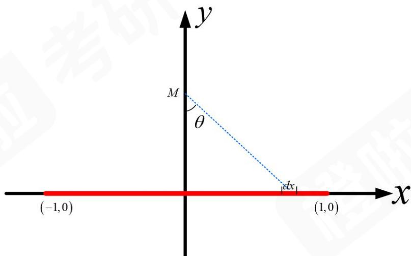
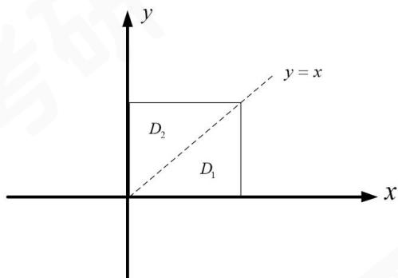
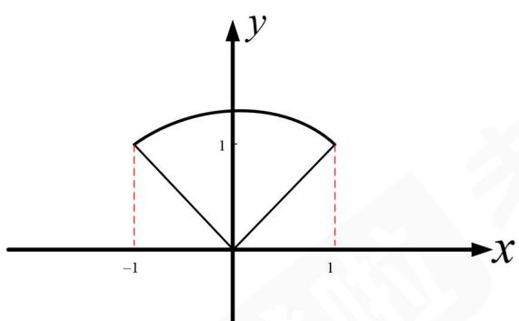

# 2026 考研数学（二）真题试卷及解析（橙啦） .pdf

# 2026 考研数学（二）真题

# 试卷及解析

## 一、选择题：1～10 小题，每小题 5 分，共 50 分．下列每题给出的四个选项中，只有一个选项是符合题目要求的.

1. 已知当 $x \to 0$ 时， $ax^2 + bx + \arcsin x$ 与 $\sqrt[3]{1 + x^2} - 1$ 是等价无穷小，则
A. $a = \frac{1}{3}, b = -1$ .
B. $a = \frac{1}{3}, b = 1$ .
C. $a = \frac{2}{3}, b = -1$ .
D. $a = \frac{2}{3}, b = 1$ .

1.【答案】A

【解析】由题意得 $x \to 0$ 时， $\sqrt[3]{1 + x^2} - 1 \sim \frac{1}{3} x^2$

$$
a x ^ {2} + b x + \arcsin x = a x ^ {2} + b x + x + \frac {1}{6} x ^ {3} + o (x ^ {2}) = (b + 1) x + a x ^ {2} + o (x ^ {2})
$$

由于 $ax^2 + bx + \arcsin x$ 与 $\sqrt[3]{1 + x^2} - 1$ 为等价无穷小，则

$$
(b + 1) x + a x ^ {2} + o \left(x ^ {2}\right) \sim \frac {1}{3} x ^ {2}
$$

故 $\left\{\begin{aligned}b+1=0,\\ a=\frac{1}{3},\end{aligned}\right.$ 解得 $\left\{\begin{aligned}b=-1,\\ a=\frac{1}{3}. \end{aligned}\right.$ 故选A.

2. 设 $y_{1}(x), y_{2}(x)$ 是某 2 阶非齐次线性微分方程的两个特解，若常数 $\lambda, \mu$ 使得

$2\lambda y_{1}(x) + \mu y_{2}(x)$ 是该方程的解， $\lambda y_{1}(x) - 2\mu y_{2}(x)$ 是该方程对应的齐次方程的解，则A. $\lambda = \frac{1}{5},\mu = \frac{2}{5}.$ B. $\lambda = \frac{2}{5},\mu = \frac{1}{5}.$ C. $\lambda = \frac{1}{4},\mu = \frac{1}{2}.$ D. $\lambda = \frac{1}{2},\mu = \frac{1}{4}.$

2.【答案】A

【解析】由线性微分方程解的叠加原理可得，要使 $2\lambda y_{1}(x) + \mu y_{2}(x)$ 为非齐次解，系数必须满足 $2\lambda + \mu = 1$ ；要使 $\lambda y_{1}(x) - 2\mu y_{2}(x)$ 为齐次方程的解，要求 $\lambda - 2\mu = 0$ 。故 $\left\{ \begin{array}{l} 2\lambda + \mu = 1, \\ \lambda = 2\mu, \end{array} \right.$ 解得 $\mu = \frac{1}{5}, \lambda = \frac{2}{5}$ 。故选 A.

3. 设函数 $z = z(x, y)$ 由方程 $x - az = e^{y + az}$ （ $a$ 是非零常数）确定，则
A. $\frac{\partial z}{\partial x} - \frac{\partial z}{\partial y} = \frac{1}{a}$ .
B. $\frac{\partial z}{\partial x} + \frac{\partial z}{\partial y} = \frac{1}{a}$ .
C. $\frac{\partial z}{\partial x} - \frac{\partial z}{\partial y} = -\frac{1}{a}$ .
D. $\frac{\partial z}{\partial x} + \frac{\partial z}{\partial y} = -\frac{1}{a}$ .

3.【答案】A

【解析】（法一）由微分形式不变性得 $\mathrm{dx} - a\mathrm{dz} = \mathrm{e}^{y + az}(\mathrm{dy} + a\mathrm{dz})$

整理得： $\left(a\mathrm{e}^{y + at} + a\right)\mathrm{d}z = \mathrm{d}x - \left(\mathrm{e}^{y + az}\right)\mathrm{d}y$ ，故 $\mathrm{dz} = \frac{1}{a}\left[\frac{1}{\mathrm{e}^{y + az} + 1}\mathrm{dx} + \frac{-\mathrm{e}^{y + az}}{\mathrm{e}^{y + az} + 1}\mathrm{dy}\right].$ 故 $\frac{\partial z}{\partial x} = \frac{1}{a}\frac{1}{\mathrm{e}^{y + az} + 1},\frac{\partial z}{\partial y} = \frac{1}{a}\left(\frac{-\mathrm{e}^{y + az}}{\mathrm{e}^{y + az} + 1}\right).$ 显然： $\frac{\partial z}{\partial x} -\frac{\partial z}{\partial y} = \frac{1}{a}$ ，选A.

（法二）构造 $F(x,y,z)=x-az-e^{y+az}$ ,

由 $\left\{\begin{aligned}F_{x}^{\prime}&=1,\\ F_{y}^{\prime}&=-\mathrm{e}^{y+az},\\ F_{z}^{\prime}&=-a-\mathrm{e}^{y+az}\cdot a,\end{aligned}\right.$ 故

$$
\frac {\partial z}{\partial x} = - \frac {F _ {x} ^ {\prime}}{F _ {z} ^ {\prime}} = - \frac {1}{- a [ 1 + e ^ {y + a z} ]} = \frac {1}{a [ 1 + e ^ {y + a z} ]},
$$

$$
\frac {\partial z}{\partial y} = - \frac {F _ {y} ^ {\prime}}{F _ {z} ^ {\prime}} = - \frac {- \mathrm{e} ^ {y + a z}}{- a [ 1 + \mathrm{e} ^ {y + a z} ]} = - \frac {\mathrm{e} ^ {y + a z}}{a [ 1 + \mathrm{e} ^ {y + a z} ]}.
$$

故 $\frac{\partial z}{\partial x}-\frac{\partial z}{\partial y}=\frac{1}{a}$ ，选A.

4. 设线密度为 1 的细直棒的两个端点分别位于点 $(-1,0)$ 和点 $(1,0)$ 处，质量为 m 的质点位于点 $(0,1)$ 处，G 为引力常量，则该细直棒对该质点的引力大小为
A. $\int_{0}^{1}\frac{2Gmx}{\left(x^{2}+1\right)^{\frac{1}{2}}}dx.$ B. $\int_{0}^{1}\frac{2Gm}{\left(x^{2}+1\right)^{\frac{1}{2}}}dx.$ C. $\int_{0}^{1}\frac{2Gmx}{\left(x^{2}+1\right)^{\frac{3}{2}}}dx.$ D. $\int_{0}^{1}\frac{2Gm}{\left(x^{2}+1\right)^{\frac{3}{2}}}dx.$

【解析】细直棒位于 $x$ 轴上 $[-1, 1]$ ，取棒上任意微元，微元位置 $x$ ， $x \in (-1, 1)$ ，长度为 $\mathrm{d}x$ .

由万有引力定律，两质点，（微元与质点）的距离为 $r = \sqrt{x^2 + 1^2} = \sqrt{1 + x^2}$ .

引力微元 $\mathrm{d}F$ 的大小为 $\mathrm{d}F = G \cdot \frac{md_{m\text{棒}}}{r^2} = G \cdot \frac{mdx}{(1 + x^2)}$ .

X 方向：由于棒关于 y 轴对称（x 与 -x 处的微元，x 分量大小相等、方向相反），故引力的水平分力为 0.

Y 方向：引力微元的 y 分量为 $dF_{y} = dF \cos \theta$ ，其中 $\cos \theta = \frac{1}{r} = \frac{1}{\sqrt{x^{2} + 1}}$ （θ 是引力方向与 y 轴的夹角）.

因此， $Y$ 方向的引力微元为： $\mathrm{d}F_y = G\frac{mdx}{1 + x^2}\cdot \frac{1}{x^2 + 1} = \frac{Gmdy}{(x^2 + 1)^{\frac{3}{2}}}$

最后积分计算总引力，利用对称性， $[-1,0]$ 与 $[0,1]$ 的引力贡献相同。

因此总引力大小为 $F = 2\int_{0}^{1}\frac{Gm}{(1 + x^{2})^{\frac{3}{2}}} \mathrm{d}x$ ，故选D.

5. 设函数 $f(x)$ 在区间 $[-1, 1]$ 上有定义，则

A. 当 $f(x)$ 在 $(-1,0)$ 单调递减，在 $(0,1)$ 单调递增时， $f(0)$ 是极小值.
B. 当 $f(0)$ 是极小值时， $f(x)$ 在 $(-1,0)$ 单调递减，在 $(0,1)$ 单调递增.

C. 当 $f(x)$ 的图形在 $[-1, 1]$ 是凹的时， $\frac{f(x) - f(1)}{x - 1}$ 在 $[-1, 1)$ 单调递增.

D. 当 $\frac{f(x) - f(1)}{x - 1}$ 在 $[-1, 1)$ 单调递增时， $f(x)$ 的图形在 $[-1, 1]$ 是凹的.

5.【答案】C

【解析】对 A 选项：取 $f(x)=\left\{\begin{aligned}x^{2}+1,&x<0,\\ x,&x\geqslant0\end{aligned}\right.$ 知 $f(0)$ 不是极小值，排除；

对 B 选项：取 $f(x)=\left\{\begin{aligned}-x^{2}+1,&x\neq0,\\0,&x=0\end{aligned}\right.$ 知 $f(x)$ 在 $(-1,0)$ 单增，且 $f(x)$ 在 $(0,1)$ 单减，
但仍满足 $f(0)$ 是极小值，排除；

对 C 选项：若 $f(x)$ 的图形在 $[-1,1]$ 上是凹的（即凸函数，二阶导数非负或满足凸性定义），则对任意 $x_{1}<x_{2}<1$ ，由凸性有 $\frac{f(1)-f(x_{1})}{1-x_{1}}\leq\frac{f(1)-f(x_{2})}{1-x_{2}}$ ,

即 $\frac{f(x_1) - f(1)}{x_1 - 1} \leq \frac{f(x_2) - f(1)}{x_2 - 1}$ , 故差商 $\frac{f(x) - f(1)}{x - 1}$ 在 $[-1, 1)$ 单调递增。因此 C 正确。对 D 选项，取 $f(x) = |x|$ 时， $\frac{f(x) - f(1)}{x - 1}$ 单增，但 $f(x)$ 在 $[-1, 1]$ 不是凹曲线，排除.

6. 已知函数 $f(x) = \int_{1}^{x^3} \frac{\mathrm{e}^t}{1 + t^2} \, \mathrm{d}t$ ， $f$ 的反函数为 $g$ ，则
A. $g(0) = 1, g'(0) = \frac{3}{2} \, \mathrm{e}$ . B. $g(0) = 1, g'(0) = \frac{2}{3\mathrm{e}}$ . C. $g(1) = 0, g'(1) = \frac{3}{2} \, \mathrm{e}$ . D. $g(1) = 0, g'(1) = \frac{2}{3\mathrm{e}}$ .

6.【答案】B
【解析】由题知，当 x=1 时， $f(1)=0$ ，故 $g(0)=1$ .
又 $f'(1)=\lim_{x\to1}\frac{f(x)-f(1)}{x-1}=\lim_{x\to1}\frac{\int_{1}^{x^3}\frac{\mathrm{e}^t}{1+t^2}\mathrm{d}t}{x-1}=\frac{3\mathrm{e}}{2}$ ,
由 $y'=\frac{dy}{dx}=\frac{1}{\frac{dx}{dy}}$ 知 $f'(1)=\frac{1}{g'(0)}$ ，故 $g'(0)=\frac{1}{f'(1)}=\frac{2}{3\mathrm{e}}$ .选 B.

7. 设函数 $f(x, y)$ 在区域 $D = \{(x, y) | 0 \leq x \leq 1, 0 \leq y \leq 1\}$ 上连续，且 $f(x, y) = f(y, x)$ ，则 $\iint_{D} f(x, y) \, \mathrm{d}x \, \mathrm{d}y =$ A. $2 \lim_{n \to \infty} \sum_{i=1}^{n} \sum_{j=n+1-i}^{n} f\left(\frac{i}{n}, \frac{j}{n}\right) \frac{1}{n^2}.$ B. $\frac{1}{2} \lim_{n \to \infty} \sum_{i=1}^{n} \sum_{j=i}^{n} f\left(\frac{i}{n}, \frac{j}{n}\right) \frac{1}{n^2}.$ C. $2 \lim_{n \to \infty} \sum_{i=1}^{2n} \sum_{j=1}^{2n+1-i} f\left(\frac{i}{2n}, \frac{j}{2n}\right) \frac{1}{n^2}.$ D. $\frac{1}{2} \lim_{n \to \infty} \sum_{i=1}^{2n} \sum_{j=1}^{i} f\left(\frac{i}{2n}, \frac{j}{2n}\right) \frac{1}{n^2}.$

7.【答案】D
【解析】由题知，对应的图形如下图所示：

$$
\begin{array}{l} \iint_ {D} f (x, y) = \iint_ {D _ {1}} f (x, y) \mathrm{d} x \mathrm{d} y + \iint_ {D _ {2}} f (x, y) \mathrm{d} x \mathrm{d} y = \iint_ {D _ {1}} f (x, y) \mathrm{d} x \mathrm{d} y + \iint_ {D _ {1}} f (y, x) \mathrm{d} x \mathrm{d} y \\ = 2 \iint_ {D _ {1}} f (x, y) \mathrm{d} x \mathrm{d} y = 2 \int_ {0} ^ {1} \mathrm{d} x \int_ {0} ^ {x} f (x, y) \mathrm{d} y. \end{array}
$$

对 D，令 $\left\{\begin{aligned}\frac{i}{2n}&\rightarrow x,\\ \left(\frac{1}{2n},\frac{2n}{2n}\right)&\rightarrow(0,1),\\ \frac{1}{2n}&\rightarrow dx,\end{aligned}\right.$ $\left\{\begin{aligned}\frac{j}{2n}&\rightarrow y,\\ \left(\frac{1}{2n},\frac{i}{2n}\right)&\rightarrow(0,x),\\ \frac{1}{2n}&\rightarrow dy,\end{aligned}\right.$

故 $\frac{1}{2}\lim_{n\to \infty}\sum_{i = 1}^{2n}\sum_{j = 1}^{i}f\left(\frac{i}{2n},\frac{j}{2n}\right)\frac{1}{n^2} = \frac{1}{2}\cdot 2\cdot 2\lim_{n\to \infty}\frac{1}{2n}\cdot \frac{1}{2n}\sum_{i = 1}^{2n}\sum_{j = 1}^{i}f\left(\frac{i}{2n},\frac{j}{2n}\right)$ $= 2\int_0^1\mathrm{d}x\int_0^x f(x,y)\mathrm{d}y.$

选D.

对A，对应积分形式为 $2\int_0^1\mathrm{d}x\int_{1 - x}^1 f(x,y)\mathrm{d}y.$ 对B，对应积分形式为 $\frac{1}{2}\int_0^1\mathrm{d}x\int_x^1 f(x,y)\mathrm{d}y.$ 对C，对应积分形式为 $8\int_0^1\mathrm{d}x\int_0^{1 - x}f(x,y)\mathrm{d}y.$

8. 单位矩阵经过若干次互换两行得到的矩阵称为置换矩阵. 设 A 为 n 阶置换矩阵, $A^{*}$ 为 A 的伴随矩阵, 则
A. $A^{*}$ 为置换矩阵.
B. $A^{-1}$ 为置换矩阵.

C. $A^{-1} = A^{*}$ D. $A^{-1} = -A^{*}$

8.【答案】B

【解析】设 $A = E_{i_{1}j_{1}} E_{i_{2}j_{2}} \cdots E_{i_{n}j_{n}}$ ,

由于 $\left(\pmb{E}_{ij}\right)^{\mathrm{T}} = \pmb{E}_{ij},\left(\pmb{E}_{ij}\right)^{-1} = \pmb{E}_{ij}$ ，故

$A^{-1}=\left(\boldsymbol{E}_{i_{n}j_{n}}\right)^{-1}\cdots\left(\boldsymbol{E}_{i_{2}j_{2}}\right)^{-1}\cdot\left(\boldsymbol{E}_{i_{1}j_{1}}\right)^{-1}=\boldsymbol{E}_{i_{n}j_{n}}\cdots\boldsymbol{E}_{i_{2}j_{2}}\boldsymbol{E}_{i_{1}j_{1}}$ ，仍为置换矩阵，故选 B.

$A^{*}=\left|A\right|\cdot A^{-1}=(-1)^{n}A^{-1}$ ，n为偶数时，为置换矩阵；n为奇数时，不为置换矩阵，故A，C，D错.

9. 设矩阵 $A=\begin{pmatrix}1&0&1\\0&0&1\\1&1&3\\1&1&1\end{pmatrix},C=\begin{pmatrix}2&0\\1&1\\1&1\\a&b\end{pmatrix}$ ，若存在矩阵 B 满足 AB=C，则
A. a=-1, b=-1.
B. a=2, b=2.
C. a=-1, b=2.
D. a=2, b=-1.

9.【答案】A

【解析】设 $A=\left(\boldsymbol{a}_{1},\boldsymbol{a}_{2},\boldsymbol{a}_{3}\right)$ , $C=\left(\boldsymbol{r}_{1},\boldsymbol{r}_{2}\right)$

由 AB = C 得，B 的列向量为 $Ax = r_{1}, Ax = r_{2}$ 的解

由 $Ax = r_{1}$ 有解得 $r(A) = r(A, r_{1})$ ,

故 $\begin{pmatrix}1&0&1&2\\0&1&2&-1\\0&0&1&1\\0&0&-2&a-1\end{pmatrix}$ 的最后两行成比例，即 $\frac{1}{-2}=\frac{1}{a-1}$ ，解得a=-1.

同理，由 $Ax = r_2$ 有解得 $r(A) = r(A, r_2)$ 故最后两行成比例 $\frac{1}{-2} = \frac{1}{b - 1}$ ，解得 $b = -1$ . 故选A.

10. 设 3 阶矩阵 A，B 满足 $AB + BA = A^{2} + B^{2}$ ，且 $A \neq B$ ，则下列结论错误的是

A. $\left(A - B\right)^3 = O$

B. $A - B$ 只有零特征值.

C. A, B 不能都是对角矩阵.

D. $A - B$ 只有一个线性无关的特征向量.

10.【答案】D

【解析】

$$
\boldsymbol {A} \boldsymbol {B} + \boldsymbol {B} \boldsymbol {A} = \boldsymbol {A} ^ {2} + \boldsymbol {B} ^ {2},
$$

$$
\boldsymbol {A} \boldsymbol {B} - \boldsymbol {A} ^ {2} + \boldsymbol {B} \boldsymbol {A} - \boldsymbol {B} ^ {2} = \boldsymbol {O},
$$

$$
\boldsymbol {A} (\boldsymbol {B} - \boldsymbol {A}) + \boldsymbol {B} (\boldsymbol {A} - \boldsymbol {B}) = \boldsymbol {O},
$$

$$
\boldsymbol {A} (\boldsymbol {B} - \boldsymbol {A}) - \boldsymbol {B} (\boldsymbol {B} - \boldsymbol {A}) = \boldsymbol {O},
$$

$$
(A - B) (B - A) = O,
$$

$$
- (A - B) ^ {2} = O,
$$

故 $(A-B)^{2}=O$ .

A 选项: $(A - B)^3 = (A - B)^2 \cdot (A - B) = O$ 成立;

B 选项: 由 $(A - B)^2 = O$ 可得, $f\left((A - B)^2\right) = O$ , 故 $(A - B)^2$ 只有零特征值. 设 $(A - B)$ 的特征值为入, 则 $(A - B)^2$ 的特征值 $\lambda^2 = 0$ , 故 $A - B$ 也只有零特征值;

C 选项：若 A，B 都是对角矩阵，则 A-B 也为对角阵，而对角矩阵的平方为零；

当且仅当自身为零矩阵（对角元平方为零则对角元为零），但 $A \neq B$ ，即 $A - B \neq O$ 。故 A，B 不能都是对角阵；

D 选项：设 C = A - B 满足 $C^{2} = O$ ，但 C 的线性无关特征向量个数不一定为 1，

举特例为 $C=\begin{pmatrix}0&1&0\\0&0&0\\0&0&0\end{pmatrix}$ ，满足 $C^{2}=O$ .

而 C 有 2 个线性无关的特征向量，故选 D.

## 二、填空题：11～16 小题，每小题 5 分，共 30 分.

11. 设 p 为常数，若反常积分 $\int_{0}^{+\infty}\frac{\arctan x}{x^{p}(x+1)}dx$ 收敛，则 p 的取值范围是 \_\_\_\_.

11.【答案】 $0 < p < 2$

【解析】 $I = \int_{0}^{+\infty}\frac{\arctan x}{x^{p}(x + 1)}\mathrm{d}x = \int_{0}^{1}\frac{\arctan x}{x^{p}(x + 1)}\mathrm{d}x + \int_{1}^{+\infty}\frac{\arctan x}{x^{p}(x + 1)}\mathrm{d}x = I_{1} + I_{2}.$

对于 $I_{1}$ ，当 $x\to 0^{+}$ 时， $\frac{\arctan x}{x^p(x + 1)}\sim \frac{x}{x^p} = \frac{1}{x^{p - 1}}$

故当 $p - 1 < 1$ 时收敛，即 $p < 2$ ；

对于 $I_{2}$ ，当 $x\to +\infty$ 时， $\frac{\arctan x}{x^p(x + 1)}\sim \frac{\frac{\pi}{2}}{x^{p + 1}}$

故当 $p+1>1$ 时收敛，即 p>0.

综上， $I$ 收敛时， $0 < p < 2$

12. $\lim_{x\to 0}\left(\frac{1}{x} -\frac{\ln(1 + x)}{x\sin x}\right) =$

12.【答案】 $\frac{1}{2}$

【解析】 $\lim_{x\to0}\left[\frac{1}{x}-\frac{\ln(1+x)}{x\sin x}\right]=\lim_{x\to0}\frac{\sin x-\ln(1+x)}{x\sin x}$

$$
= \lim _ {x \rightarrow 0} \frac {\left[ x - \frac {1}{6} x ^ {3} + o \left(x ^ {3}\right)\right] - \left[ x - \frac {1}{2} x ^ {2} + o \left(x ^ {2}\right)\right]}{x ^ {2}}
$$

$$
\begin{array}{l}= \lim _ {x \rightarrow 0} \frac {\frac {1}{2} x ^ {2} + o (x ^ {2})}{x ^ {2}}\\= \frac {1}{2}.\end{array}
$$

13. 曲线 $x^{2} + 2\sqrt{3}xy + y^{2} = 1$ 在点 $(0,1)$ 处的曲率半径为 \_\_\_\_.

13.【答案】4

【解析】由 $x^{2} + 2\sqrt{3} xy + y^{2} = 1$ ，求导得

$$
2 x + 2 \sqrt {3} y + 2 \sqrt {3} x y ^ {\prime} + 2 y y ^ {\prime} = 0 - - - ①
$$

代入 x=0, y=1 知 $y'=-\sqrt{3}$ .

对①继续求导得:

$$
2 + 2 \sqrt {3} y ^ {\prime} + 2 \sqrt {3} y ^ {\prime} + 2 \sqrt {3} x y ^ {\prime \prime} + 2 (y ^ {\prime}) ^ {2} + 2 y y ^ {\prime \prime} = 0.
$$

代入 $x = 0, y = 1, y' = -\sqrt{3}$ 得 $y'' = 2$ .

由曲率公式知 $k=\frac{\left|y''\right|}{\left[1+\left(y'\right)^{2}\right]^{\frac{3}{2}}}=\frac{1}{4}$ ，故曲率半径为 $R=\frac{1}{k}=4$ .

14. 已知函数 $f(x, y)$ 可微，且 $\mathrm{d}f(0, 0) = \pi \mathrm{d}x + 3\mathrm{d}y$ . 记 $g(x) = f(\ln x, \sin \pi x)$ ，则 $g'(1) =$ \_\_\_\_.

14.【答案】 $-2\pi$

【解析】由 $\mathrm{df}(0,0) = \pi \mathrm{dx} + 3\mathrm{dy}$ 知， $\left.\frac{\partial f}{\partial x}\right|_{(0,0)} = \pi ,\left.\frac{\partial f}{\partial y}\right|_{(0,0)} = 3.$

故 $g^{\prime}(x) = f_{1}^{\prime}\cdot \frac{1}{x} +f_{2}^{\prime}\pi \cos \pi x.$ 因此

$$
g ^ {\prime} (1) = \pi \cdot 1 + 3 \cdot \pi \cos \pi = - 2 \pi .
$$

15. 函数 $f(x)=\ln(2+x)$ 在区间 $[0,2]$ 上的平均值为 \_\_\_\_.

15.【答案】 $3 \ln 2 - 1$

【解析】 $f(x) = \frac{1}{2}\int_{0}^{2}\ln (2 + x)\mathrm{d}x\frac{\text{令}t = \ln(2 + x)}{x = \mathrm{e}^x - 2}\frac{1}{2}\int_{\ln 2}^{2\ln 2}te^t\mathrm{d}t$ $= \frac{1}{2}\bigl (te^{t} - e^{t}\bigr)\big|_{\ln 2}^{2\ln 2} = \frac{1}{2}\bigl (6\ln 2 - 2\bigr) = 3\ln 2 - 1.$

16. 设矩阵 $A=\begin{pmatrix}1 & b & -1 \\ a+2 & 3 & -3a\end{pmatrix}$ . 若二次型 $\boldsymbol{x}^{\mathrm{T}}\left(\boldsymbol{A}\boldsymbol{A}^{\mathrm{T}}\right)\boldsymbol{x}$ 的规范形为 $y_{1}^{2}$ ，则 $a+b=$

16.【答案】2

【解析】由题可知，二次型 $x^{T}AA^{T}x$ 的规范形为 $y_{1}^{2}$ ，因此矩阵 $AA^{T}$ 的秩为 1，故 A 的秩为 1，矩阵 $A=\begin{pmatrix}1 & b & -1 \\ a+2 & 3 & -3a\end{pmatrix}$ 的两行对应成比例，

$$
\frac {1}{a + 2} = \frac {b}{3} = \frac {- 1}{3 a},
$$

即 $\left\{ \begin{array}{l} 3 = (a + 2)b, \\ -3ab = -3. \end{array} \right.$ 联立解得 $a = 1, b = 1$ . 故 $a + b = 2$ .

## 三、解答题：17～22 小题，共 70 分．解答应写出文字说明、证明过程或演算步骤.

17.（本题满分10分）

计算 $I = \int_{-1}^{1}\mathrm{d}x\int_{|x|}^{\sqrt{2 - x^2}}y\sin \sqrt{x^2 + y^2}\mathrm{d}y.$

17.【解】如图所示，

令 $x = r\cos \theta ,y = r\sin \theta$ ，则

$$
I = \int_ {\frac {\pi}{4}} ^ {\frac {3}{4} \pi} \mathrm{d} \theta \int_ {0} ^ {\sqrt {2}} r \sin \theta \sin r \cdot r \mathrm{d} r = \int_ {\frac {\pi}{4}} ^ {\frac {3}{4} \pi} \sin \theta \mathrm{d} \theta \int_ {0} ^ {\sqrt {2}} r ^ {2} \cdot \sin r \mathrm{d} r,
$$

$$
\begin{array}{r l} \text {其中} & \int_ {\frac {\pi}{4}} ^ {\frac {3}{4} \pi} \sin \theta \mathrm{d} \theta = - \cos \theta \Big | _ {\frac {\pi}{4}} ^ {\frac {3}{4} \pi} = \sqrt {2}, \int_ {0} ^ {\sqrt {2}} r ^ {2} \sin r \mathrm{d} r = \int_ {0} ^ {\sqrt {2}} r ^ {2} \mathrm{d} (- \cos r) \\ & = - r ^ {2} \cos r \Big | _ {0} ^ {\sqrt {2}} + \int_ {0} ^ {\sqrt {2}} 2 r \cdot \cos r \mathrm{d} r = 2 \sqrt {2} \sin \sqrt {2} - 2. \end{array}
$$

故 $I = \sqrt{2}\cdot (2\sqrt{2}\sin \sqrt{2} -2) = 4\sin \sqrt{2} -2\sqrt{2}.$

18.（本题满分12分）

已知函数 $g(x)$ 连续. 设 $f(x)=\int_{0}^{x^{2}}g(xt)\mathrm{d}t$ ，求 $f'(x)$ 的表达式，并判断 $f'(x)$ 在 x=0 处的连续性.

18.【解】当 $x \neq 0$ 时， $f(x) = \int_{0}^{x^2} g(xt) \, \mathrm{d}t \xlongequal{u = xt} \int_{0}^{x^3} g(u) \frac{1}{x} \, \mathrm{d}u = \frac{1}{x} \int_{0}^{x^3} g(u) \, \mathrm{d}u.$

对 $f(x)$ 求导得，

$$
f ^ {\prime} (x) = \frac {g \left(x ^ {3}\right) 3 x ^ {3} - \int_ {0} ^ {x ^ {3}} g (u) \mathrm{d} u}{x ^ {2}} = 3 x g \left(x ^ {3}\right) - \frac {\int_ {0} ^ {x ^ {3}} g (u) \mathrm{d} u}{x ^ {2}}.
$$

在 x=0 处，由定义式可得

$$
f ^ {\prime} (0) = \lim _ {x \rightarrow 0} \frac {f (x) - f (0)}{x - 0} = \lim _ {x \rightarrow 0} \frac {\int_ {0} ^ {x ^ {3}} g (u) \mathrm{d} u}{x ^ {2}} = 0.
$$

$$
\text {故} f ^ {\prime} (x) = \left\{ \begin{array}{c c} 3 x g \left(x ^ {3}\right) - \frac {\int_ {0} ^ {x ^ {3}} g (u) \mathrm{d} u}{x ^ {2}}, & x \neq 0, \\ 0, & x = 0. \end{array} \right.
$$

$$
\text {又} \lim _ {x \rightarrow 0} f ^ {\prime} (x) = \lim _ {x \rightarrow 0} \left[ 3 x g (x ^ {3}) - \frac {\int_ {0} ^ {x ^ {3}} g (u) \mathrm{d} u}{x ^ {2}} \right]
$$

$$
= \lim _ {x \rightarrow 0} 3 x g (x ^ {3}) - \lim _ {x \rightarrow 0} \frac {\int_ {0} ^ {x ^ {3}} g (u) \mathrm{d} u}{x ^ {2}} = - \lim _ {x \rightarrow 0} \frac {3 x ^ {2} g \left(x ^ {3}\right)}{2 x} = 0,
$$

故 $f'(x)$ 在 x=0 处连续.

## 19.（本题满分 10 分）

求函数 $f(x,y) = (2x^{2} - y^{2})\mathrm{e}^{x}$ 的极值.

19.【解】由题可知， $f_{x}^{\prime}=4xe^{x}+\left(2x^{2}-y^{2}\right)e^{x},f_{y}^{\prime}=-2ye^{x}$

令 $\left\{\begin{aligned}f_{x}^{\prime}&=0\\ f_{y}^{\prime}&=0\end{aligned}\right.\Rightarrow\left\{\begin{aligned}x&=0,\\ y&=0,\end{aligned}\right.$ 或 $\left\{\begin{aligned}x&=-2,\\ y&=0.\end{aligned}\right.$

又 $A = f_{xx}^{\prime \prime} = \mathrm{e}^{x}\left(2x^{2} + 8x + 4 - y^{2}\right),B = f_{xy}^{\prime \prime} = -2y\mathrm{e}^{y},C = f_{yy}^{\prime \prime} = -2\mathrm{e}^{x},$

故 $AC - B^2\Big|_{(0,0)} = -8 < 0, AC - B^2\Big|_{(-2,0)} = 8\mathrm{e}^{-4} > 0$ 且 $A_{(-2,0)} = -4\mathrm{e}^{-2} < 0,$ 则 $(0,0)$ 为非极值点， $(-2,0)$ 为极大值点且极大值 $f(-2,0) = \frac{8}{\mathrm{e}^2}$ .

## 20.（本题满分12分）

已知 $M\left(x_0, y_0\right)$ 是曲线 $y = \frac{1}{1 + x^2} (x \geq 0)$ 的拐点， $O$ 为坐标原点。记 $D$ 是第一象限中以曲线 $y = \frac{1}{1 + x^2} (x \geq x_0)$ ，线段 $OM$ 及 $x$ 正半轴为边界的无界区域，求 $D$ 绕 $x$ 轴旋转所成旋转体的体积。

20.【解】由题可知 $y' = -\frac{2x}{(1 + x^2)^2}, y'' = \frac{6x^2 - 2}{(1 + x^2)^3}$ .

令 $y''=0$ 且 $x_{0}>0$ ，解得 $\left\{\begin{aligned}x_{0}&=\frac{1}{\sqrt{3}},\\ y_{0}&=\frac{3}{4}.\end{aligned}\right.$

OM 直线段为 $y=\frac{3}{4}\sqrt{3}x, x\in\left[0,\frac{1}{\sqrt{3}}\right]$ ,

则旋转体的体积 $V = \int_{0}^{\frac{1}{\sqrt{3}}}\pi \cdot \left(\frac{3}{4}\sqrt{3} x\right)^{2}\mathrm{d}x + \int_{\frac{1}{\sqrt{3}}}^{+\infty}\pi \cdot \frac{1}{\left(1 + x^{2}\right)^{2}}\mathrm{d}x,$

其中

$$
\int_ {0} ^ {\frac {1}{\sqrt {3}}} \pi \left(\frac {3}{4} \sqrt {3} x\right) ^ {2} \mathrm{d} x = \frac {2 7}{1 6} \pi \int_ {0} ^ {\frac {1}{\sqrt {3}}} x ^ {2} \mathrm{d} x = \frac {\sqrt {3}}{1 6} \pi ,
$$

$$
\int_ {\frac {1}{\sqrt {3}}} ^ {+ \infty} \pi \frac {1}{(1 + x ^ {2}) ^ {2}} d x.
$$

令 $x = \tan \theta$ ，得

$$
\pi \int_ {\frac {\pi}{6}} ^ {\frac {\pi}{2}} \frac {1 + \cos 2 \theta}{2} \mathrm{d} \theta = \frac {\pi^ {2}}{6} + \left(- \frac {\sqrt {3}}{8} \pi\right) = \frac {\pi^ {2}}{6} - \frac {\sqrt {3}}{1 6} \pi .
$$

21.（本题满分12分）

求微分方程 $x^{2}y''-2xy'-\left(y'\right)^{2}=0(x>2)$ 满足条件 $y\big|_{x=3}=\frac{1}{2},y'\big|_{x=3}=-9$ 的解.

21.【解】此方程属于二阶可降阶中的不显含 y 的类型.

令 $p = y', y'' = \frac{\mathrm{d}p}{\mathrm{d}x} = p'$ ，则代入原方程可得， $x^2 p' - 2xp - p^2 = 0$

整理得 $p' - \frac{2}{x} p = x^{-2} p^{2}$ .

令 $z = p^{-1}, z' = -p^{-2} \frac{\mathrm{d}p}{\mathrm{d}x} = -p^{-2} p'$ ，代入上式得 $z' + \frac{2}{x} z = -x^{-2}$ .

$$
z = \mathrm{e} ^ {- \int_ {x} ^ {2} \mathrm{d} x} \left(\int \mathrm{e} ^ {\int_ {x} ^ {2} \mathrm{d} x} \cdot (- x ^ {- 2}) \mathrm{d} x + C\right) = - \frac {1}{x} + \frac {C}{x ^ {2}}.
$$

又 $z\big|_{x=3}=\frac{1}{y'(3)}=-\frac{1}{9}$ 代入上式：C=2.

故 $\frac{1}{y'} = -\frac{1}{x} + \frac{2}{x^2}, y' = y^{\frac{x^2}{2 - x}}$ ，则

$$
y = - \frac {1}{2} x ^ {2} - 2 x - 4 \ln (x - 2) + C.
$$

又 $y\big|_{x=3}=\frac{1}{2}$ 代入上式，C=11.

故 $y = -\frac{1}{2} x^2 - 2x - 4\ln (x - 2) + 11$ .

## 22.（本题满分12分）

已知向量组 $\alpha_{1}=\begin{pmatrix}1\\0\\-1\\-1\end{pmatrix},\quad\alpha_{2}=\begin{pmatrix}1\\-1\\0\\-2\end{pmatrix},\quad\alpha_{3}=\begin{pmatrix}0\\-1\\1\\-1\end{pmatrix},\alpha_{4}=\begin{pmatrix}0\\1\\-1\\1\end{pmatrix}$ ，记

$$
\boldsymbol {A} = \left(\boldsymbol {\alpha} _ {1}, \boldsymbol {\alpha} _ {2}, \boldsymbol {\alpha} _ {3}, \boldsymbol {\alpha} _ {4}\right), \quad \boldsymbol {G} = \left(\boldsymbol {\alpha} _ {1}, \boldsymbol {\alpha} _ {2}\right).
$$

（1）证明： $\alpha_{1},\alpha_{2}$ 是 $\alpha_{1},\alpha_{2},\alpha_{3},\alpha_{4}$ 的极大线性无关组；

(2) 求矩阵 H 使得 A = GH，并求 $A^{10}$ .

22.（1）【证明】 $A = (\alpha_{1},\alpha_{2},\alpha_{3},\alpha_{4}) = \left( \begin{array}{cccc}1 & 1 & 0 & 0\\ 0 & -1 & -1 & 1\\ -1 & 0 & 1 & -1\\ -1 & -2 & -1 & 1 \end{array} \right)\rightarrow \left( \begin{array}{cccc}1 & 1 & 0 & 0\\ 0 & -1 & -1 & 1\\ 0 & 0 & 0 & 0\\ 0 & 0 & 0 & 0 \end{array} \right),$

$r(A)=2$ 且 $\alpha_{1},\alpha_{2}$ 线性无关.

又 $\alpha_{3}=-\alpha_{1}+\alpha_{2},\quad\alpha_{4}=\alpha_{1}-\alpha_{2}$ ，所以 $\alpha_{1},\alpha_{2}$ 是 $\alpha_{1},\alpha_{2},\alpha_{3},\alpha_{4}$ 的极大线性无关组.

(2)【解】 $A=\left(\boldsymbol{\alpha}_{1},\boldsymbol{\alpha}_{2},-\boldsymbol{\alpha}_{1}+\boldsymbol{\alpha}_{2},\boldsymbol{\alpha}_{1}-\boldsymbol{\alpha}_{2}\right)_{1\times4}=\left(\boldsymbol{\alpha}_{1},\boldsymbol{\alpha}_{2}\right)_{1\times2}\begin{pmatrix}1&0&-1&1\\0&1&1&-1\end{pmatrix}_{2\times4}$

$$
\boldsymbol {A} ^ {1 0} = \boldsymbol {G H G H} \dots \boldsymbol {G H} = \boldsymbol {G D} ^ {9} \boldsymbol {H},
$$

其中 $D=\begin{pmatrix}1&0&-1&1\\0&1&1&-1\end{pmatrix}_{2\times4}\begin{pmatrix}1&1\\0&-1\\-1&0\\-1&-2\end{pmatrix}_{4\times2}=\begin{pmatrix}1&-1\\0&1\end{pmatrix}_{2\times2}$ 又 $\boldsymbol{D}^{2}=\begin{pmatrix}1&-2\\0&1\end{pmatrix},\boldsymbol{D}^{3}=\begin{pmatrix}1&-3\\0&1\end{pmatrix}$ ，由此可推出 $\boldsymbol{D}^{9}=\begin{pmatrix}1&-9\\0&1\end{pmatrix}$ .

$$
\boldsymbol {A} ^ {1 0} = \boldsymbol {G} \boldsymbol {D} ^ {9} \boldsymbol {H} = \left( \begin{array}{c c c c} 1 & 8 & - 9 & 9 \\ 0 & - 1 & - 1 & 1 \\ - 1 & 9 & 1 0 & - 1 0 \\ - 1 & 7 & 8 & - 8 \end{array} \right).
$$
