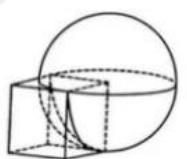
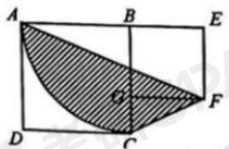
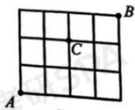
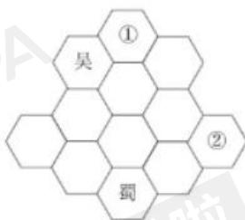

# 2026考研199管综真题及参考答案.pdf

## 2026 考研管综真题及参考答案

## 一、问题求解：第 1\~15 小题，每小题 3 分，共 45 分。下列每题合出的 A、B、C、D、E 五个选项中，只有一项是符合试题要求的。请在答题卡上将所选项的字母涂黑。

1. 某工厂生产一批电子产品，计划 25 天完成。开始生产 5 天后，生产率提高了 25%，则完成这批产品的生产还需
A. 10 天
B. 12 天
C. 13 天
D. 15 天
E. 16 天

2.

瓶中装满了酒精溶液,倒出 $\frac{1}{3}$ 瓶后加满水,再倒出 $\frac{1}{3}$ 瓶后加满水,得到了浓度为24%的酒精福液,则原酒精溶液的浓度为。
A. 36%
B. 40%
C. 45%
D. 54%
E. 56%

若实数 $x, y$ 满足 $x^{2} + y^{2} \leq 1$ , 则 $\sqrt{(x - 2)^{2} + y^{2}}$ 的取值范围是
3.
A. [0, 1]
B. [1, 2]
C. [1, 3]
D. [1, 4]
E. [2, 3]

$\frac{\sqrt{9}-1}{(1+\sqrt{5})(\sqrt{5}+\sqrt{9})}+\frac{\sqrt{13}-\sqrt{5}}{(\sqrt{5}+\sqrt{9})(\sqrt{9}+\sqrt{13})}+\cdots+\frac{\sqrt{49}-\sqrt{41}}{(\sqrt{41}+\sqrt{45})(\sqrt{45}+\sqrt{49})}=$ A. $\sqrt{5}+2$ B. $\sqrt{5}-2$ C. $\sqrt{5}+1$ D. $\sqrt{5}-1$ E. $2\sqrt{5}+1$

5. 直线 $y = x$ 与抛物线 $y = ax^2 + bx + 1$ 的交点为 $(1,1)$ , $(2,2)$ , 则
A. $a = \frac{1}{2}, b = -\frac{1}{2}$ B. $a = -\frac{1}{2}, b = \frac{1}{2}$ C. $a = \frac{1}{2}, b = \frac{1}{2}$ D. $a = -\frac{1}{2}, b = -\frac{1}{2}$ E. $a = 1, b = 1$

6. 如图 1，正方体的一个顶点位于球心，若正方体的棱长为 1，球的半径为 1，则正方体在球外部部分的体积为

$1 - \frac{\pi}{4}$ A. $1 - \frac{\pi}{5}$ B.

C. $1 - \frac{\pi}{6}$ D. $1 - \frac{\pi}{8}$ E. $1 - \frac{\pi}{10}$

7. 在小于 30 的质数中任取一个，其被 3 除余 1 的概率为
A. $\frac{3}{10}$ B. $\frac{2}{5}$ C. $\frac{4}{9}$ D. $\frac{5}{9}$

$$
\frac {3}{5}
$$

对实数 x， $[x]$ 表示不超过 x 的最大整数，则 $[\sqrt{1}]+\sqrt{2}+\sqrt{3}+\cdots+\sqrt{16}=$ A. 40
B. 39
C. 38
D. 28
E. 16

9.

若实数 $x, y$ 满足 $xy + x + y = 10$ , $x^2y + xy^2 = 24$ , 则 $x^2 + y^2 =$ A. 4 B. 28 C. 34 D. 44 E. 52

10. 甲、乙两人驾车分别从 A, B 两地同时出发, 相向而行, 甲行驶了 50 千米后与乙相遇, 之后甲提速 $21\%$ , 乙保持速度不变, 他们继续前行, 当甲到达 B 地时, 乙恰好到达 A 地, 则 A, B 两地之间的路程为
A. 120 千米
B. 115 千米
C. 110 千米
D. 105 千米
E. 100 千米

11. 甲、乙两袋中各有若干个球，其中红球所占的比例分别为 $\frac{1}{4}$ 和 $\frac{1}{3}$ 。从两袋中各摸出 1 个球，恰有 1 个红球的概率为  
A. $\frac{11}{12}$ B. $\frac{7}{12}$ C. $\frac{1}{2}$ D. $\frac{5}{12}$ E. $\frac{1}{12}$

设 $f(x)$ 是周期为2的偶函数，且当 $x\in[2,3]$ 时， $f(x)=x$ ，则 $f(-0.5)=12.$ A. 3.5
B. 2.5
C. 1
D. 0
E. -0.5

13. 某单位有 85 人参加了长城、故宫、颐和园的游览，游览了这三地的人数分别为 60、40、40。游览了全部三地的人数为 a，只游览了长城和故宫的人数为 b，只游览了故宫和颐和园的人数为 c，只游览了长城和颐和园的人数为 d。若 a: b: c: d=1:2:3:4，则仅游览了一地的人数为
A. 29
B. 31

C. 33  
D. 35  
E. 37

14. 如图 2，正方形 ABCD 的边长为 6，正方形 BEFG 的边长为 4。AC 在以 B 为圆心、以 BC 为半径的圆上，则阴影部分的面积为

A. $8\pi$

B. $8\pi + \frac{5}{6}$ C. $8\pi + 6$ D. $9\pi - \frac{5}{6}$ E. $9\pi$

15. 一个城市的部分街道如图 3，路口C 因施工禁行。从 A 出发前往 B，如果只许向“上”或向“右”行驶，那么不同的路线有

## 二、条件充分性判断：第 16\~25 小题，每小题 3 分，共 30 分。要求判断每题给出的条件（1）和条件（2）能否充分支持题干所陈述的结论。A、B、C、D、E 五个选项为判断结果，请选择一项符合试题要求的判断，在答题卡上将所选项预的字母涂黑。

A. 条件（1）充分，但条件（2）不充分  
B. 条件（2）充分，但条件（1）不充分  
C. 条件（1）和条件（2）单独都不充分，但联合起来充分  
D. 条件（1）充分，条件（2）也充分  
E. 条件（1）和条件（2）单独都不充分，联合起来也不充分

16. A、B两班共有90名同学，则能确定这90名同学中男生人数和女生人数的比例。
（1）A班男生人数与女生人数之比为5：6
（2）B班男生人数与女生人数之比为12：11

17. 设 $f(x)=ax^{2}+bx+c$ ，其中 a, b, c 为实数，则 $f(x)>0$

(1) a,b,c 成等比数列

(2) a>0

18.

设 $a, b, c$ 是非零实数，则能确定 $\frac{|a|}{a} + \frac{|b|}{b} + \frac{|c|}{c} + \frac{|abc|}{abc}$ 的值。

(1) $abc > 0$ .

(2) $ab > 0$ 。

## 19. 已知

$$
A = \{x \mid (x ^ {2} - 1) (x + 2) > 0 \}, \quad B = \{x \mid x ^ {2} + a x + b \leq 0 \},
$$

则

$$
A \cap B = \{x \mid 1 <   x \leq 3 \}.
$$

(1) $a = -2, b = -3$ 。

(2) $a = -3, b = 0$ 。

20. 已知数列 $\{a_{n}\}$ 的前 n 项和 $S_{n}=bn^{2}+c$ ，其中 b, c 为实数，则 $a_{10}=38$ 。

(1) $a_{1} = 1$

(2) $a_{2} = 6$

21. 设 $a, b$ 是正实数，则能确定 $\frac{a - b + \frac{1}{5}}{a + b + 1}$ 的值。

(1) $\frac{b}{a} = \frac{2}{3}$ (2) $\frac{b}{a} = \frac{1}{3}$

22.《高等数学》课程的总评成绩由平时成绩、期中成绩、期末成绩确定，则能确定该学生这门课程的总评成绩。

（1）已知某学生平时成绩、期中成绩、期末成绩之比。

（2）已知某学生平时成绩、期中成绩、期末成绩的平均值。

23. 已知抛物线 $y = ax^2 + bx + 1$ 与坐标轴有 3 个交点 $A, B, C$ ，则能确定三角形 $ABC$ 的面积。

(1) 已知 $a$ 的值。

(2) 已知 $\frac{b^2 - 4a}{a^2}$ 的值。

24. 已知 $a > 0, b > 0$ , 则能确定 $a + b$ 的最小值。

(1) $\frac{1}{a} + \frac{1}{b} = 3$ 。

(2) $ab^{2}+a^{2}b=16$ 。

25. 已知直线 $L: mx - y - 2m + 5 = 0$ ，则能确定 $m$ 的值。

(1) 直线 $L$ 被圆 $(x - 3)^2 + (y - 4)^2 = 9$ 截得的线段长为6。

(2) 直线 $L$ 被圆 $(x - 2)^{2} + (y - 5)^{2} = 4$ 截得的线段长为 $4$ 。

## 三、逻辑推理：第 $26\sim 55$ 小题，每小题2分，共60分。下列每题给出的A、B、C、D、E五个选项中，只有一项是符合试题要求的。

26. 中国对全球气候治理的贡献有目共睹。风电、光伏发电、水电、生物质发电装机容里连续多年位居世界第一，大幅降低了全球发展可再生能源的成本。国际能源署官员表示，中国今天已经成为全球清洁能源领域的冠军。相关人士表示，作为负责任的发展中大国，中国始终保持气假行动的战略定办，中国经济社会发展已经走上全面绿色转型的轨道。

以下各项如果为真，则除哪项外均能支持上述相关人士的观点？

A. 中国深入推进能源革命，非化石能源装机容量比重已超 $50\%$ 。

B. 中国全面停止新建境外燃煤电厂，得到许多国家的高度赞扬。

C. 中国大力推进绿色发展，二氧化碳等温室气体排放强度已连续多年持续下降。

D. 中国新能源汽车产销量稳居全球第一，保有里超1800万辆，占世界一半以上。

E. 中国利用自身先进的清洁能源技术和低成本优势，正帮助世界其他国家实现绿色转型。

27. 平日里进行高强度耐力训练的人，反而没有那些不太运动的人长寿。所以，运动未必益寿。以下哪项与上述论证方式最为相似？

A. 相比于那些较少食用含果葡糖浆食品的人，经常食用者患脂肪肝、心脏病的风险比较高。因此，为了健康应尽量远离含果葡糖浆的食品。

B. 今年国庆、中秋长假临近时，民航国内航线长假出票量已超去年同期，个别航线余票所剩无几。所以，长假出行应尽早订票。

C. 不能将接受的新信息与现有知识储备有机结合的人，反而会比他们未接受新信息时作出更糟的选择。所以，知识更多未必有助于人们作出明智的选择。

D. 14-16 世纪，当北美农耕村落的人口增加一倍时，人均居住面积和家庭财富会显著增加。由此可知，人口集中带来的合作可让社群中的所有人都受益。

E. 一项对非洲中低收入家庭的调查显示，在取水过程中女性比男性更易因动物袭击、交通事故等原因而受伤。因此，男性更应该承担取水的责任。

28. 近几年，汉服悄然流行起来。从日常生活到顶级时尚圈，汉服无处不在。随着汉服从小众走向大众，从舞台表演走向日常生活，各种乱象也时有发生。某些影视剧、综艺节目的制作者因对相关历史、服饰演变等知识了解不够，经常会乱改、乱搭汉服。对此有专家主张，必须规范汉服的生产和使用，因为只有还原传统汉服的本来面貌才能保持汉服应有的历史文化价值和独特美感。

以下哪项如果为真，最能质疑上述专家的主张？

A. 汉服的发展历史悠久，每个时代的汉服都各具特色。在日常生活中，许多汉服爱好者各美其美，根据自己的喜好自由选择不同时代的服饰。

B. 穿上传统汉服并不方便工作。将传统汉服的代表元素抽离出来，设计出适合现代人穿着的汉服，依旧能保存汉服的历史文化和审美价值。

C. 近现代以来，我国大多数人不再穿汉服，日常生活中的汉服也已改变了许多，很难再回到传统汉服的模样。

D. 有些景区安排演员身着汉服，但其服饰与景区文化主题并不匹配，这种做法严重损害了汉服的历史文化价值和相关礼仪的神圣感。

E. 最好的传承就是走进日常生活，但有些人为了迎合时尚、体现个性，将汉服改得不伦不类，丢失了传统汉服的典型特征。

29. 根据某宇宙学模型，宇宙中大约有 68% 的成分是暗能量，27% 为暗物质，剩下 5% 左右才是普通物质。在这 5% 左右的普通物质中，看得见、摸得着的 大约只占理论估算的一半，剩下的一半估计散落在星系之间并且因为密度太低而无法称量。但是有专家指出，对宇宙中的快速射电暴爆发现象进行精确定位，就可以对这些些散落在星系间的“灰尘进行”称重”了。

以下哪项如果为真，最能支持上述专家的观点？

A. 快速射电暴爆发所产生的电磁波信号在宇宙空间中穿行时，遇到宇宙中的尘埃会发生散射现象。

B. 只有多国科学家通力合作，在地球多点同时进行观测，才能对宇宙中的快速射电暴爆发现象进行精确定位。

C. 利用射电望远镜可在一个星系中确定快速射电暴爆发的精确位置，并由此计算出该星系中散落物质的分布区域。

D. 根据快速射电暴爆发的精确位置可以计算出其电磁波信号到达地球的时间差，从而可以估算出快速射电暴爆发信号穿越了多少 “灰尘”。

E. 宇宙中的普通物质通常聚集成网状结构，对越来越多的快速射电暴爆发现象进行定位，可为未来绘制出普通物质在宇宙中的分布图提供有利条件。

30. 北宋名臣包拯铁面无私、刚正不阿，其事迹被编成话本、戏曲，长期在民间流传和上演。话本、戏曲中的包拯，一般是以黑脸大汉的面目出场的。但据史料记载，宋仁宗庆历五年夏，包拯曾任契丹正旦使。古代选拔官吏一般都十分注重外表，包拯能够担任外交官，可见其仪表堂堂。流传后世的私家画像和官方画像也印证了这点。这说明，包大人的“黑”其实是后人塑造的。

以下哪项如果为真，最能解释包大人被后人所“黑”的原因？

A. 明朝万历年间，包大人的脸开始变黑。成书于这一时期的《百家公案》讲述包拯的长相特征是“黑脸”。到了清朝，包大人全身都变黑了。

B. 包拯断案如神，执法如山。根据中国古代五行理论，水主阴，阴刑杀，而水属北方，其色黑。明清艺人可能由此偏爱黑脸的包大人。

C. 从心理学角度看，黑色象征黑暗、黑夜，容易让人产生恐惧。包拯刚猛严明的形象让豪强贼子惧怕，明清艺人为追求社会效应才慢慢将包大人“涂黑”。

D. 包拯又被称为包龙图。与包拯同朝为官的龙图阁大学士梅挚，一次跌入溪中全身变黑，后变得百毒不侵。这个荒诞故事可能被明清艺人“张冠李戴”了。

E. 皋陶相传是远古舜帝时期的司法官，他脸色青绿、执法公正。明清时期的百姓可能不经意间将狱神皋陶的相貌和品质移植到了包大人身上。

31. 下面图形所含的每个六边形格子中均可填入“魏”“蜀”“吴”三个汉字之一，有部分格子已经填入。要求相邻的每个格子中所填入的汉字均不相同。

根据上述要求，以下哪项是①②格子中依次应填入的汉字？

A. 蜀、吴  
B. 魏、蜀  
C. 蜀、魏  
D. 魏、吴  
E. 魏、魏

32. 在预防疾病、降低早逝风险等方面，中年时期的运动力尤其重要。中年人应该多坚持有氧运动。有氧运动可以锻炼心肺功能和四肢的肌肉力量。

中年人每次久坐不宜超过 45 分钟。每周进行合适、足量的有氧运动对中年人的身体健康非常有益。有专家由此认为，中年人只要每天坚持散步 40 分钟以上，就可以提高健康指数，降低患病风险。

以下哪项最可能是上述专家观点的假设？  
A. 散步有助于提高身体的平衡机能。  
B. 持之以恒的散步是合适的有氧运动之一。  
C. 心肺功能是人体最为重要的健康指标，而散步可增强心肺功能。

D. 中年人面临着家庭、生活、工作等多重压力，处于保健的关键期。

E. 散步是人类在长期进化过程中保留下来的最基本运动方式，也可能是锻炼效果最佳的运动方式。

33. 当前，网络犯罪呈现出新形式、新特点。相比于传统的违法犯罪，网络暴力往往。。。以下哪项最适合作为上述论证的前提？

A. 我国刑法、民法典以及治安管理处罚法等多部法律已对遏制网络暴力作出相关规定，不断扎紧惩治网络暴力的法律篱笆，网络生态持续向好。

B. 网络暴力行为突破了道德底线，践踏法律红线，不仅侵害当事人的权利，还扰乱网络秩序、破坏网络生态，成为人民群众深恶痛绝的网络“毒瘤”。

C. 近年来，人民法院、人民检察院、公安机关坚持严惩立场，依法能动履职，为受害人提供有效的法律救济，维护了公民合法权益和网络秩序。

D. 人工智能、大数据、云计算等新技术新应用的快速发展，催生了一系列网络新业态新模式，但相关法律法规还存在时间差、空白区。

E. 清除网络暴力，需要凝聚各方合力，推动全社会增强法治意识，增强严惩网络暴力的信心和决心，积极营造向上向善、诚信互助的网络风尚。

34. 在工业革命之前的更早历史时期，M 国在诸多方面曾是技术领域的领先者。M 国为什么会错过改变世界的工业革命呢？有学者认为，前工业化技术的发展往往是改进或合并已有技术，经过反复试错直到取得想要的结果，未必了解其运作机理。然而，科学思维的出现提供了对于世界真正运作机理的深刻见解，从而拓展了发明者想象力的疆域，进而缩减了试错的规模。而 M 国则继续依赖试错法进行创新，从而导致其与技术先进国家之间出现巨大的发展差距。

以下哪项如果为真，最能支持上述学者的观点？  
A. 依赖试错法进行创新，试错规模的大小直接影响了创新的效率。  
B. 近代实验方法的诞生和自古希腊以来的数学和逻辑传统催生了科学思维。  
C. 只有通过科学思维而不是仅仅依赖试错法才能揭示世界的真正运作机理。  
D. 强调技术的实用性而不重视科学的纯粹性造成了两种思维方式的巨大差异。

E. 研究者的想象力决定了创新的空间和潜力，而拘泥于技术的功利性严重限制了研究者的想象力。

35. 某科研团队表示, 他们在南非一处洞穴的深处发现了现代人即“智人”的远亲“纳莱迪人”的墓葬。该团队有科学家指出: “你在这里看到的是一种反复进行的仪式, 是对死者的回应。”他还特别提到, 他们发现一具脊柱完好的婴儿遗骸, 每节脊椎骨都完好无损。

以上情况如果属实，那么该团队的发现将推翻这样的信条：埋养死者是我们智人的专属领域。
以下哪项如果为真，最能支持上述论点？
A. 这些纳莱迪人的骨骸可以追溯到23.6万至33.5万年前。
B. 假如婴儿尸体不是被刻意掩埋的，那些骨头就会散落于各处。
C. 有些纳莱迪人为躲避捕食者而进入洞穴，被其他动物杀死后留下骨骸
D. 没有证据证明，雨水或者泥石流可能把骨骸从洞穴某处冲到它们现在的位置。
E. 尽管纳莱迪人的脑容量只有现代人的三分之一，但他们也许已经有了宗教意识。

36. 人才是第一资源。当前，科技人才在综合国力较量与全球科技竞争中的作用愈发凸显。高质量科技人才培养离不开高质量教育体系的构建，而高质量教育体系的构建亦须遵循人才成长规律。只有构建高质量教育体系，尤其要完善从基出教育到高等教育的科技教育链条，才能让高质量科技人才脱颖而出。

根据上述信息，可以得出以下哪项？

A. 高质量科技人才培养要遵循人才成长规律。
B. 高质量科技人才培养是高质量教育体系构建的保证。
C. 如果构建了高质量教育体系，就能培养高质量科技人才。
D. 如果遵循人才成长规律，就能让高质量科技人才脱颖而出。
E. 高质量科技人才将在综合国力较量与全球科技竞争中发挥决定性作用。

37. “乡村振兴”“政策需动”“资本下乡”的热潮。许多工商资本下乡进行耕地的规模经营，从而推动以村为单位的土地流转。这些耕地或流入公司用于经济树苗的种植，或流入家庭农场用于粮食作物的生产，村民则利用地租获得补偿。有关人士据此认为，工商资本下乡，推动土地流转实现规模经营，可使村民真正富裕起来。
以下哪项如果为真，最能质疑上述人士的观点？
A. 如今某些下乡搞规模经营的公司已出现付不起地租的情况。
B. 下乡资本所支付的地租一最高于村民自己耕作所获得的收入。
C. 村民通过流转土地所获得的地租只占其可支配收入的一小部分。
D. 在通过土地流转实现规模经营的过程中，工商资本可能会把不确定的市场性风险和经营性风险转嫁给村民。
E. 农业领域很难有超额利润，作为土地流入方的公司和家庭农场通常还需依赖当地政府的政策代惠和赚项补贴。

38. 中国画创新的难点不在笔墨技法，而在文化认知、胸中丘壑。假以时日，用笔的轻重疾缓、运墨的浓淡干湿等都能掌握，甚至可以达到炉火纯青的地步，但艺术格调取决于创作者的文化修养和思想境界。同样的山水，为什么在不同时代不同画家的作品中呈现出不同的意境？原因的在于画家腹中是否有"诗书"。

以下哪项如果为真，最能支持上述论证？

A. 只是掌握外在的笔墨技法，很难创作出优秀的中国画作品。  
B. 在科技高速发展的时代，中国画滋养精神、慰藉心灵的作用更加凸显。  
C. 只有从中国文化的特质出发去理解中国画，才可能提高画家的文化修养。

D. 凭借修养境界，通过笔墨形式来呈现意境、审美价值以及人文精神，才是中国画创新的关键。

E. 只有从中国艺术精神出发，将自身理想追求，时代气象与笔墨语言结合起来，才能开创艺术新境。

39. 智慧健康养老产业涉及家政、医疗、康复、护理等多个行业。它是以智能产品和信息系统平台为载体，面向养老服务需求，深度融合应用大数据、人工智能等新一代信息技术的新兴产业形态。有专家由此指出，在人口老龄化的背景下，智慧健康养老产业可以弥补养老资源的供给不足。

以下各项如果为真，则除哪项外均能支持上述专家的观点？

A. 使用远程健康监测的嵌入式传感设备，可切实解决独居老人无人监护的现实问题。

B. 构建"菜单式"上门服务网络定制平台，同时加强服务产品的实用性、便利性，可满足老年人居家养老的基本需求。

C. 许多技术公司正着力提升养老服务产品的智慧化水平，使其便捷易操作，让更多老年人轻松学习与掌握。

D. 给陪护与康复机器人增添若干互动功能，可为老年人提供更温暖、更贴近人性化的服务。

E. 社区食堂居民家门口的消费场所，既能满足附近上班族的用餐需求，又能解决居家老年人的“吃饭难”问题。

40. 关节处于骨与骨连续的部位，包括关节面、软骨、关节囊、韧带等，出现炎症时，称之为关节炎，关节炎最常见的症状是关节痛，此外还有晨僵、关节肿胀、活动受限和关节畸形等症状。关节炎的病因非常广泛，由此形成免疫性、遗传性、代谢性、外伤、肿瘤性、退行性、感染性等关节炎。因此，如果出现关节痛，尤其是非创伤相关的关节痛，建议到风湿免疫科就诊。

以下哪项如果为真，最能支持上述论证？

A. 外界环境是诱发关节疼痛的重要因素  
B. 关节炎种类多达上百种，都属于风湿病的范畴  
C. 保护关节最重要的是养成规律作息、保证睡眠，戒烟限酒等健康生活方式  
D. 关节炎患者在关节不负重的情况下进行康复性运动，可增强肌肉力量，维持良好的免疫功能

E. 风湿性关节炎是由链球菌感染诱发的，不会造成关节破坏，而类风湿关节炎可造成关节破坏

41. 某单位通知大家在网上预约体检。已知本周三、周四、周五的体检各有 2 个空余名额，该单位的黄、林、宋、李、赵 5 人都预约到其中一个名额。另外，还知道：

(1) 若宋、林中至少有 1 人的体检约到周三，则黄约到周五体检；

(2) 若李、黄中至少有 1 人的体检到周三，则宋也约到当天体检；

（3）若林、黄中至少有 1 人的体检到周五，则李、黄均到周三体检。
根据上述信息，可以得出以下哪项？
A. 黄约到周三
B. 林约到周三
C. 宋约到周四
D. 李约到周五
E. 赵约到周五

42. 某年秋季，全国大部分地区气温较常年偏高。贵州、辽宁、四川、天津、新疆、云南、浙江等7省区市的平均气温均有高低差异。在这7省区市中，气温从高到低贵州排第4；浙江比云南低，但比辽宁高；贵州比新疆低，但比四川高。另外，还知道：

(1) 如果云南排第 2 或新疆排第 3，则四川排第 1;

（2）如果新疆排第2或浙江排第6，则辽宁排第3  
A. 云南高于天津。  
B. 贵州高于浙江。  
C. 浙江高于四川。  
D. 新疆高于云南。  
E. 四川高于辽宁。

43. 张、李、赵 3 人是好友。他们各自居住在甲、乙、丙 3 个不同的城市（顺序未必对应），3 人中有 2 人爱好摄影、2 人爱好绘画、1 人爱好写诗。已知：

（1）赵居住在丙市；

（2）如果李居住在甲市，则李不爱好绘画；

（3）如果李居住在乙市，则张、李2人均爱好摄影

（4）如果李、赵至少有1人居住在丙市，则2人均爱好绘画。根据以上信息，可以得出以下哪项？  
A. 张爱好写诗与绘画。  
B. 张、李的爱好完全相同。  
C. 李爱好摄影与写诗。  
D. 张、赵的爱好完全不同。  
E. 赵爱好摄影与绘画。

44. 甲、乙、丙、丁、戊、己、庚7名教授参加某学会的年度学术会议，其中2人是特邀报告人。拍集体照时，特邀报告人均坐在第1排，其余5人坐在后面4排之中。另外，还知道：

(1) 丙坐在戊后面，但坐在己和庚前面；

（2）若甲、丁至少有1人是特邀报告人，则乙、丙2人均坐在第2排。根据上述信息，可以得出以下哪项？  
A. 甲坐在已前面。  
B. 乙、戊坐在同一排。  
C. 丙坐在乙前面。  
D. 庚坐在丁后面。  
E. 戊坐在第1排。

45. 某小区张、王、赵、李和林 5 位老友相约晚饭后到小区附近的一个“共享”操场慢跑。已知：

(1) 林跑的圈数仅与王相同;

(2) 赵、王、李中有两人跑的圈数相同;

（3）赵跑的圈数至少比张、李中的一位多，但比王跑的圈数少。根据上述信息，以下哪项是不可能的？  
A. 赵比张跑的圈数多  
B. 王比张跑的圈数多  
C. 林比李跑的圈数多  
D. 王比李跑的圈数多  
E. 张比林跑的圈数多

46. 田径赛场上，甲、乙、丙、丁、戊5位运动员正在进行100米的决赛，他们每人所穿运动服的颜色分别为红、黄、绿、白、蓝5种颜色中的一种。关于运动员着装的颜色情况，已知：（1）甲穿红色或者丁穿绿色；（2）如果甲或者丁穿红色，则乙穿黄色；（3）如果乙穿黄色，则并穿蓝色并且甲穿白色。
根据以上信息，可以得出以下哪项？
A. 甲穿红色运动服。
B. 乙穿黄色运动服。
C. 丙穿蓝色运动服。
D. 丁穿绿色运动服。
E. 戊穿白色运动服。

47. 田径赛场上，甲、乙、丙、丁、戊5位运动员正在进行100米的决赛，他们每人所穿运动服的颜色分别为红、黄、绿、白、蓝5种颜色中的一种。关于运动员着装的颜色情况，已知：（1）甲穿红色或者丁穿绿色；（2）如果甲或者丁穿红色，则乙穿黄色；（3）如果乙穿黄色，则并穿蓝色并且甲穿白色。
根据以上信息，如果乙不穿红色且丙穿黄色，则可以得出以下哪项？
A. 甲穿蓝色运动服。
B. 乙穿蓝色运动服。
C. 乙穿白色运动服。
D. 戊穿白色运动服。
E. 戊穿红色运动服。

48. 大学人文学院教师中，按职称高低现有教授 2 人，副教授 5 人、讲师 7 人、助教 1 人。已知甲、乙、丙、丁、戊、己、庚 7 人是该学院教师，他们现有职称情况如下：

(1) 副教授的人数比讲师多;

(2) 丁和己的职称都比乙和戊的高;

（3）丙和庚的职称都比甲的职称高，但都比己的低。
根据上述信息，可以得出以下哪项？
A. 己是教授
B. 丁是副教授
C. 丙是副教授
D. 乙是助教
E. 甲是讲师

49. 大学人文学院教师中，按职称高低现有教授 2 人，副教授 5 人、讲师 7 人、助教 1 人。已知甲、乙、丙、丁、戊、己、庚 7 人是该学院教师，他们现有职称情况如下：

(1) 副教授的人数比讲师多;

(2) 丁和己的职称都比乙和戊的高;

（3）丙和庚的职称都比甲的职称高，但都比己的低。
若7人中只有1人是教授，则以下哪项是不可能的？
A. 甲是助教。
B. 乙是助教。
C. 丙是讲师。
D. 戊是讲师。
E. 庚是副教授。

$50^{\sim}51$ 基于以下题干：

某村民本周一至周五在不同地块安排了杀虫、播种、施肥、灌溉、除草5项农活（顺序未必对应），每天只安排其中1项且每项均在1天内完成。另外，还知道：

（1）若周一未安排除草，则周二安排施肥；

(2) 若周二安排施肥, 则插种安排在杀虫的后一天;

（3）若灌溉安排在除草的前面，则施肥安排在播种的前一天。

50. 根据以上信息，能够得出哪项？
A. 周一除草
B. 周二灌溉
C. 周三播种
D. 周四杀虫
E. 周五施肥

51. 若周二施肥，则以下哪项是不可能的？
A. 周三杀虫
B. 周三灌溉
C. 周四灌溉
D. 周四播种
E. 周五播种

52\~53 基于以下题干:

某医学院为了增强学生对中医典籍的了解，设立了4个读书小组，分别阅读《黄帝内经》《神农本草经》《金匮要略》《伤寒论》4部中医典籍，并且规定报名者至多报2个读书小组。小王、小李、小徐、小贵4人均报名参加了上述读书小组。已知：

（1）如果小李、小徐中至少有 1 人报了《伤寒论》读书小组，则他们均报了《金匮要略》读书小组；

（2）加果小王至少报了《伤寒论》读书小组或《黄帝内经》读书小组之一，则他也报了《神农本草经》读书小组。

52. 如果上述 4 人报名参加的读书小组均完全不相同，则可以得出以下哪项？
A. 小李报了《伤寒论》读书小组
B. 小王报了《神农本草经》读书小组
C. 小徐报了《黄帝内经》读书小组
D. 小徐报了《金匮要略》读书小组
E. 小黄报了《伤寒论》读书小组

53. 如果上述 4 人均报名参加了上述 2 个读书小组但均不完全相同，且每个读书小组都有他们中的 2 人报名，则可以得出以下哪项
A. 小王报了《黄帝内经》读书小组
B. 小王报了《神农本草经》读书小组
C. 小李报了《伤寒论》读书小组
D. 小李报了《金匮要略》读书小组
E. 小黄报了《伤寒论》读书小组

54\~55 基于以下题干:

甲、乙、丙、丁、戊 5 位画家入选《最美中国画》美术作品展。已知，他们各自画作的主题分别是梅、兰、竹、菊、松之一。另外，还知道：

(1) 如果丁画的是梅、菊之一, 则甲画的是竹;

(2) 如果甲画的是菊、竹之一, 则戊画的是松;

（3）如果丁画的是兰、松之一，则甲画的是菊且戊画的是梅。

54. 根据以上信息，可以得出哪项？
A. 甲画的不是竹
B. 乙画的不是兰
C. 丙画的不是菊
D. 丁画的不是松
E. 戊画的不是梅

55. 如果丁画的不是竹，则可以得出以下哪项？
A. 甲画的是梅
B. 乙画的是竹
C. 丙画的是菊
D. 丁画的是兰
E. 戊画的是松

## 四、中文写作：第 56\~57 小题，共 65 分。其中论证有效性分析 30 分，论说文 35 分。

56. 论证有效性分析：分析下述论证中存在的缺陷和漏洞，选择若干要点，写一篇 600 字左右的文章，对该论证的有效性进行分析和评论。

时下一些年轻人选择租物使用，租物范围越来越广，由此可见，现在人们的消费观念都转变了，从过去购买所有权转向购买使用权。

过去人们看重物品所有权，生活物品一般是自己买来用，租用怕被他人看不起。若以租代买就可以及时体验到最新款相机带来的拍摄乐趣，这意味着，不以租代买就无法及时体验到这一乐趣。

通过以租代买形式，中低收入者也可以获得使用奢侈品的机会，实现“低价高享”的愿望，这表明奢侈品不再是高收入者的专属，中低收入者也可拥有奢侈品。大到汽车小到充电宝，对这些商品如果人们习惯以租代买，就可避免很多浪费，如果不以租代买，就不能避免浪费。对各种商品如果人们习惯以租代买，就可避免很多浪费，避免浪费相对来说就是增加财富。（材料尚不完整，有待更新）。

## 57. 阅读以下材料，写一篇 700 字左右的议论文，题目自拟。

在观看足球比赛时,观众们会责怪球员往往有更好的进攻路线,却选择了不合格的路径,事实上,球员在球场上竞争非常激烈,没有观众所具有的全景视角。

## 参考答案:

1-10: EDCBA CACBD
11-20: DBDEA CCEDB
21-30: AEBDA DCBDC
31-40: ACDCB ADDEB
41-50: EADEE DEACA
51-55: EEBDE

56. 漏洞 1: 以偏概全。

材料论述，时下一些年轻人选择租物使用，租物范围越来越广，由此可见，现在人们的消费观念都转变了，从过去购买所有权转向购买使用权。这欠妥当。材料由"一部分年轻人选择租物使用"的特例，得出"现在人们的消费观念都发生了转变"的一般性结论，这不具当然合理性。

## 漏洞 2：另有他因。

材料论述，过去人们看重物品所有权，生活物品一般是自己买来用，租用怕被他人看不起。这欠妥当。材料认为，过去人们的生活物品一般是自己买来用是因为“租用怕被他人看不起”，然而由于生活物品用品的使用频次高、单价较低，故之所以选择购买，更可能是因为这样经济上更划算。

## 漏洞 3：条件关系谬误。

材料论述，若以租代买就可以及时体验到最新款相机带来的拍摄乐趣，这意味着，不以租代买就无法及时体验到这一乐趣。这欠妥当。材料认为，以租代买是体验最新款相机拍摄乐趣的唯一途经，然而事实并非如此。除此以外，人们可以通过直接购买、从他人处借用等方式，来体验这种乐趣。

## 漏洞 4: 混淆概念。

材料论述，通过以租代买形式，中低收入者也可以获得使用奢侈品的机会，实现"低价高享”的愿望，这表明奢侈品不再是高收入者的专属，中低收入者也可拥有奢侈品。这欠妥当。中低收入者有"使用"奢侈品的机会不等于其可"拥有"有奢侈品。材料论述不当的将"使用"和"拥有"混为一谈。

## 漏洞 5：条件关系谬误。

材料论述，大到汽车小到充电宝，对这些商品如果人们习惯以租代买，就可避免很多浪费，如果不以租代买，就不能避免浪费。这欠妥当。材料认为，要避免浪费有且仅有以租代买这一种方式，然而事实并非如此。除此以外，购买商品之后做到物尽其用、不满足"伪需求"等，都是避免浪费的有效途径。

## 57.【参考】辩证分析

立意 1：有限视角下的决策可符合客观实际。

立意 2：立足当下最优，力求全局最优。

立意 3：摒弃"旁观者清"，尊重客观实际。

立意 4：选择、取舍。
